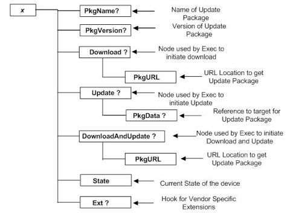

# 10.1 Firmware Update Management Object 固件更新管理对象

The parameters associated with a single firmware update are assembled into a firmware update management object as shown in Figure. A firmware update management object may be either permanent or dynamic. There may be one or more such firmware update management objects in a device management tree. Only one update package, or reference to an update package, is associated with each such management object.  The grouping or placement within the device management tree of multiple management objects, such as under a common node, is not addressed in this specification.  
与单个固件更新相关联的参数被组装到如图所示的固件更新管理对象中。固件更新管理对象可以是永久的或动态的。在设备管理树中可以存在一个或多个这样的固件更新管理对象。只有一个更新包或对更新包的引用与每个这样的管理对象相关联。在本说明书中没有涉及多个管理对象的设备管理树内的分组或放置，例如在公共节点下。

Management Object identifier: urn:oma:mo:oma-fumo:1.0 
管理对象标识符：urn：oma：mo：oma-fumo：1.0

Protocol Compatibility:  This object is compatible with OMA Device Management, version 1.2 [OMADM] and any later compatible versions of OMA Device Management. 
协议兼容性：此对象与OMA设备管理版本1.2[OMADM]和任何更高版本的OMA设备管理兼容。

## 10.1.1 Firmware Update Management Object Parameters 固件更新管理对象参数
The following are the nodes of the Firmware Update management object. 以下是固件更新管理对象的节点。

### 10.1.1.1 Node: x
This interior node acts as a placeholder for a firmware upgrade package unique identifier.  The node Type property MUST correspond to the management object identifier specified in section 10.1. The manufacturer MAY pre-create permanent nodes for x, allow update package nodes x to be created as needed, or a combination of these two methods.  For example, permanent nodes might be created for all firmware packages known at the time of manufacture, with additional nodes added dynamically as new features become available.  An example would be to include nodes FWPkg1, FWPkg2...FWPkgn. The DDF file provided by the device manufacturer MAY specify where the x node is to be located in the management tree of the device. 
该内部节点充当固件升级包唯一标识符的占位符。节点类型属性必须对应于在第10.1节中指定的管理对象标识符。制造商可以预先创建x的永久节点，允许根据需要创建更新包节点x或这两种方法的组合。例如，可以为制造时已知的所有固件包创建永久节点，随着新特征变得可用，附加节点被动态地添加。 一个示例是包括节点FWPkg1，FWPkg2 ... FWPkgn。设备制造商提供的DDF文件可以指定x节点在设备的管理树中的位置。
Occurrence: ZeroOrMore 
出现次数：零次或多次

Format: Node 
格式：Node

Access Types: Get  
访问类型：Get

Values: N/A  
值：无

### 10.1.1.2 Node: x/PkgName
This optional node specifies the Name associated with the firmware update package.  
此可选节点指定与固件更新包关联的名称。

Occurrence: ZeroOrOne 
出现次数：零次或一次

Format: Chr 
格式：Chr

Access Types: Get
访问类型：Get

Values: N/A 
值：无

### 10.1.1.3 Node: x/PkgVersion
This optional node specifies the Version information for the firmware update package. The version information is device manufacture specific and can contain any data. 
此可选节点指定固件更新包的版本信息。版本信息是特定于设备制造的，并且可以包含任何数据。

Occurrence: ZeroOrOne 
出现次数：零次或一次

Format: Chr 
格式：Chr

Access Types: Get
访问类型：Get

Values: N/A 
值：无

### 10.1.1.4 Node: x/Download
This interior node is the target of an ‘Exec’ command in order to initiate a firmware download for the specified update package and is optional.   
该内部节点是“Exec”命令的目标，以便发起用于指定的更新包的固件下载，并且是可选的。

Occurrence: ZeroOrOne 
出现次数：零次或一次

Format: Chr 
格式：Chr

Access Types: Exec, Get
访问类型：Exec,Get

Values: N/A 
值：无

### 10.1.1.5 Node: x/Download/PkgURL
This node specifies the URL where the firmware update package or download descriptor is located.  This URL is used for alternative download mechanisms (such as HTTP Get [RFC2616] or Descriptor Based Download [DLOTA]). 
此节点指定固件更新包或下载描述符所在的URL。此URL用于备用下载机制（例如HTTP Get [RFC2616]或基于描述符的下载[DLOTA]）。

Occurrence: One 
出现次数：一次

Format: Chr 
格式：Chr

Access Types: Replace, Get
访问类型：Replace,Get

Values: N/A 
值：无

### 10.1.1.6 Node: x/Update
This interior node is a target of an ‘Exec’ command in order to initiate a firmware update for the specified update package and is optional.   
该内部节点是“Exec”命令的目标，以便启动用于指定的更新包的固件更新，并且是可选的。

Occurrence: ZeroOrOne 
出现次数：零次或一次

Format: Chr 
格式：Chr

Access Types: Exec, Get
访问类型：Exec,Get

Values: N/A 
值：无

### 10.1.1.7 Node: x/Update/PkgData
This node is the target of a ‘Replace’ command when DM is used to directly provide the binary firmware update package. 
当DM用于直接提供二进制固件更新包时，该节点是“Replace”命令的目标。

Occurrence: ZeroOrOne 
出现次数：零次或一次

Format: Bin 
格式：Bin

Access Types: Replace
访问类型：Replace

Values: N/A 
值：无

### 10.1.1.8 Node: x/DownloadAndUpdate
This interior node is the target of an ‘Exec’ command invoked to initiate a firmware download and update for the specified update package and is optional. The update MUST take place as soon as practical after download. 
该内部节点是被调用以启动用于指定的更新包的固件下载和更新的“Exec”命令的目标，并且是可选的。更新必须在下载后尽快进行。

Occurrence: ZeroOrOne 
出现次数：零次或一次

Format: Node 
格式：Node

Access Types: Exec,Get
访问类型：Exec,GEt

Values: N/A 
值：无

### 10.1.1.9 Node: x/DownloadAndUpdate/PkgURL
This node specifies the URL where the firmware update package or download descriptor is located, that is to be downloaded and installed at the next practical opportunity.  This URL is used for alternative download mechanisms (such as HTTP Get [RFC2616] or Descriptor Based Download [DLOTA]). 
此节点指定固件更新包或下载描述符所在的URL，将在下一个实际机会下载和安装。此URL用于备用下载机制（例如HTTP Get [RFC2616]或基于描述符的下载[DLOTA]）。

Occurrence: One 
出现次数：一次

Format: Chr 
格式：Chr

Access Types: Replace, Get
访问类型：Replace,Get

Values: N/A 
值：无

### 10.1.1.10 Node: x/DownloadAndUpdate/PkgURL
Contains a value indicating the current state of the mobile device with respect to this firmware update.  
包含指示移动设备相对于此固件更新的当前状态的值。

Occurrence: One 
出现次数：一次

Format: Int 
格式：Int

Access Types: Get  
访问类型：Get

Values: See table below  
值：见下表

The following state table enumerates the valid states:  
以下状态表枚举了有效状态：

| State 状态 | Description 描述| Integer Value 整数值 |
| -- | -- | -- |
| Idle/Start 空闲/开始 | No pending operation 无待处理操作 | 10 |
| Download Failed 下载失败 | Download Failed 下载失败 | 20 |
| Download Progressing 下载进度 | Download has started 下载已开始 | 30 |
| Download Complete 下载完成 | Download has been completed successfully  下载已成功完成 | 40 |
| Ready to Update 准备更新 | Have data and awaiting command to start update 有数据和等待命令开始更新 | 50 |
| Update Progressing 更新进度 | Update has started 更新已开始 | 60 |
| Update Failed / Have Data 更新失败/有数据 | Update failed but have update package 更新失败，但有更新包 | 70 |
| Update Failed / No Data 更新失败/无数据 | Update failed and no update package available 更新失败，没有可用的更新包 | 80 |
| Update Successful / Have Data 更新成功/有数据 | Update complete and data still available 更新完成，数据仍然可用 | 90 |
| Update Successful / No Data 更新成功/无数据 | Data deleted or removed after a successful Update 成功更新后删除或删除数据 | 100 |

