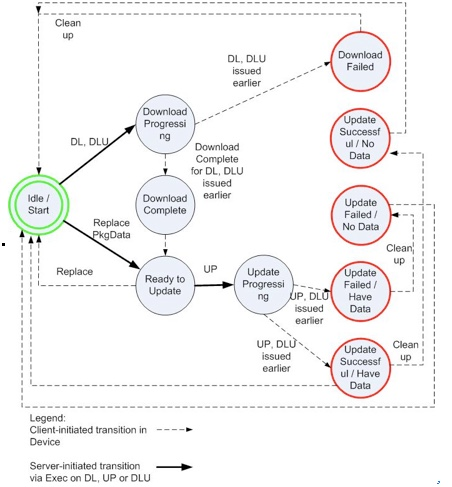

# 10.2  Behavior Associated with the Management Object 与管理对象相关的行为

The following diagram shows the various valid states of the mobile device as they are related to firmware updates. It is possible that the server may not see some of these states.<br/>
下图显示了移动设备与固件更新相关的各种有效状态。 服务器可能无法看到这些状态中的一些。


Typically, the starting state is ‘Idle/Start’ and the terminating states are one of:<br/>
通常，起始状态是“空闲/开始”，并且终止状态是以下之一：
*	Update Failed / Have Data 
    更新失败/有数据
*	Update Failed / No Data 
    更新失败/无数据
*	Update Successful / Have Data
    更新成功/有数据
*	Update Successful / No Data
    更新成功/无数据
*	Download Failed
	下载失败

## 10.2.1 ‘Exec’ Command "Exec"命令
The ‘Exec’ command MUST be supported. <br/>
必须支持'Exec'命令。

The server issues ‘Exec’ commands to initiate long running operations in the client, such as download and update. The result of the ‘Exec’ command, encoded as a ResultCode, is returned in a Generic Alert following completion of the operation. A correlator, if supplied with the ‘Exec’ command, is also returned in that Generic Alert.  The client MUST send a status 202 (asynchronous) for the ‘Exec’ operation if the command is accepted for later processing.<br/>
服务器发出“Exec”命令以在客户端中启动长时间运行的操作，例如下载和更新。在操作完成后，在通用报警中返回编码为ResultCode的“Exec”命令的结果。如果提供了'Exec'命令，相关器也会在该通用警报中返回。如果命令被接受用于以后的处理，客户端必须发送用于'Exec'操作的状态202（异步）。

Optionally a User Interaction Alert [DMPRO] can be used for soliciting user opt-in prior to the execution of the Exec command on the Download node. <br/>
可选地，用户交互警报[DMPRO]可以用于在下载节点上执行Exec命令之前请求用户选择加入。

In the case of a download of an update package employing the large-object download feature of the OMA-DM protocol [DMPRO], the ‘Replace’ command is used by the DM server to initiate the download, prior to the invocation of an ‘Exec’ command to invoke the update activity.<br/>
在下载采用OMA-DM协议[DMPRO]的大对象下载特征的更新包的情况下，DM服务器使用“替换”命令来启动下载，在调用“Exec'命令前来调用更新活动。

The State element in the management object is updated to indicate the state the client reached during the corresponding Exec initiated update or download activity (See Chapter 10.2.).<br/>
管理对象中的State元素被更新，以指示客户端在相应的Exec启动的更新或下载活动期间达到的状态（请参见第10.2章）。

### 10.2.1.1 ‘Exec’ Command "Exec"命令
The server issues an ‘Exec’ command targeting the x/Download node. The client initiates an alternate download operation from the URL identified in the x/Download/PkgURL value. When the download operation is complete, the client issues a Generic Alert indicating the result of the download operation.<br/>
服务器发出一个“Exec”命令，目标是x/Download节点。 客户端从x/Download/PkgURL值中标识的URL启动备用下载操作。当下载操作完成时，客户端发出指示下载操作的结果的通用警报。

#### 10.2.1.1.1 Example of ‘Exec’ Command for Alternate Download 备用下载的'Exec'命令示例
Pre-Condition: The following element needs to be set with an appropriate value:<br/>
前提条件：以下元素需要设置一个适当的值：

`x/Download/PkgURL` is set<br/>
`x/Download/PkgURL` 已被设置好

Example of ‘Exec’ command:
'Exec'命令示例：
```
<Exec>
	<CmdID>3</CmdID>
	<Item>
		<Target>
			<LocURI>x/Download</LocURI>
		</Target>
	</Item>
</Exec>

```
### 10.2.1.2 ‘Exec’ Command Semantics for Update 用于更新的'Exec'命令语义

The server issues an ‘Exec’ command targeting the x/Update node. The client applies the previously received update package. When the update operation is complete, the client issues a Generic Alert indicating the result of the update operation.<br/>
服务器发出一个“Exec”命令，目标是x/Update节点。客户端应用预先接收更新包。更新操作完成后，客户端将发出一个通用警报，指示更新操作的结果。

### 10.2.1.2.1 	Example of ‘Exec’ Command for Update 用于更新的'Exec'命令示例
Pre-Condition: 预先条件

The firmware update package must be available on the device.<br/>
固件更新包必须在设备上可用。

Example of ‘Exec’ command:<br/>
'Exec'命令示例：
```
<Exec>
	<CmdID>3</CmdID>
	<Item>
		<Target>
			<LocURI>x/Update</LocURI>
		</Target>
 	</Item>
</Exec>
```
### 10.2.1.3 ‘Exec’ Command Semantics for Download And Update 用于下载和更新的'Exec'命令语义
The server issues an ‘Exec’ command targeting the x/DownloadAndUpdate node. The client initiates an alternate download operation from the URL identified in the x/DownloadAndUpdate/PkgURL value. When the download operation is completed successfully, the client applies the received update package without further server intervention. When the update operation is complete, the client issues a Generic Alert indicating the result of the update operation. In the event that the download fails, the client issues a Generic Alert indicating the failure of the download operation.<br/>
服务器发出一个“Exec”命令，目标是x/DownloadAndUpdate节点。 客户端从x/ DownloadAndUpdate/PkgURL值中标识的URL启动备用下载操作。当下载操作成功完成时，客户端应用所接收的更新包而无需进一步的服务器干预。更新操作完成后，客户端将发出一个通用警报，指示更新操作的结果。在下载失败的情况下，客户端发出指示下载操作失败的通用警报。

The Update activity is launched at the next practical opportunity.<br/>
更新活动在下一个实际机会时启动。

#### 10.2.1.3.1 Example of ‘Exec’ Command for DownloadAndUpdate 用于下载和更新的'Exec'命令示例
Pre-Condition: The following element needs to be set with an appropriate value:<br/>
前提条件：以下元素需要设置一个适当的值：

`x/Download/PkgURL` is set<br/>
`x/Download/PkgURL` 已被设置好

Example of ‘Exec’ command:<br/>
'Exec'命令示例：
```
<Exec>
	<CmdID>3</CmdID>
	<Item>
		<Target>
			<LocURI>x/DownloadAndUpdate</LocURI>
		</Target>
 	</Item>
</Exec>

```
