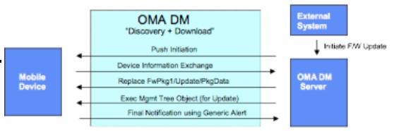
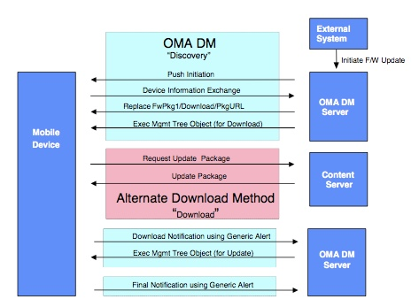

# 10.4 FUMO Usage FUMO 用法

## 10.4.1 Firmware Update Protocol Overview 固件更新协议概述
The Firmware Update Protocol specifies a set of standard commands with associated parameters and management objects that shall be used for OTA firmware updates.  OTA Firmware updates require special attention to handle the discovery, security, download and installation.  <br/>
固件更新协议指定一组具有相关参数和管理对象的标准命令，这些参数和管理对象将用于OTA固件更新。OTA固件更新需要特别注意处理发现，安全，下载和安装等方面事宜。

OMA DM is the leading standards initiative that focuses on device management for wireless devices.  The OMA Download specification [DLOTA] provides a flexible protocol for enabling the download of generic content, controlled through the use of a separate download descriptor.  By drawing on elements of these protocols and adding new elements, an effective protocol is constructed that combines Device Management [DMPRO] for controlling the main device management functions and provides for the use of descriptor-based download mechanisms to download larger binary objects such as firmware updates.  The download process is abstracted to allow the use of either OMA DM (E.g., Add/Replace) or any suitable alternative download mechanisms (for example, a descriptor based download protocol such as OMA Download [DLOTA].).<br/>
OMA DM是主要针对无线设备的设备管理的领先标准计划。OMA下载规范[DLOTA]提供了一个灵活的协议，允许下载通用内容，通过使用单独的下载描述符进行控制。通过利用这些协议的元素和添加新的元素，构造有效的协议，其组合用于控制主要设备管理功能的设备管理[DMPRO]，并且提供使用基于描述符的下载机制来下载更大的二进制对象，例如固件更新。抽象下载过程以允许使用OMA DM（例如，添加/替换）或任何合适的替代下载机制（例如，诸如OMA下载[DLOTA]的基于描述符的下载协议）。

The protocol shall support the following process steps in order to achieve an OTA firmware update:<br/>
协议应支持以下过程步骤以实现OTA固件更新：
1. 	Firmware Update Step 1: Firmware Update Initiation<br/>
固件更新步骤1：固件更新启动
2. 	Firmware Update Step 2: Device Information Exchange<br/>
固件更新步骤2：设备信息交换

3.	Firmware Update Step 3: Firmware Download<br/>
固件更新步骤3：固件下载

4.	Firmware Update Step 4: Firmware Installation<br/>
固件更新步骤4：固件安装

5.	Firmware Update Step 5: Notification of Firmware Update<br/>
固件更新步骤5：固件更新通知

## 10.4.1.1 Scenario 1: Firmware Update via OMA DM Download (Replace)  场景1：通过OMA DM更新固件下载（替换）
The following example shows how OMA DM is used directly to move a firmware update package to the device using a DM “Replace” command to access a management object representing the actual firmware binary package data:<br/>
以下示例显示如何使用OMA DM直接使用DM“Replace”命令将固件更新包移动到设备，以访问表示实际固件二进制包数据的管理对象：

## 10.4.1.2 Scenario 2: Firmware Update through an Alternative Download Mechanism 场景2：通过备用下载机制更新固件
The following examples shows how OMA DM is used to invoke an external download method, using a DM “Replace” command to specify the URL of the download descriptor that describes further details concerning the firmware package and the download method to be used:<br/>
以下示例显示如何使用OMA DM调用外部下载方法，使用DM“Replace”命令指定有关固件包和要使用的下载方法的下载描述符的URL：

### 10.4.1.2.1 Example 1: ‘Exec’ on x/Download node + ‘Exec’ on x/Update node 示例1：在x /Download节点上'Exec'，在x /Update节点上'Exec'

### 10.4.1.2.2 Example 2: ‘Exec’ on x/DownloadAndUpdate node 示例2：x / DownloadAndUpdate节点上“Exec”
The server issues an ‘Exec’ command targeting the x/DownloadAndUpdate node. Client sends final notification to server after the completion of DownloadAndUpdate operation.<br/>
服务器发出一个“Exec”命令，目标是x / DownloadAndUpdate节点。 完成DownloadAndUpdate操作后，客户端向服务器发送最终通知。

## 10.4.2 Protocol Definition 协议定义
### 10.4.2.1 Firmware Update Step1: Firmware Update Initiation 固件更新步骤1：固件更新启动
In order to begin any kind of firmware update, the device is required to open a data connection to the server. The following mechanisms could be supported to initiate the firmware update process:<br/>
为了开始任何类型的固件更新，设备需要打开到服务器的数据连接。可以支持以下机制来启动固件更新过程：

• User initiated<br/>
用户启动

• Network initiated<br/>
网络启动

The subscriber experience for user-initiated updates is not addressed in this specification as it does not require specific standardization. Recommended approaches are through menu items and service codes on the device. The user initiated update process would simply launch an OMA DM session.<br/>
在本规范中没有涉及用户发起的更新的用户体验，因为它不需要特定的标准化。推荐的方法是通过设备上的菜单项和服务代码。用户发起的更新过程将简单地启动OMA DM会话。

For network initiated updates, OMA Device Management provides a framework by which clients can be sent a “Notification Initiation Alert” to trigger the client to start the data session. It is the intent of the Firmware Update Protocol to leverage General Package#0 as specified in the OMA DM Notification Initiation Session document [DMNOTI]. OMA DM specifies that WAP Push can be used for this purpose and specifies a format acceptable for the purpose of firmware upgrade initiation.<br/>
对于网络发起的更新，OMA设备管理提供了一个框架，通过该框架可以向客户端发送“通知发起警报”以触发客户端开始数据会话。固件更新协议的目的是利用在OMA DM通知发起会话文档[DMNOTI]中指定的通用包＃0。 OMA DM指定WAP推送可以用于此目的，并且指定可接受的格式以用于固件升级启动的目的。

### 10.4.2.2 Firmware Update Step 2: Device Information Exchange 固件更新步骤2：设备信息交换
In order to provide a device with the appropriate firmware update, a minimum set of selection criteria is sent by the device to the server. For the purpose of the firmware updates, the minimum set of criteria is the required DevInfo parameters that are mandatory for each OMA DM management session as specified in [DMSTDOBJ, Section 5].<br/>
为了向设备提供适当的固件更新，设备向服务器发送一组最小的选择标准。为了固件更新的目的，最小标准集是对于如在[DMSTDOBJ，第5节]中规定的每个OMA DM管理会话必需的所需DevInfo参数。

NOTE: The device information exchange can be followed by an optional user interaction prior to the setup of the firmware download process described in the next section. An OMA DM “Alert” command can be used to seek user confirmation.<br/>
注意：在设置下一部分中描述的固件下载过程之前，设备信息交换后可以进行可选的用户交互。 OMA DM“Alert”命令可用于寻求用户确认。

### 10.4.2.3 Firmware Update Step 3: Firmware Download 固件更新步骤3：固件下载
The firmware download could occur either through an OMA DM ‘Replace’ command or via an alternative (external descriptor-based download) method by initiating the download process with the appropriate behavioural parameters. There are advantages and disadvantages to each process and it is at the discretion of the operators and manufacturers to select a preferred implementation. The protocol proposed here allows for either download method to be used.<br/>
通过启动具有适当行为参数的下载过程，可以通过OMA DM'替换'命令或通过替代（基于外部描述符的下载）方法来进行固件下载。 每个过程都有优点和缺点，并且操作者和制造商自行决定选择优选实施方式。 这里提出的协议允许使用下载方法。

### 10.4.2.4 Firmware Update Step 4: Firmware Installation 固件更新步骤4：固件安装
It is anticipated that there will be multiple methods available on the market to process firmware updates within a device. The firmware update specification’s intent is to standardize interoperability between devices and wireless network solutions. Therefore, this specification does not address the method of how a device must process the actual firmware update when it is independent of the network. Instead, this specification provides requirements to achieve an acceptable user experience for the firmware installation.<br/>
预期在市场上将有多种方法来处理设备内的固件更新。固件更新规范的目的是标准化设备和无线网络解决方案之间的互操作性。因此，本说明书不涉及当设备独立于网络时设备必须如何处理实际固件更新的方法。相反，本规范提供了为固件安装实现可接受的用户体验的要求。

### 10.4.2.4.1 Firmware Install after OMA DM Download 在OMA DM下载后的固件安装

The following Exec command initiates the update process in cases where the firmware update is downloaded into the PkgData element using OMA DM Replace:<br/>
在使用OMA DM Replace将固件更新下载到PkgData元素中的情况下，以下Exec命令启动更新过程：
```
<Exec>
  <CmdID>3</CmdID> 
  <Item>
    <Target> 
      <LocURI>.x/Update</LocURI>
    </Target> 
  </Item>
</Exec>
```

### 10.4.2.4.2 Firmware Install after OMA DM Download 固件安装备选下载

For alternative download (such as Descriptor based OMA v1.0 Download), it is recommended that the appropriate install parameters are provided prior to the download initiation Exec command. Please reference ‘ Normative – Exec Command’ section above for the appropriate Exec command.<br/>
对于其他下载（如基于描述符的OMA v1.0下载），建议在下载启动Exec命令之前提供相应的安装参数。请参考上面的“Normative-Exec命令”部分，了解相应的Exec命令。

The update package could be deleted from object storage at the completion of the update when it is no longer needed. The management client could choose to delete it as soon as an update is successfully or unsuccessfully terminated, or whenever prompted to do so by the DM server.<br/>
更新包可以在更新完成且不再需要时从对象存储中删除。管理客户端可以选择在更新成功或失败成功终止时或者在DM服务器提示这样做时立即将其删除。

### 10.4.2.5 Firmware Update Step 5: Notification of Firmware Update Status 固件更新步骤5：固件更新状态的通知

At the completion of the firmware update process, the device notifies the server of the resulting status of the firmware update. This is accomplished through a subsequent client or server initiated OMA DM session to assure that the management server is informed of the final result.<br/>
在固件更新处理完成时，设备向服务器通知固件更新的结果状态。这通过随后的客户端或服务器发起的OMA DM会话来完成，以确保管理服务器被通知最终的结果。

A Result Code is provided to the DM server via a Generic Alert [DMPRO] notification.<br/>
结果代码通过通用警报[DMPRO]通知提供给DM服务器。

The Generic Alert [DMPRO] command provided by the OMA-DM protocols is to be used by the OMA-DM client to communicate the ResultCode value to the DM Server.<br/>
由OMA-DM协议提供的通用警报[DMPRO]命令将由OMA-DM客户端用于将结果代码值传送到DM服务器。

#### 10.4.2.5.1 Non-Fatal Result Codes 非致命结果代码

For non-fatal update failures, the end-user can be provided an indication of the failure and return the phone to an operational mode.<br/>
对于非致命更新故障，可以向终端用户提供故障的指示并将电话返回到操作模式。

In addition to the result codes listed in the ResultCodes table, the ./FwUpdate/x/State element provides additional detailed information regarding the state in which the mobile device is left in at the termination (successful or otherwise) Exec operations invoked on the Update or Download elements.<br/>
除了结果代码表中列出的结果代码之外，./FwUpdate/x/State元素还提供有关移动设备在终止（成功或其他）执行更新或下载元素操作时调用的移动设备的状态的额外详细信息。

#### 10.4.2.5.2 Fatal Failures 致命故障

Fatal failure will likely render the device inoperable. Therefore, it will not be possible to provide indication to the user or notify the OMA DM server of the failure. For this reason, implementations that do not provide a high degree of fault tolerance are not likely to be used for the purpose of updating firmware.<br/>
致命故障可能会导致设备无法操作。因此，将不可能向用户提供指示或通知OMA DM服务器失败。由于这个原因，不提供高度容错的实现不可能用于更新固件。
