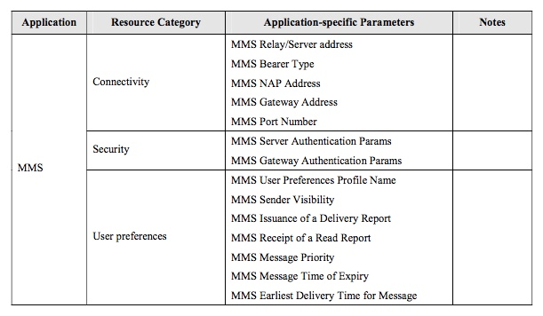
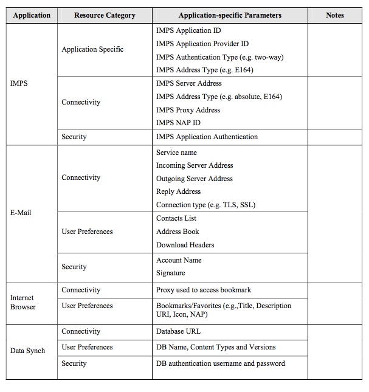

# 1.5 urces to be managed in the Device (Informative) 要在设备中管理的信息（资料性）

This section provides an overview of the resources which are candidates for being managed using the Device Management mechanism. Categories of parameters and the parameters themselves that are listed in association with a resource are informative only – they are meant to provide guidance, and are not an exhaustive list of required parameters for particular capabilities, applications, or other Device characteristics. 
本节概述了使用设备管理机制管理的资源。与资源相关联列出的参数类别和参数本身仅是信息性的 - 它们旨在提供指导，并且不是用于特定能力，应用或其他设备特性的所需参数的详尽列表。

There may be some special conditions or expectations around the presence, access, or manipulation of managed resources that should be taken into account when defining parameters and some of those conditions are noted here: 
围绕被管理资源的存在，访问或操作可能有的一些特殊条件或期望，在定义参数时应该考虑这些条件或期望，并且在这里注意到这些条件中的一些：

Note that not all resources may be available at a given time depending on a number of factors, such as the presence of accessories or permissions associated with a resource. For example, in Devices with a smart card, some parts of the resources managed in the Device may be specific to a certain IMSI, for example the username & password associated with a bearer. These shall only be active if the specified IMSI is inserted in the Device. 
注意，并非所有资源在给定时间都可用，这取决于多个因素，诸如与资源相关联的附件或许可的存在。例如，在具有智能卡的设备中，在设备中管理的资源的一部分可能特定于某个IMSI，例如与承载相关联的用户名和密码。只有在设备中插入指定的IMSI时，它们才会处于活动状态。

Time-sensitive resources shall be noted as such and their configurability specified such that it is possible to ascertain when such settings apply. For instance, some settings may have one or more time periods with distinct start and stop clock times. Other such settings may only be active for a period measured by cumulative use. 
对时间敏感的资源应该这样注意，指定其可配置性，确定何时应用这些设置。例如，一些设置只应用于一个或多个不同的时间段，它们拥有不同的开始和停止时间。其他此类设置只能在通过累计使用时间来决定是否处于活动状态。

For operationally critical resources it shall be possible to locally or remotely revert the handset back to using a previously working value of the resources, should the new settings fail (e.g. software defined radio). Critical resources should be supported by adequate fault management on or off the Device as appropriate. 
对于操作上关键的资源，如果新的设置失败（例如软件定义的无线电），则可以本地或远程地将手机恢复到使用该资源前的工作状态。关键资源的使用与否应通过适当的设备上的故障管理来支持。

Management data may be set originally by OMA bootstrap methods, then read and maintained via Device Management. Subsequent to booting, resources may be created, added, deleted, or modified in accordance with any implementation of Device Management or OA&M mechanisms. 
管理数据可以由OMA引导方法最初设置，然后通过设备管理读取和维护。在引导之后，可以根据设备管理或OA＆M机制的任何实现来创建，添加，删除或修改资源。

## 1.5.1 Applications Requiring Managed Resources 需要管理资源的应用程序
Following is a non-exhaustive list of common mobile applications that are expected to be supported by managed resources. The list of applications may be appended and special requirements pertaining to their managed resources may be noted in this section. However, the categories of managed resources presented in a subsequent section are intended to be applicable to the Applications listed here as well as additional applications that are added. The addition or modification of managed resource parameters should reference back to specific applications or use cases as presented in this document. The current list of Applications are: 
以下是预期受管资源支持的常见移动应用程序的非详尽列表。 该列表可以增加，并且其与管理资源有关的特殊要求在本节中可以注明。 但是，后续章节中提供的管理资源类别旨在适用于此处列出的应用程序以及添加的其他应用程序。 管理资源参数的添加或修改应参考本文档中介绍的特定应用程序或用例。 当前应用程序列表是：

* Multi-Media Messaging Service 多媒体消息
* E-mail 电子邮件
* Instant Messaging 即时消息
* Internet Browser 网络浏览器
* Device Synchronization 设备同步
* Device Management Agents 设备管理代理

## 1.5.2 Application and Service Resource Categories 应用程序和服务资源类别
The categories of Managed Resources required by some or all of these Applications are detailed in this section and are comprised of: 
这些部分或全部应用程序所需的管理资源类别在本节中详细介绍，包括：

* Connectivity 连接
* Device Physical 物理设备
* Security 安全
* Performance 性能
* Billing 计费
* User Preferences & Customization 用户首选项和自定义
* Other 其它

In the following tables the Default Actor “Management Authority” is abbreviated MA.  
在下面的表中，默认动作者“管理权限”缩写为MA。

Change Policy has generic settings as follows: 
更改策略具有如下的通用设置：

Without Authorization, implying no or weak authentication. Usually applies to User or Subscriber modifiable resources – abbreviated W/O A 
没有授权，意味着没有或较弱的身份验证。通常适用于用户或订户可修改的资源（缩写为W/O A）
  
With Authorization, implying data integrity required, authentication with cryptographic means. Usually associated with Network or Service Provider Management Authorities, Enterprise/IT Administrators, or other MA Delegates. – abbreviated W/A 
使用授权，意味着需要数据完整性，使用加密方法进行身份验证。通常与网络或服务提供商管理机构，企业/IT管理员或其他MA代表相关联。-缩写为W/A
  
Unknown (which may mean it’s ambiguous) – abbreviated Unk 
未知（这可能意味着它的模棱两可） -缩写Unk

### 1.5.2.1 Application Data Resources 应用数据资源
| Resource 资源 | Parameters 参数 | Default Actor 默认参与者| Change Policy (Easy, Hard, Unknown) 更改政策（简单，困难，未知） | Notes |
| -- | -- | -- | -- | -- |
| Device Management settings  设备管理设置 | TBD | MA | W/A |  |
| Data Synchronization settings  数据同步设置 | Application Service Access Point 应用程序服务访问点 Server Name 服务器名称 Access Point Link 接入点链路 Proxy Information Link 代理信息链接 | User, Subscriber 用户，订户 | W/O A |  |

### 1.5.2.2 Connectivity 连接性