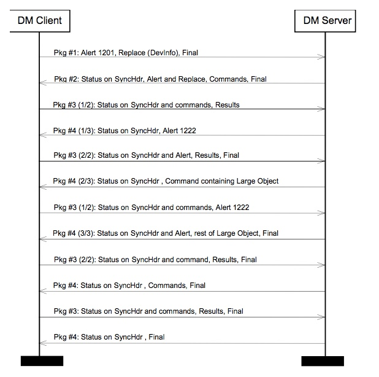

# 2.1 Multiple Messages In Package 包中的多个信息
## 2.1.1  Description 描述
The OMA Device Management protocol provides the functionality to transfer one SyncML package using multiple SyncML messages. This is necessary when one SyncML package is too large to be transferred in one SyncML message. For example, this limitation may be caused by the transport protocol or by the limitations of a small footprint device. 
OMA设备管理协议提供使用多个SyncML消息传输一个SyncML包的功能。当一个SyncML包太大而无法在一个SyncML消息中传输时，这是必需的。例如，这种限制可能由传输协议或小型脚印装置的限制引起。

In OMA Device Management, the role of the package as a logical grouping of items is very limited. Most restrictions occur on messages, not on packages. For example, a command must fit entirely into one message. This includes the Sequence and Atomic commands, each of which must fit entirely into one message. 
在OMA设备管理中，包作为项目的逻辑分组的作用非常有限。大多数限制发生在消息上，而不是在包上。例如，命令必须完全适合于一个消息。这包括序列和原子命令，每个命令必须完全适合一个消息。

In order to avoid overwhelming a client with limited resources, a server is not permitted to send new commands to a client that has not yet returned a status to previous commands. In other words, most messages sent by the server to the client will correspond to a (one message) package, except in the case where a server is sending a large object or asking for more messages (using Alert 1222). A package containing a large object datum will span as many messages as necessary to transmit the large object, as specified in Section 2.2. 
为了避免使用有限资源的客户端宕机，服务器不允许向尚未向先前命令返回状态的客户端发送新命令。换句话说，除了在服务器发送大对象或请求更多消息（使用警报1222）的情况下，服务器发送到客户端的大多数消息将对应于（一个消息）一个包。包含大对象数据的包将传输大对象所需的许多消息，如第2.2节中所述。

Note that the server is always in one of the following states with respect to package boundaries: 
请注意，对于包边界，服务器始终处于以下状态之一：
1. The server has sent a complete package. In this state, the server is awaiting status from the client on the commands sent in the package. Because the status and results may be large, such as the result of Get commands, the client may send multiple messages back to the server before completing its response. 
服务器已发送完整包。在这种状态下，服务器正在等待客户端对包发送的命令的状态。 因为状态和结果可能很大，例如Get命令的结果，所以客户端可以在完成其响应之前将多个消息发送回服务器。
2. The server has received a complete package (of responses) from the client. In this state, the server may send new commands to the client. 
服务器已经从客户端接收到完整的（响应）包。 在这种状态下，服务器可以向客户端发送新的命令。
3. The server has sent one or more messages that are part of the same package, but has not yet sent the final message of the current package. This state is only valid when the server is sending a large object, and the package will end when the last chunk of the large object is sent. 
服务器已发送一个或多个消息，这些消息是同一个包的一部分，但尚未发送当前包的最终消息。 此状态仅在服务器发送大对象时有效，并且包将在大对象的最后一个块发送时结束。

Because the underlying transports for SyncML have a request/response form, either the client or the server may be required to send a message that contains neither new commands nor a Final flag, in order to keep the request/response cycle going. 
由于SyncML的底层传输具有请求/响应形式，因此可能需要客户端或服务器发送既不包含新命令也不包含Final标志的消息，以便保持请求/响应周期。

For example, when the server is in State 1 (above), it may receive many messages from the client containing Status and Results. The server will respond to each such message sent by the client, but may not include new commands in those responses. Messages sent by the server in this state will contain a Status to the SyncHdr sent by the client and also the Alert 1222 (More Messages). Status MUST BE sent in response to Alert but MUST NOT be sent in response to Results. 
例如，当服务器处于状态1（如上所述）时，它可以从客户端接收包含状态和结果的许多消息。 服务器将响应由客户端发送的每个这样的消息，但可以不在这些响应中包括新的命令。 处于此状态的服务器发送的消息将包含客户端发送的SyncHdr的状态以及警报1222（更多消息）。 状态必须响应于警报发送，但绝不能发送响应结果。

It is also possible for Alert 1222 to be replaced by Alert 1223 (Session Abort) if the server wishes to abort the session. 
如果服务器希望中止会话，也可以用警报1223（会话中止）替换警报1222。

The following chart shows an example of how multiple messages can be used.
下图显示了如何使用多个消息的示例。

## 2.1.2  Requirements 需求
If a SyncML package is transferred in multiple SyncML messages, the last message in the package MUST include the Final element [REPPRO]. Other messages belonging to the package MUST NOT include the Final element. 
如果SyncML包在多个SyncML消息中传输，则包中的最后一个消息必须包含Final元素[REPPRO]。属于包的其他消息必须不包含Final元素。

The Final element MUST NOT be supplied by the client to close its package until the server has sent its Final element to close the previous package. For instance, the client MUST NOT supply the Final element to close package #2 or package #4 until the server has supplied the Final element which closes the previous package (#1 or #3, respectively). This is necessary because packages #2 and #4 constitute replies to the commands in packages #1 and #3. 
Final元素必须不由客户端提供以关闭其包，直到服务器发送其Final元素以关闭先前的包。例如，客户端不能提供Final元素来关闭包＃2或包＃4，直到服务器提供了关闭前一个包的Final元素（分别为＃1或＃3）。这是必要的，因为包＃2和＃4构成对包＃1和＃3中的命令的回复。

The recipient of a SyncML package containing multiple messages MUST be able to ask for more messages. This is done by sending an Alert command, with the alert code 1222, back to the sender. If there are SyncML commands to be sent as a response to a preceding message, i.e. Results, the Alert command with the 1222 alert code MAY be omitted. 
包含多个消息的SyncML包的接收者必须能够请求更多消息。这是通过将具有警报代码的1222的警报命令发送回发送者来完成的。如果存在要作为对前一个消息（即结果）的响应而发送的SyncML命令，则可以省略具有1222警报代码的Alert命令。

In the situation in which the server has sent the Final flag, and the client has not yet sent its Final flag, the server MUST respond to the client with the following "Next Message" response: 
在服务器已经发送Final标志并且客户机尚未发送其Final标志的情况下，服务器必须用下面的“下一消息”响应来响应客户机：

The "Next Message" response contains Alert code 1222 (or 1223 to abort), status to the SyncHdr, no other commands, and no Final flag. 
“下一条消息”响应包含警报代码1222（或中止1223），状态到SyncHdr，没有其他命令，没有Final标志。

A server MUST send the Final flag in every message, when possible. This is not possible during the sending of a Large Object (see Section 2.2), or when sending the "Next Message" response. 
如果可能，服务器必须在每个消息中发送Final标志。这在发送大对象（见第2.2节）或发送“下一条消息”响应时是不可能的。

