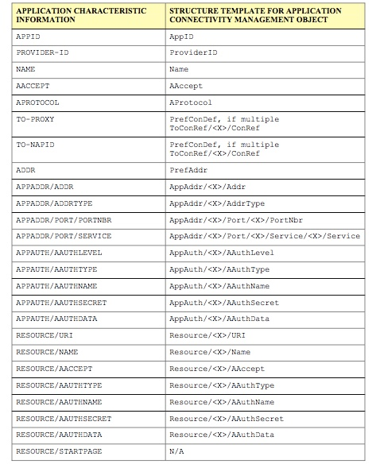

# Appendix 附录

## General Mapping 一般映射
In the below table the Provisioning Content APPLICATION characteristic correspondence is shown to the Structure Template for Application Connectivity Management Object. 
在下表中，向应用连接性管理对象的结构模板展示出了配置内容APPLICATION的特性对应。

左列：应用特征信息  右列：应用连接管理对象的结构模板

