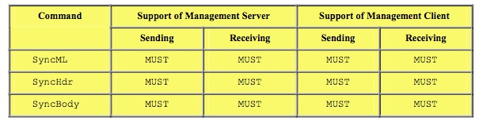
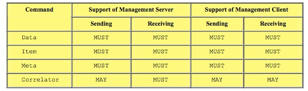
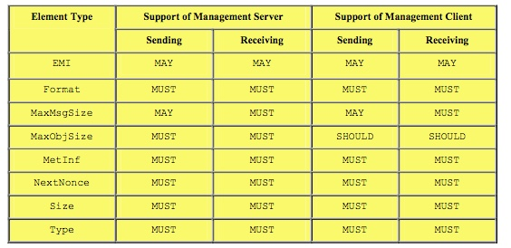
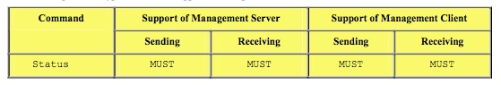
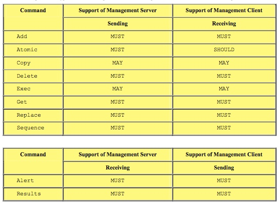

# 4.1 Mark-up Language Description 标记语言说明

Examples in this section make use of XML snippets. They are not intended to be complete XML documents. They are only provided to illustrate an example usage of the element type in question.<br/>
本节中的示例使用XML片段。它们不是要作为完整的XML文档。它们仅被提供来展示所讨论的元素类型的示例使用。

Restrictions listed in this document are in addition to the restrictions listed in [REPPRO].<br/>
本文档中列出的限制是除[REPPRO]中列出的限制外的限制。

## 4.1.1 Common Use Elements 常用元素
The following are common element types used by numerous other element types. The table lists the mandatory and optional elements that servers and clients send and receive.<br/>
以下是许多其他元素类型使用的常见元素类型。该表列出了服务器和客户端发送和接收的必需和可选元素。

### 4.1.1.1 Archive
Restrictions: This element is not used in OMA Device Management Protocol.<br/>
限制：此元素不在OMA设备管理协议中使用。

### 4.1.1.2 Chal
Restrictions: When using syncml:auth-md5 or syncml:auth-MAC, the Meta Format for the NextNonce element MUST be specified and it MUST be b64.<br/>
限制：当使用syncml：auth-md5或syncml：auth-MAC时，必须指定NextNonce元素的元格式，并且必须为b64。

Example: The following is an example of a "MD-5" authentication challenge. The password and userid are requested to be Base64 character encoded. The type and format of the authentication scheme are specified by the meta-information in the Meta element type.<br/>
示例：以下是“MD-5”身份验证质询的示例。请求对密码和用户标识进行Base64字符编码。认证方案的类型和格式由Meta元素类型中的元信息指定。
```
<Status>
  <MsgRef>0</MsgRef>
  <Cmd>SyncHdr</Cmd> 
  <TargetRef>http://www.datamgr.org/servlet/manageit</TargetRef> 
  <SourceRef>IMEI:001004FF1234567</SourceRef>
 *<Chal>*
    <Meta>
      <Type xmlns=’syncml:metinf’>syncml:auth-md5</Type>
      <Format xmlns=’syncml:metinf’>b64</Format>
      <NextNonce xmlns=’syncml:metinf’>ZG9iZWhhdmUNCg==</NextNonce>
    </Meta>
  *</Chal>*
  <Data>401</Data>
</Status>
```

### 4.1.1.3 cmd
Restrictions: No additional restrictions beyond those defined in [REPPRO].<br/>
限制：除了[REPPRO]中定义的限制外，没有其他限制。

Example: 示例
```
<Status>
  <MsgRef>1</MsgRef>
  <CmdRef>2</CmdRef>
  <CmdID>1234</CmdID>
 * <Cmd>*Replace*</Cmd>* 
  <TargetRef>./antivirus_data</TargetRef> 
  <!-- OK, antivirus update loaded--> 
  <Data>200</Data>
</Status>
```

### 4.1.1.4 CmdID
Restrictions: No additional restrictions beyond those defined in [REPPRO].<br/>
限制：除了[REPPRO]中定义的限制外，没有其他限制。

Example: 示例
```
<Status>
  <MsgRef>1</MsgRef>
  <CmdRef>2</CmdRef>
  *<CmdID>*1234*</CmdID>*
  <Cmd>Replace</Cmd> 
  <TargetRef>./antivirus_data</TargetRef> 
  <!-- OK, antivirus update loaded--> 
  <Data>200</Data>
</Status>
```

### 4.1.1.5 CmdRef
Restrictions: No additional restrictions beyond those defined in [REPPRO].<br/>
限制：除了[REPPRO]中定义的限制外，没有其他限制。

Example: 示例
```
<Status>
  <MsgRef>1</MsgRef>
  *<CmdRef>*2*</CmdRef>*
  <CmdID>1234</CmdID>
  <Cmd>Replace</Cmd> 
  <TargetRef>./antivirus_data</TargetRef> 
  <!-- OK, antivirus update loaded--> 
  <Data>200</Data>
</Status>
```
### 4.1.1.6 Cred
Restrictions: Same restriction defined in [REPPRO]. In addition, OMA DM restricts the usage of the Cred element to within the sync header element: SyncHdr. The originator MUST NOT supply credentials within individual commands. When using syncml:auth-md5, the Meta Format for the Cred element MUST be specified and it MUST be b64.<br/>
限制：在[REPPRO]中定义的限制相同。此外，OMA DM将Cred元素的使用限制在同步头元素：SyncHdr内。发起者必须不在单个命令中提供凭证。当使用syncml：auth-md5时，必须指定Cred元素的元格式，并且必须是b64。

Example: The following is an example of an MD5 digest authentication credential scheme consisting of the character string Bruce2: OhBehave: Nonce. The MD5 Digest is also Base64 character encoded. The type and format of the credential, as well as the next nonce are specified by the meta-information in the Meta element type.
示例：以下是由字符串Bruce2组成的MD5摘要认证凭证方案示例：OhBehave：Nonce MD5摘要也是Base64字符编码。凭证的类型和格式以及下一个nonce由Meta元素类型中的元信息指定。
```
*<Cred>*
  <Meta>
    <Type xmlns=’syncml:metinf’>syncml:auth-md5</Type> 
    <Format xmlns=’syncml:metinf’>b64</Format>
  </Meta>
  <Data>Zz6EivR3yeaaENcRN6lpAQ==</Data>
*</Cred>*
```
### 4.1.1.7 Final
Restrictions: No additional restrictions beyond those defined in [REPPRO].<br/>
限制：除了[REPPRO]中定义的限制外，没有其他限制。

Example: 示例
```
<SyncML xmlns=’SYNCML:SYNCML1.2’> <SyncHdr>
  </SyncHdr>...blah, blah...</SyncBody>
  ...blah, blah...
  *<Final/>*
  </SyncBody>
</SyncML>
```
### 4.1.1.8 Lang
Restrictions: This element is not used in OMA Device Management Protocol.<br/>
限制：此元素不在OMA设备管理协议中使用。

### 4.1.1.9 LocName
Restrictions: Used for sending userid for MD5 authentication.<br/>
限制：用于发送MD5认证的用户ID。

### 4.1.1.10 LocURI
Restrictions: No additional restrictions beyond those defined in [REPPRO].<br/>
限制：除了[REPPRO]中定义的限制外，没有其他限制。

Example: 示例
```
<SyncHdr>
  <VerDTD>1.2</VerDTD>
  <VerProto>DM/1.2</VerProto>
  <SessionID>1</SessionID>
  <MsgID>1</MsgID>
  <Target>
     *<LocURI>*http://www.syncml.org/mgmt-server*</LocURI>*
  </Target>
  <Source> 
     *<LocURI>*IMEI:493005100592800*</LocURI>*
  </Source>
</SyncHdr>
```
### 4.1.1.11 MoreData
Restrictions: No additional restrictions beyond those defined in [REPPRO].<br/>
限制：除了[REPPRO]中定义的限制外，没有其他限制。

Example: 示例
```
<Add>
  <CmdID>15</CmdID>
  <Meta>
    <Type xmlns=’syncml:metinf’>bin</Type> 
    <Format xmlns=’syncml:metinf’>b64</Format> 
    <Size xmlns=’syncml:metinf’>3000</Size>
  </Meta>
  <Item>
     <Target>
       <LocURI>./</LocURI>
     </Target>
     <Data>
       <!-- First chunk of data file -->
     </Data>
     *<MoreData/>*
  </Item>
</Add>
```
### 4.1.1.12 MsgID
Restrictions: No additional restrictions beyond those defined in [REPPRO].<br/>
限制：除了[REPPRO]中定义的限制外，没有其他限制。

Example: 示例
```
<SyncHdr>
  <VerDTD>1.2</VerDTD>
  <VerProto>DM/1.2</VerProto> 
  <SessionID>1</SessionID> 
  *<MsgID>*1*</MsgID>*
  <Target>
      <LocURI>http://www.syncml.org/mgmt-server</LocURI> 
  </Target>
  <Source> 
      <LocURI>IMEI:493005100592800</LocURI>
  </Source>
</SyncHdr>
```
### 4.1.1.13 MsgRef
Restrictions: No additional restrictions beyond those defined in [REPPRO].<br/>
限制：除了[REPPRO]中定义的限制外，没有其他限制。

Example: 示例
```
<Status>
  *<MsgRef>*1*</MsgRef>*
  <CmdRef>2</CmdRef>
  <CmdID>1234</CmdID>
  <Cmd>Replace</Cmd> 
  <TargetRef>./antivirus_data</TargetRef> 
  <!-- OK, antivirus update loaded--> 
  <Data>200</Data>
</Status>
```
### 4.1.1.14 NoResp
Restrictions: This element is not used in OMA Device Management Protocol.<br/>
限制：此元素不在OMA设备管理协议中使用。
### 4.1.1.15 NoResults
Restrictions: This element is not used in OMA Device Management Protocol.<br/>
限制：此元素不在OMA设备管理协议中使用。
### 4.1.1.16 NumberOfChanges
Restrictions: This element is not used in OMA Device Management Protocol.<br/>
限制：此元素不在OMA设备管理协议中使用。
### 4.1.1.17 RespURI
Restrictions: No additional restrictions beyond those defined in [REPPRO].<br/>
限制：除了[REPPRO]中定义的限制外，没有其他限制。

Example: 示例
```
<SyncHdr>
  <VerDTD>1.2</VerDTD>
  <VerProto>DM/1.2</VerProto>
  <SessionID>1</SessionID>
  <MsgID>1</MsgID>
  <Target>
     <LocURI>http://www.syncml.org/mgmt-server</LocURI> 
  </Target>
  <Source> 
     <LocURI>IMEI:493005100592800</LocURI>
  </Source>
  *<RespURI>*http://www.deviceman.org/servlet/manageit/bruce1?user=jsmith&af ter=20000512T133000Z*</RespURI>*
</SyncHdr>
```
### 4.1.1.18 SessionID
Restrictions: No additional restrictions beyond those defined in [REPPRO].<br/>
限制：除了[REPPRO]中定义的限制外，没有其他限制。

Example: 示例
```
<SyncML xmlns=’SYNCML:SYNCML1.2’ >
  <SyncHdr>
    <VerDTD>1.2</VerDTD> 
    <VerProto>DM/1.2</VerProto> 
    <SessionID>1</SessionID> 
    <MsgID>1</MsgID>
    <Target> 
        <LocURI>http://www.syncml.org/mgmt-server</LocURI>
    </Target>
    <Source>
        <LocURI>IMEI:493005100592800</LocURI> 
    </Source>
  </SyncHdr>
  <SyncBody>
     ...blah, blah...
  </SyncBody>
</SyncML>
```
### 4.1.1.19 SftDel
Restrictions: This element is not used in OMA Device Management Protocol.<br/>
限制：此元素不在OMA设备管理协议中使用。

### 4.1.1.20 Source
Restrictions: No additional restrictions beyond those defined in [REPPRO].<br/>
限制：除了[REPPRO]中定义的限制外，没有其他限制。

Example: 示例
```
<SyncHdr>
  <VerDTD>1.2</VerDTD>
  <VerProto>DM/1.2</VerProto>
  <SessionID>1</SessionID>
  <MsgID>1</MsgID>
  <Target>
    <LocURI>http://www.syncml.org/mgmt-server</LocURI> 
  </Target>
 *<Source>*
    <LocURI>IMEI:493005100592800</LocURI>
 *</Source>*
</SyncHdr>
```
### 4.1.1.21 SourceRef
Restrictions: No additional restrictions beyond those defined in [REPPRO].<br/>
限制：除了[REPPRO]中定义的限制外，没有其他限制。

Example: 示例
```
<Status>
  <CmdID>4321</CmdID>
  <MsgRef>1</MsgRef>
  <CmdRef>1234</CmdRef>
  <Cmd>Copy</Cmd> 
  <TargetRef>./DM/WAPSetting/1</TargetRef> 
  *<SourceRef>*./Common/WAP/1*</SourceRef> *
  <Data>200</Data>
</Status>
```
### 4.1.1.22 Target
Restrictions: No additional restrictions beyond those defined in [REPPRO].<br/>
限制：除了[REPPRO]中定义的限制外，没有其他限制。

Example: The following is an example of the usage in a SyncHdr element type.<br/>
示例：以下是SyncHdr元素类型中的用法示例。
```
<SyncHdr> 
  <VerDTD>1.2</VerDTD> 
  <VerProto>DM/1.2</VerProto> 
  <SessionID>1</SessionID> 
  <MsgID>1</MsgID>
  *<Target>*
    <LocURI>http://www.syncml.org/mgmt-server</LocURI>
  *</Target>*
  <Source> 
    <LocURI>IMEI:493005100592800</LocURI>
  </Source>
</SyncHdr>
```

### 4.1.1.23 TargetRef
Restrictions: No additional restrictions beyond those defined in [REPPRO].<br/>
限制：除了[REPPRO]中定义的限制外，没有其他限制。

Example: 示例
```
<Status>
  <CmdID>4321</CmdID>
  <MsgRef>1</MsgRef>
  <CmdRef>1234</CmdRef>
  <Cmd>Copy</Cmd> 
  *<TargetRef>*./DM/WAPSetting/1*</TargetRef>*
  <SourceRef>./Common/WAP/1</SourceRef> 
  <Data>200</Data>
</Status>
```

### 4.1.1.24 VerDTD
Restrictions: No additional restrictions beyond those defined in [REPPRO].<br/>
限制：除了[REPPRO]中定义的限制外，没有其他限制。

Example: 示例
```
<SyncHdr>
  *<VerDTD>1.2</VerDTD>*
  <VerProto>DM/1.2</VerProto>
  <SessionID>1</SessionID>
  <MsgID>1</MsgID>
  <Target>
     <LocURI>http://www.syncml.org/mgmt-server</LocURI> 
  </Target>
  <Source> 
      <LocURI>IMEI:493005100592800</LocURI>
  </Source>
</SyncHdr>
```
### 4.1.1.25 VerProto
Restrictions: Major revisions of the specification create incompatible changes that may require a new management client. Minor revisions involve changes that do not impact basic compatibility of existing management clients.<br/>
限制：规范的主要修订版会导致不兼容的更改，可能需要新的管理客户端。次要修订涉及的更高不影响现有管理客户端的基本兼容性。

When the DM message conforms to this revision of the OMA Device Management protocol specification the value MUST be 'DM/1.2’.
当DM消息符合OMA设备管理协议规范的此修订版时，值必须是“DM/1.2”。

```
<SyncHdr>
  <VerDTD>1.2</VerDTD> 
  *<VerProto>*DM/1.2*</VerProto> *
  <SessionID>1</SessionID> 
  <MsgID>1</MsgID>
  <Target>
    <LocURI>http://www.syncml.org/mgmt-server</LocURI> 
  </Target>
  <Source> 
    <LocURI>IMEI:493005100592800</LocURI>
  </Source> 
</SyncHdr>
```

## 4.1.2 Message Container Elements 消息容器元素
The following element types provide the basic container support for the DM message.<br/>
以下元素类型为DM消息提供了基本的容器支持。


## 4.1.2.1 SyncML
Restrictions: Within transports that support MIME content-type identification, this object MUST be identified as
application/vnd.syncml.dm+xml (for clear-text, XML representation) or
application/vnd.syncml.dm+wbxml (for binary, WBXML representation).<br/>
限制：在支持MIME内容类型标识的传输中，此对象必须标识为application/vnd.syncml.dm +xml（对于明文，XML表示）或 application/vnd.syncml.dm+wbxml（用于二进制，WBXML表示)。

Example: 示例
```
*<SyncML xmlns=’SYNCML:SYNCML1.2’>* 
  <SyncHdr>
     <VerDTD>1.2</VerDTD>
     <VerProto>DM/1.2</VerProto>
     <SessionID>1</SessionID>
       <MsgID>1</MsgID>
     <Target>
        <LocURI>http://www.syncml.org/mgmt-server</LocURI> 
     </Target>
     <Source> 
        <LocURI>IMEI:493005100592800</LocURI>
     </Source>
  </SyncHdr>
  <SyncBody>
     ...blah, blah...
  </SyncBody>
*</SyncML>*
```

### 4.1.2.2 SyncHdr
Restrictions: No additional restrictions beyond those defined in [REPPRO].<br/>
限制：除了[REPPRO]中定义的限制外，没有其他限制。

Example: 示例
``` 
<SyncML xmlns=’SYNCML:SYNCML1.2’>
  *<SyncHdr>*
     <VerDTD>1.2</VerDTD>
     <VerProto>DM/1.2</VerProto>
     <SessionID>1</SessionID>
     <MsgID>1</MsgID>
     <Target>
        <LocURI>http://www.syncml.org/mgmt-server</LocURI> 
     </Target>
     <Source> 
        <LocURI>IMEI:493005100592800</LocURI>
     </Source>
  *</SyncHdr>*
  <SyncBody>
     ...blah, blah...
  </SyncBody>
</SyncML>
```

### 4.1.2.3 SyncBody
Restrictions: No additional restrictions beyond those defined in [REPPRO].<br/>
限制：除了[REPPRO]中定义的限制外，没有其他限制。

Example: 示例
```
<SyncML xmlns=’SYNCML:SYNCML1.2’>
  <SyncHdr>
      ...blah, blah... 
  </SyncHdr> 
  *<SyncBody>*
     <Status>
       <MsgRef>2</MsgRef>
       <CmdID>1</CmdID>
       <CmdRef>0</CmdRef>
       <Cmd>SyncHdr</Cmd>
       <Data>200</Data>
     </Status>
     <Alert>
     <CmdID>2</CmdID>
     <Data>1100</Data> <!—- User displayable notification --> 
     <Item></Item>
     <Item>
        <Data>Your antivirus software is being updated.</Data> 
     </Item>
     </Alert>
     <Get>
       <CmdID>3</CmdID>
       <Item>
       <Target> 
         <LocURI>./antivirus_data/version</LocURI>
         </Target>
       </Item>
    </Get>
  <Final/>
  *</SyncBody>*
</SyncML>
```

## 4.1.3 Data Description Elements 数据描述元素
The following element types are used as data description elements for data exchanged in a DM Message.<br/>
以下元素类型被用作DM消息中交换的数据的数据描述元素。

### 4.1.3.1 Data
Restrictions: It is REQUIRED that either the mark-up characters of the Data element content are properly escaped according to [XML] specification rules or that the CDATA sections are used.<br/>
限制：要求根据[XML]规范规则正确转义Data元素内容的标记字符，或者使用CDATA节。

Example: 示例
```
<Item> 
  *<Data>*MINDT=10*</Data>*
</Item> 
```
### 4.1.3.2 Item
Restrictions: When an Item contains information for a managed node, and the meta format is not null, the Data element MUST be specified.<br/>
限制：当项目包含受管节点的信息，并且元格式不为空时，必须指定Data元素。

Example: 示例
```
*<Item>* 
  <Data>MINDT=10</Data>
*</Item>* 
```

### 4.1.3.3 Meta
Restrictions: No additional restrictions beyond those defined in [REPPRO].<br/>
限制：除了[REPPRO]中定义的限制外，没有其他限制。

Example: 示例
```
<Cred>
  *<Meta>*
    <Type xmlns=’syncml:metinf’>syncml:auth-md5</Type>
    <Format xmlns=’syncml:metinf’>b64</Format>
  *</Meta>*
  <Data>Zz6EivR3yeaaENcRN6lpAQ==</Data>
<Cred>
```

### 4.1.3.4 Correlator
Restrictions: No additional restrictions beyond those defined in [REPPRO].<br/>
限制：除了[REPPRO]中定义的限制外，没有其他限制。

Example: 示例
```
*<Correlator>*
    abc1234
*</Correlator>*
```

## 4.1.4 Meta Information Elements 元信息元素
The following specifies the SyncML Common Meta-Information [META] element types that are used in DM protocol. Use of the elements not listed in this table is implementation specific decision and is not defined by this specification.<br/>
以下指定在DM协议中使用的SyncML常见元信息[META]元素类型。使用本表中未列出的元素是用于实现特定的决定，并且本规范没有定义。

## 4.1.5 Protocol Management Elements 协议管理元素
The following element types are used to support the DM protocol.<br/>
以下元素类型用于支持DM协议。

### 4.1.5.1 Status
Restrictions: A Status command MUST NOT be sent in response to a Results command if the Status code is 200 otherwise a Status command MUST be sent. In the case of sending or receiving a large object, Alert 1222 (More Messages) MUST be used to continue the message exchange.<br/>

限制：如果状态码为200，则必须不发送Status命令以响应Results命令，否则必须发送Status命令。 在发送或接收大对象的情况下，必须使用警报1222（更多消息）来继续消息交换。

Example: 示例
```
*<Status>*
  <MsgRef>2</MsgRef>
  <CmdID>1</CmdID>
  <CmdRef>0</CmdRef>
  <Cmd>SyncHdr</Cmd>
  <Data>200</Data> 
*</Status>*
```
## 4.1.6 Protocol Command Elements 协议命令元素
The following element types are used to represent device management commands in a DM Message.<br/>
以下元素类型用于表示DM消息中的设备管理命令。

### 4.1.6.1 Add
Restrictions: Add creates a new node and returns error if there is an existing node, is not allowed to create node at the Add target URI, or if the specified URI cannot be resolved.<br/>
限制：如果存在现有节点，或不允许在Add目标URI创建节点，或指定的URI无法解析，则Add一个新节点时会返回错误。

Nodes MUST be added as children of existing interior nodes. The root (.) interior node MUST exist, device manufacturers MAY provide additional existing leaf or interior nodes.<br/>
节点必须作为现有内部节点的子节点添加。 根（.）内部节点必须存在，设备制造商可以提供附加的现有叶或内部节点。

If any parent interior node along the path of the Target LocURI doesn’t exist, the device MAY add it implicitly. When adding interior nodes implicitly, the ACLs of the implicitly created nodes SHALL be empty, e.g. `<Data/>`, to allow each such node to inherit the ACL from its parent node. However the exception to this rule, as specified in [DMTND] §7.7.1.1 SHALL apply to implicitly added nodes: If a server is adding an interior node and does not have Replace access rights on the parent of the new node then the device MUST automatically set the ACL of the new node so that the creating server has Add, Delete and Replace rights on the new node.<br/>
如果沿着目标LocURI的路径的任何父内部节点不存在，则设备可以隐式地添加它。当隐式地添加内部节点时，隐式创建的节点的ACL必须为空。如`<Data/>`，以允许每个此类节点从其父节点继承ACL。但是，如[DMTND]§7.7.1.1中规定的，此规则的例外必须适用于隐式添加的节点：如果服务器添加内部节点，并且没有对新节点的父节点具有Replace访问权限，则设备必须自动设置新节点的ACL，以便创建服务器在新节点上具有添加，删除和替换权限。

In case the Add operation fails because the device fails to implicitly add a missing interior node, the status code SHOULD be the same as if the device had tried to add the interior node explicitly. Additionally, the returned Status element in such a failure case SHOULD include an Item element. The Item element, if present, MUST contain a Target element which includes the LocURI of the interior node that the device failed to add.<br/>
如果因为设备无法隐式添加一个缺少的内部节点而导致Add操作失败，则推荐使状态代码与设备尝试显式添加内部节点时相同。此外，推荐这种故障情况下返回的Status元素应包含一个Item元素。Item元素（如果存在）必须包含目标元素，其包括设备未能添加的内部节点的LocURI。

If the MIME-Type is as defined in [DMTNDS] then multiple nodes MAY be created with one Add command. Client MUST send status code 415, “Unsupported media type or format”, if the device does not support DMTNDS objects. The device can only report one status for all created nodes if the DMTNDS object contains multiple nodes. If the creation of any nodes from the DMTNDS object fails then the client MUST return the same error status code as if that failure node was created with a normal Add command and the devices Management Tree SHOULD not be changed as result of this operation. ACL values MAY be included in the DMTNDS object and these values MUST follow the rules specified in [DMTND] §7.7.1.<br/>
如果MIME类型是在[DMTNDS]中定义的，则可以使用一个Add命令创建多个节点。如果设备不支持DMTNDS对象，客户端必须发送状态码415，“Unsupported media type or format”。 如果DMTNDS对象包含多个节点，则设备只能报告所有已创建节点的一个状态。 如果从DMTNDS对象创建任何节点失败，那么客户端必须返回就像使用正常的Add命令创建失败节点一样的错误状态代码，并且推荐设备管理树不因为这个操作而改变。ACL值可以包括在DMTNDS对象中，并且这些值必须遵循[DMTND]§7.7.1中指定的规则。

Paths in DMTNDS objects are interpreted relative to the target URI in the Add command.<br/>
DMTNDS对象中的路径相对于Add命令中的目标URI进行解释。

The mandatory CmdID element type specifies the message-unique identifier for the command.<br/>
强制CmdID元素类型指定命令的消息唯一标识符。

The Cred element MUST NOT be used at command level.<br/>
Cred元素必须不在命令级别使用。

Meta element type specifies meta-information to be used for the command. Specifying the node type in the meta-information is REQUIRED as specified in [DMTND]. For example, the common media type or format for all the items can be specified. The scope of the meta-information is limited to the command. The Size meta element MAY be used to notify the recipient about the size of the data item being added.<br/>
Meta元素类型指定要用于命令的元信息。在元信息中指定节点类型是[DMTND]中指定的必须的。 例如，可以指定所有项目的通用介质类型或格式。元信息的范围限于命令。Size元素可以用于通知收件人要添加的数据项的大小。

One or more Item element types MUST be specified. The Item element type specifies the data items to be transferred to the recipient. The Target specified within the Item element type MUST be a full device URI.<br/>
必须指定一个或多个Item元素类型。Item元素类型指定要传输到收件人的数据项。在Item元素类型中指定的Target必须是完整的设备URI。

The command MUST return a valid status code as defined in [REPPRO], Status codes listed here are for implementation guidance only:<br/>
命令必须返回[REPAIR]中定义的有效状态代码，此处列出的状态代码仅供实施指导：

| Status code 状态码 | Meaning 含义 |
| -- | -- |
| (200) OK | The command accessed leaf node and it completed successfully.<br/> 该命令访问了叶节点，并成功完成。 |
| (213) Chunked item accepted | Chunked item accepted and buffered <br/> 分块项目被接受和缓冲|
| (215) Not executed | Command was not executed, as a result of user interaction and user chose to abort or cancel.<br/> 命令未执行，由于用户交互，用户选择中止或取消。 |
| (216) Atomic roll back OK | Command was inside Atomic element and Atomic failed. This command was rolled back successfully.<br/> 命令在原子元素内，原子失败。此命令已成功回滚。 |
| (401) Unauthorized | The originator's authentication credentials specify a principal with insufficient rights to complete the command.<br/> 发起方的身份验证凭据指定了具有完全命令权限不足的主体。 |
| (404) Not Found | The specified data item doesn't exist on the recipient. This may also imply that the stated URI for the location of the new management object cannot be resolved.<br/> 指定的数据项不存在于收件人。这还可能意味着无法解析所述新管理对象的位置的URI。 |
| (405) Command not allowed | Command not allowed.The requested command is not allowed on the target.<br/> 命令不允许。目标不允许请求的命令。 |
| (407) Authentication required | No authentication credentials were specified. A suitable challenge can also be returned.<br/> 未指定验证凭证。也可以返回合适的质询。 |
| (413) Request entity too large | The data item to be transferred is too large (e.g., there are restrictions on the size of data items transferred to the recipient). <br/> 要传送的数据项过大（例如，对传送到接收方的数据项的大小有限制）。|
| (414) URI too long | URI in command is too long. Either string presenting URI or segment in URI is too long or URI has too many segments.<br/>命令中的URI太长。在URI中显示URI或段的字符串太长，或者URI的段太多。 |
| (415) Unsupported media type or format | The media type or format for the data item is not supported by the recipient.<br/> 收件人不支持数据项的介质类型或格式。 |
| (418) Already exists | The requested Add command failed because the target already exists.<br/> 请求的Add命令失败，因为目标已存在。 |
| (420) Device full | The recipient device storage is full. <br/> 接收方设备存储已满。 |
| (424) Size mismatch | The chunked object was received, but the size of the received object did not match the size declared within the first chunk.<br/> 接收到分块对象，但接收的对象的大小与第一个块中声明的大小不匹配。 |
| (425) Permission denied | The server does not have the proper ACL permissions.<br/> 服务器没有正确的ACL权限。 |
| (500) Command failed | Non-specific errors created by the recipient while attempting to complete the command.<br/> 尝试完成命令时接收者发生的非特定错误。|
| (516) Atomic roll back failed | Command was inside Atomic element and Atomic failed. This command was not rolled back successfully. Server should take action to try to recover client back into original state. <br/> 命令在原子元素内，原子失败。此命令未成功回滚。服务器应采取措施尝试恢复客户端回到原始状态。|

Example: 范例
```
*<Add>*
  <CmdID>2</CmdID>
  <Meta>
    <Format xmlns="syncml:metinf">b64</Format> 
    <Type xmlns="syncml:metinf">
          application/antivirus-inc.virusdef 
    </Type>
  </Meta>
  <Item>
  <Meta>
    <Size xmlns='syncml:metinf'>37214</Size>
  </Meta> 
  <Target><LocURI>./antivirus_data</LocURI></Target>
  <Data>
       <!—Base64-coded antivirus file -->
     </Data>
  </Item>
*</Add>*
```
### 4.1.6.2 Alert
Restrictions: The Alert command is specifically used to convey notifications, such as device management session requests, to the recipient. For example, a mobile device will use this command to initiate a "client-initiated, management session" with a network server. The mandatory CmdID element type specifies the message-unique identifier for the command.<br/>
限制：Alert命令专门用于向接收方传送通知，如设备管理会话请求。例如，移动设备将使用该命令来发起与网络服务器的“客户端发起的管理会话”。强制CmdID元素类型指定命令的消息唯一标识符。

The Cred element MUST NOT be used at command level.<br/>
Cred元素必须不在命令级别使用。

The Data element type MUST be used to specify the type of alert.<br/>
Data元素类型必须用于指定的警报类型。

The Correlator element type MUST be identical to the Correlator value of an Exec command if the alert is sent as an asynchronous response to that Exec command.<br/>
如果警报作为异步响应发送到该Exec命令，则Correlator元素类型必须与Exec命令的Correlator值相同。

Optionally, one or more Item element types MAY be specified. For example, Alert 1224, which is used to send client event information to a server, requires the use of one or more Item elements. Each Item conveys an independent event. Each Item MUST contain a Meta element indicating the Type and Format of the event data.<br/>
可选地，可以指定一个或多个Item元素类型。例如，用于向服务器发送客户端事件信息的警报1224需要使用一个或多个Item元素。每个项目传达独立事件。每个项必须包含指示事件数据的类型和格式的Meta元素。

Currently, any valid DM Type and Format (e.g. “text/plain” and “xml”, respectively) are allowed.<br/>
目前，允许任何有效的DM类型和格式（例如，分别为“text/plain”和“xml”）。

A server MUST send back status 200 (Ok) when it is capable of processing the Data in the Alert.A server MUST send back status 406 (Optional Feature Not Supported)when it is not able to process the Data in the Alert.<br/>
当服务器能够处理警报中的数据时，服务器必须发送回状态200（Ok）。当服务器不能在警报中处理数据时，服务器必须发送回状态406（Optional Feature Not Supported）。

The Item element type specifies parameters for the Alert command. The command returns one of the following status
codes.<br/>
Item元素类型指定Alert命令的参数。该命令返回以下状态代码之一。

The command MUST return a valid status code as defined in [REPPRO], Status codes listed here are for implementation guidance only:<br/>
命令必须返回[REPAIR]中定义的有效状态代码，此处列出的状态代码仅供实施指导：

| Status code 状态码 | Meaning 含义 |
| -- | -- |
| (200) OK | The command and the associated Alert action are completed successfully.<br/> 命令和相关联的警报操作已成功完成。 |
| (202) Accepted for processing| The command was accepted successfully, but the Alert action has not yet been executed successfully. A subsequent exception condition can be created to relate the eventual completion status of the associated Alert action.<br/> 该命令已成功接受，但警报操作尚未成功执行。可以创建后续异常条件以关联相关的警报操作的最终完成状态。|
| (214) Operation Cancelled | The user cancelled the user interaction Alert. <br/> 用户取消了用户交互报警。|
| (215) Not executed | Command was not executed, as a result of user interaction and user chose to abort or cancel.<br/> 命令未执行，由于用户交互，用户选择中止或取消。 |
| (216) Atomic roll back OK | Command was inside Atomic element and Atomic failed. This command was rolled back successfully.<br/> 命令在原子元素内，原子失败。此命令已成功回滚。 |
| (401) Unauthorized | The originator's authentication credentials specify a principal with insufficient rights to complete the command.<br/> 发起方的身份验证凭据指定了具有完全命令权限不足的主体。 |
| (405) Command not allowed | The device management protocol does not allow the Alert command to be specified at within the current DM package.<br/> 设备管理协议不允许在当前DM包内指定报警命令。 |
| (406) Optional feature not supported | The specified Alert command is not supported by the recipient. <br/> 收件人不支持指定的报警命令。|
| (408) Request timeout | The user didn't respond to the user interaction Alert within the timeout period.<br/> 用户在超时期限内没有响应用户交互警报。 |
| (412) Incomplete command | The Alert command didn’t include all the correct parameters in the Item element type.<br/>Alert命令未包含Item元素类型中的所有正确参数。 |
| (415) Unsupported media type or format | The media type or format for the data item is not supported by the recipient.<br/> 收件人不支持数据项的介质类型或格式。 |
| (416) Requested range not satisfiable | The client is not able to display the user interaction Alert because of a device limitation (like too long choice).<br/> 由于设备限制（如过长的选择），客户端无法显示用户交互提醒。|
| (500) Command failed | Non-specific errors created by the recipient while attempting to complete the command.<br/> 尝试完成命令时接收者发生的非特定错误。|
| (516) Atomic roll back failed | Command was inside Atomic element and Atomic failed. This command was not rolled back successfully. Server should take action to try to recover client back into original state. <br/> 命令在原子元素内，原子失败。此命令未成功回滚。服务器应采取措施尝试恢复客户端回到原始状态。|
See alert codes in Section 4.2 of this document.<br/>
请参阅本文档第4.2节中的警报代码。

Example: 范例
```
*<Alert>*
  <CmdID>2</CmdID>
  <Data>1200</Data> <!-- Server-initiated session -->
*</Alert>*
``` 

### 4.1.6.3 Atomic
Restrictions: The set of commands inside Atomic MUST be processed in the same way as commands inside Sequence (as described in Section 4.1.6.14, below), with all subordinate commands to be executed as a set or not at all.<br/>
Atomic中的命令集必须以与Sequence中的命令相同的方式处理（如下面的第4.1.6.14节所述），所有下级命令都将作为集合执行或根本不执行。

If a client can execute all the atomic commands together (and thus guarantee the result) then a client MAY split the responses up over multiple messages.<br/>
如果客户端可以一起执行所有的原子命令（从而保证结果），则客户端可以将响应拆分成多个消息。

If a client cannot execute all the atomic commands together (and thus cannot guarantee the results of commands not executed) and status responses would go into multiple messages, then the Atomic command MUST fail with status code 517 - Atomic response too large to fit in message. Previously executed commands in Atomic command MUST be rolled back.<br/>
如果客户端不能一起执行所有的原子命令（因此不能保证未执行的命令的结果），并且状态响应将进入多个消息，那么原子命令必须失败，并发送状态代码517 - 原子响应太大而不适合消息。原子命令中以前执行的命令必须回滚。

If a command within an atomic fails, the failure response code MUST be returned.<br/>
如果原子中的命令失败，则必须返回失败响应代码。

The mandatory CmdID element type specifies the message-unique identifier for the command.<br/>
强制CmdID元素类型指定命令的消息唯一标识符。

The remainder of the command consists of one or more Add, Alert, Delete, Copy, or Replace commands that are the scope of the Atomic functionality.
命令的其余部分包含一个或多个作为Atomic功能范围的Add，Alert，Delete，Copy或Replace命令。

Nested Atomic commands and Get commands are not legal. A nested Atomic command or Get command will generate an error(500) Command failed.<br/>
嵌套原子命令和Get命令不合法。嵌套的Atomic命令或Get命令将生成错误（500）Command failed。

The command MUST return a valid status code as defined in [REPPRO], Status codes listed here are for implementation guidance only:<br/>
命令必须返回如[REPPRO]中定义的有效状态代码，此处列出的状态代码仅供实施指导：

| Status code 状态码 | Meaning 含义 |
| -- | -- |
| (200) OK | The command and the associated Alert action are completed successfully.<br/> 命令和相关联的警报操作已成功完成。 |
| (215) Not executed | Command was not executed, as a result of user interaction and user chose to abort or cancel.<br/> 命令未执行，由于用户交互，用户选择中止或取消。 |
| (401) Unauthorized | The originator's authentication credentials specify a principal with insufficient rights to complete the command.<br/> 发起方的身份验证凭据指定了具有完全命令权限不足的主体。 |
| (406) Optional feature not supported | The specified Atomic command is not supported by the recipient. <br/> 收件人不支持指定的Atomic命令。|
| (407) Authentication required | No authentication credentials were specified. A suitable challenge can also be returned.<br/> 未指定验证凭证。也可以返回合适的质询。 |
| (500) Command failed | Nested Atomic command was detected.<br/> 检测到嵌套Atomic命令。|
| (507) Atomic failed | Error occurs while performing an individual command specified in an Atomic element type.<br/> 执行Atomic元素类型中指定的单个命令时发生错误。|
| (517) Atomic Response too large to fit. | The response to an atomic command was too large to fit in a single message. <br/> 对原子命令的响应太大，无法适应单个消息。|

Example: 范例
```
*<Atomic>*
  <CmdID>42</CmdID>
  <Alert>
     <!—User confirmation -->
  </Alert>
  <Replace>
     ... blah, blah ...
  </Replace>
*</Atomic>*
```
### 4.1.6.4 Copy
Restrictions: Implementation MUST treat the data of the copy and the data of the original independently after the copy is complete. It is implementation dependent when a physical copy of the item is made in the recipient.<br/>
限制：实施必须在复制完成后独立处理副本的数据和原始数据。当在接收者中创建项目的物理副本时，它是实现相关的。

The Copy command in this version of the specification is NOT intended to be used to attempt to change the media type of a data item, compress the data item or otherwise transform a target data item. It is intended to provide a facility for duplicating or moving data (as can be obtained by using Copy followed by a Delete of the original) on the client without having to send this data to a server and back to achieve the same effect.<br/>
此版本的规范中的“复制”命令不用于尝试更改数据项的媒体类型，压缩数据项或以其他方式转换目标数据项。它旨在提供用于在客户端上复制或移动数据（如可以通过使用复制然后删除原件而获得）的设施，而不必将该数据发送到服务器并返回以实现相同的效果。

The mandatory CmdID element type specifies the message-unique identifier for the command. The Cred element MUST NOT be used at command level.<br/>
强制CmdID元素类型指定命令的消息唯一标识符。Cred元素必须不能在命令级别使用。

The optional Meta element type specifies meta-information to be used for the command. For example, the common media type or format for all the items can be specified. The scope of the meta-information is limited to the command.<br/>
可选的Meta元素类型指定要用于命令的元信息。例如，可以指定所有项目的通用介质类型或格式。元信息的范围限于命令。

One or more Item element types MUST be specified. The Item element type specifies the data item to be copied on the recipient's management tree. Copy MUST be specified within an Atomic, Sequence or SyncBody element type and the Target and Source specified within the Item element type in the Copy command MUST be a full device URI.<br/>
必须指定一个或多个Item元素类型。Item元素类型指定要在接收者的管理树上复制的数据项。复制必须在Atomic，Sequence或SyncBody元素类型中指定，并且Copy命令中的Item元素类型中指定的Target和Source必须是完整的设备URI。

In this version, the source and the destination nodes MUST be both leaf nodes. Assuming both nodes are leaves, the value of the source node overwrites the value of the target node. If the Copy command cannot be executed because the target node can not be over written with the value of the source node for reasons other than access control rights, (403) Forbidden status MUST be sent back.
在此版本中，源节点和目标节点必须都是叶节点。假设两个节点都是叶节点，则源节点的值将覆盖目标节点的值。如果因为目标节点由于访问控制权之外的其他原因而无法用源节点的值重写导致无法执行复制命令，必须返回（403）Forbidden状态。

The command MUST return a valid status code as defined in [REPPRO], Status codes listed here are for implementation guidance only:<br/>
命令必须返回[REPAIR]中定义的有效状态代码，此处列出的状态代码仅供实施指导：

| Status code 状态码 | Meaning 含义 |
| -- | -- |
| (200) OK | The command and the associated Alert action are completed successfully.<br/> 命令和相关联的警报操作已成功完成。 |
| (215) Not executed | Command was not executed, as a result of user interaction and user chose to abort or cancel.<br/> 命令未执行，由于用户交互，用户选择中止或取消。 |
| (216) Atomic roll back OK | Command was inside Atomic element and Atomic failed. This command was rolled back successfully.<br/> 命令在原子元素内，原子失败。此命令已成功回滚。 |
| (401) Unauthorized | The originator's authentication credentials specify a principal with insufficient rights to complete the command.<br/> 发起方的身份验证凭据指定了具有完全命令权限不足的主体。 |
| (403) Forbidden | Forbidden. The command could not be executed because the source cannot be copied to the destination URI for reasons other than access control rights.<br/> 禁止。 无法执行命令，因为除了访问控制权限以外，源不能复制到目标URI。 |
| (405) Command not allowed | The requested command is not allowed on the target.<br/> 目标不允许请求的命令。|
| (406) Optional feature not supported | The specified Copy command is not supported by the recipient. <br/> 收件人不支持指定的复制命令。|
| (407) Authentication required | No authentication credentials were specified. A suitable challenge can also be returned.<br/> 未指定验证凭证。也可以返回合适的质询。 |
| (414) URI too long | URI in command is too long. Either string presenting URI or segment in URI is too long or URI has too many segments.<br/>命令中的URI太长。在URI中显示URI或段的字符串太长，或者URI的段太多。 |
| (418) Already exists | The requested Add command failed because the target already exists.<br/> 请求的Add命令失败，因为目标已存在。 |
| (420) Device full | The recipient device storage is full. <br/> 接收方设备存储已满。
| (425) Permission denied | The server does not have the proper ACL permissions.<br/> 服务器没有正确的ACL权限。 |
| (500) Command failed | Non-specific errors created by the recipient while attempting to complete the command.<br/> 尝试完成命令时接收者发生的非特定错误。|
| (500) Command failed | Nested Atomic command was detected.<br/> 检测到嵌套Atomic命令。|
| (510) Data store failure | Error occurs while the recipient copying the data item within the recipient's management tree.<br/> 接收者在接收者的管理树中复制数据项时发生错误。|
| (516) Atomic roll back failed | Command was inside Atomic element and Atomic failed. This command was not rolled back successfully. Server should take action to try to recover client back into original state. <br/> 命令在原子元素内，原子失败。此命令未成功回滚。服务器应采取措施尝试恢复客户端回到原始状态。|

Example: 范例
```
*<Copy>*
  <CmdID>4</CmdID>
  <Item>
     <Target>./DM/WAPSetting/1</Target>
     <Source>./Common/WAP/1</Source>
  </Item>
*</Copy>*
```
### 4.1.6.5 Delete
Restrictions: The Delete command deletes a node, and the entire sub-tree beneath that node if one exists, subject to access rights and the AccessType status of the node. The purpose of the Delete command is to delete nodes. To delete node values, use the Replace command.<br/>
限制：Delete命令删除一个节点，以及该节点下面的整个子树（如果存在），命令能否成功取决于访问权限和节点的AccessType状态。删除命令的目的是删除节点。要删除节点值，请使用Replace命令。

The following rules apply when deleting nodes that has child nodes.<br/>
删除具有子节点的节点时，以下规则适用。
1. If all the child nodes along with the target node can be deleted, a "complete delete" was achieved, and the (200) OK status is returned to indicate this.<br/>
如果可以删除与目标节点一起的所有子节点，则“完全删除”可以实现，并且返回（200）OK状态以指示这一点。
2. Permanent nodes cannot be deleted. If attempt to delete a permanent node is made, (405) Command not allowed status is returned.<br/>
永久节点不能被删除。如果尝试删除永久节点，则（405）Command not allowed状态将被返回。
3. The root node (.) cannot be deleted. Attempts to do so always return the (405) Command not allowed status.<br/>
根节点（.）不能被删除。尝试这样做总是返回（405）Command not allowed状态。

The mandatory CmdID element type specifies the message-unique identifier for the command.<br/>
强制的CmdID元素类型指定命令的消息唯一标识符。

The Cred element MUST NOT be used at command level.<br/>
Cred元素必须不在命令级别使用。

One or more Item element types MUST be specified. The Item element type specifies the data item deleted from the management tree.The Target specified within the Item element type MUST be a full device URI.<br/>
必须指定一个或多个Item元素类型。Item元素类型指定从管理树中删除的数据项。在Item元素类型中指定的目标必须是完整设备URI。

The command MUST return a valid status code as defined in [REPPRO], Status codes listed here are for implementation guidance only:
命令必须返回如[REPPRO]中定义的有效状态代码，此处列出的状态代码仅供实施指导：

| Status code 状态码 | Meaning 含义 |
| -- | -- |
| (200) OK | The command and the associated Alert action are completed successfully.<br/> 命令和相关联的警报操作已成功完成。 |
| (215) Not executed | Command was not executed, as a result of user interaction and user chose to abort or cancel.<br/> 命令未执行，由于用户交互，用户选择中止或取消。 |
| (216) Atomic roll back OK | Command was inside Atomic element and Atomic failed. This command was rolled back successfully.<br/> 命令在原子元素内，原子失败。此命令已成功回滚。 |
| (401) Unauthorized | The originator's authentication credentials specify a principal with insufficient rights to complete the command.<br/> 发起方的身份验证凭据指定了具有完全命令权限不足的主体。 |
| (403) Forbidden | Forbidden. The command could not be executed because the source cannot be copied to the destination URI for reasons other than access control rights.<br/> 禁止。无法执行命令，除了访问控制权限以外的原因，源不能复制到目标URI。 |
| (404) Not Found | The recipient determines that the data item doesn't exist on the recipient's management tree.<br/> 接收者确定数据项不存在于接收者的管理树上。 |
| (405) Command not allowed | The requested command is not allowed on the target.<br/> 目标不允许请求的命令。|
| (407) Authentication required | No authentication credentials were specified. A suitable challenge can also be returned.<br/> 未指定验证凭证。也可以返回合适的质询。 |
| (414) URI too long | URI in command is too long. Either string presenting URI or segment in URI is too long or URI has too many segments.<br/>命令中的URI太长。在URI中显示URI或段的字符串太长，或者URI的段太多。 |
| (425) Permission denied | The server does not have the proper ACL permissions.<br/> 服务器没有正确的ACL权限。 |
| (516) Atomic roll back failed | Command was inside Atomic element and Atomic failed. This command was not rolled back successfully. Server should take action to try to recover client back into original state. <br/> 命令在原子元素内，原子失败。此命令未成功回滚。服务器应采取措施尝试恢复客户端回到原始状态。|
Example: 范例
```
*<Delete>*
  <CmdID>5</CmdID>
  <Item>
<Target>./DM/WAPSetting/1</Target> </Item>
*</Delete>*
```
### 4.1.6.6 Exec
Restrictions: Implementations MUST behave as if the execution were synchronous, i.e. as if the target were executed and returned a value. When used to start a long-running process, such as a service, Exec SHOULD be implemented to return a status code indicating whether the process was successfully launched, and perhaps a local identifier for that process as well.<br/>
限制：实现必须表现为执行是同步的，即好像目标被执行并返回一个值。当用于启动长时间运行的进程（如服务）时，推荐执行Exec以返回指示进程是否已成功启动的状态代码，以及可能还有该进程的本地标识符。

The mandatory CmdID element type specifies the message-unique identifier for the command.<br/>
强制的CmdID元素类型指定命令的消息唯一标识符。

The Cred element MUST NOT be used at command level.<br/>
Cred元素不能在命令级别使用。

The Correlator SHOULD be used if the server is expecting an asynchronous response to an Exec command.<br/>
如果服务器正在等待对Exec命令的异步响应，则推荐使用相关器。

The optional Meta element type specifies meta-information to be used for the command. For example, the common media type or format for all the items can be specified. The scope of the meta-information is limited to the command.<br/>
可选的Meta元素类型指定要用于命令的元信息。例如，可以指定所有项目的通用介质类型或格式。元信息的范围限于命令。

At least one Item element type MUST be specified. The Item element type specifies a data item to be used as an argument to the executed process. Exec MUST be specified within a Sequence or SyncBody element type and the Target specified within the Item element type in the Exec command MUST be a full device URI.<br/>
必须至少指定一个Item元素类型。Item元素类型指定要用作所执行进程的参数的数据项。Exec必须在Sequence或SyncBody元素类型中指定，并且Exec命令中的Item元素类型中指定的Target必须是完整的设备URI。

Note that the nature of the target of the Exec command, how it interprets arguments, and how it returns values are all dependent upon the node description for the target.<br/>
注意，Exec命令的目标的性质，即它如何解释参数以及它如何返回值都取决于目标的节点描述。

The command MUST return a valid status code as defined in [REPPRO], Status codes listed here are for implementation guidance only:<br/>
命令必须返回如[REPPRO]中定义的有效状态代码，此处列出的状态代码仅供实施指导：

| Status code 状态码 | Meaning 含义 |
| -- | -- |
| (200) OK | The command and the associated Alert action are completed successfully.<br/> 命令和相关联的警报操作已成功完成。 |
| (202) Accepted for processing | The request to either run a remote execution of an application or to alert a user or application was successfully received.<br/> 已成功接收到运行应用程序的远程执行或警告用户或应用程序的请求。 |
| (401) Unauthorized | The originator's authentication credentials specify a principal with insufficient rights to complete the command.<br/> 发起方的身份验证凭据指定了具有完全命令权限不足的主体。 |
| (403) Forbidden | Forbidden. The command could not be executed because the source cannot be copied to the destination URI for reasons other than access control rights.<br/> 禁止。无法执行命令，除了访问控制权限以外的原因，源不能复制到目标URI。 |
| (404) Not Found | The recipient determines that the data item doesn't exist on the recipient's management tree.<br/> 接收者确定数据项不存在于接收者的管理树上。 |
| (405) Command not allowed | The requested command is not allowed on the target.<br/> 目标不允许请求的命令。|
| (406) Optional feature not supported | The specified Exec command is not allowed on the target. <br/> 目标不允许指定的Exec命令。|
| (407) Authentication required | No authentication credentials were specified. A suitable challenge can also be returned.<br/> 未指定验证凭证。也可以返回合适的质询。 |
| (414) URI too long | URI in command is too long. Either string presenting URI or segment in URI is too long or URI has too many segments.<br/>命令中的URI太长。在URI中显示URI或段的字符串太长，或者URI的段太多。 |
| (420) Device full | The recipient device storage is full. <br/> 接收方设备存储已满。
| (425) Permission denied | The server does not have the proper ACL permissions.<br/> 服务器没有正确的ACL权限。 |
| (500) Command failed | Non-specific errors created by the recipient while attempting to complete the command.<br/> 尝试完成命令时接收者遇到非特定错误。|
| (510) Data store failure | Error occurs while the recipient copying the data item within the recipient's management tree.<br/> 接收者在接收者的管理树中复制数据项时发生错误。|
Example: 范例
```
*<Exec>*
  <CmdID>3</CmdID>
  <Item>
     <Target>
       <LocURI>./bin/shutdown</LocURI>
     </Target>
     <Data>argument</Data>
  </Item>
*</Exec>*
```