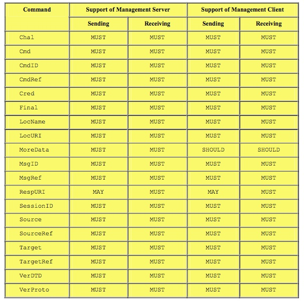

# 4.1 Mark-up Language Description 标记语言说明

Examples in this section make use of XML snippets. They are not intended to be complete XML documents. They are only provided to illustrate an example usage of the element type in question.<br/>
本节中的示例使用XML片段。它们不是要作为完整的XML文档。它们仅被提供来展示所讨论的元素类型的示例使用。

Restrictions listed in this document are in addition to the restrictions listed in [REPPRO].<br/>
本文档中列出的限制是除[REPPRO]中列出的限制外的限制。

### 4.1.1 Common Use Elements 常用元素
The following are common element types used by numerous other element types. The table lists the mandatory and optional elements that servers and clients send and receive.<br/>
以下是许多其他元素类型使用的常见元素类型。该表列出了服务器和客户端发送和接收的必需和可选元素。

### 4.1.1.1 Archive
Restrictions: This element is not used in OMA Device Management Protocol.<br/>
限制：此元素不在OMA设备管理协议中使用。

### 4.1.1.2 Chal
Restrictions: When using syncml:auth-md5 or syncml:auth-MAC, the Meta Format for the NextNonce element MUST be specified and it MUST be b64.<br/>
限制：当使用syncml：auth-md5或syncml：auth-MAC时，必须指定NextNonce元素的元格式，并且必须为b64。

Example: The following is an example of a "MD-5" authentication challenge. The password and userid are requested to be Base64 character encoded. The type and format of the authentication scheme are specified by the meta-information in the Meta element type.<br/>
示例：以下是“MD-5”身份验证质询的示例。请求对密码和用户标识进行Base64字符编码。认证方案的类型和格式由Meta元素类型中的元信息指定。
```
<Status>
  <MsgRef>0</MsgRef>
  <Cmd>SyncHdr</Cmd> 
  <TargetRef>http://www.datamgr.org/servlet/manageit</TargetRef> 
  <SourceRef>IMEI:001004FF1234567</SourceRef>
 *<Chal>*
    <Meta>
      <Type xmlns=’syncml:metinf’>syncml:auth-md5</Type>
      <Format xmlns=’syncml:metinf’>b64</Format>
      <NextNonce xmlns=’syncml:metinf’>ZG9iZWhhdmUNCg==</NextNonce>
    </Meta>
  *</Chal>*
  <Data>401</Data>
</Status>
```

### 4.1.1.3 cmd
Restrictions: No additional restrictions beyond those defined in [REPPRO].<br/>
限制：除了[REPPRO]中定义的限制外，没有其他限制。

Example: 示例
```
<Status>
  <MsgRef>1</MsgRef>
  <CmdRef>2</CmdRef>
  <CmdID>1234</CmdID>
 * <Cmd>*Replace*</Cmd>* 
  <TargetRef>./antivirus_data</TargetRef> 
  <!-- OK, antivirus update loaded--> 
  <Data>200</Data>
</Status>
```

### 4.1.1.4 CmdID
Restrictions: No additional restrictions beyond those defined in [REPPRO].<br/>
限制：除了[REPPRO]中定义的限制外，没有其他限制。

Example: 示例
```
<Status>
  <MsgRef>1</MsgRef>
  <CmdRef>2</CmdRef>
  *<CmdID>*1234*</CmdID>*
  <Cmd>Replace</Cmd> 
  <TargetRef>./antivirus_data</TargetRef> 
  <!-- OK, antivirus update loaded--> 
  <Data>200</Data>
</Status>
```

### 4.1.1.5 CmdRef
Restrictions: No additional restrictions beyond those defined in [REPPRO].<br/>
限制：除了[REPPRO]中定义的限制外，没有其他限制。

Example: 示例
```
<Status>
  <MsgRef>1</MsgRef>
  *<CmdRef>*2*</CmdRef>*
  <CmdID>1234</CmdID>
  <Cmd>Replace</Cmd> 
  <TargetRef>./antivirus_data</TargetRef> 
  <!-- OK, antivirus update loaded--> 
  <Data>200</Data>
</Status>
```
### 4.1.1.6 Cred
Restrictions: Same restriction defined in [REPPRO]. In addition, OMA DM restricts the usage of the Cred element to within the sync header element: SyncHdr. The originator MUST NOT supply credentials within individual commands. When using syncml:auth-md5, the Meta Format for the Cred element MUST be specified and it MUST be b64.<br/>
限制：在[REPPRO]中定义的限制相同。此外，OMA DM将Cred元素的使用限制在同步头元素：SyncHdr内。发起者必须不在单个命令中提供凭证。当使用syncml：auth-md5时，必须指定Cred元素的元格式，并且必须是b64。

Example: The following is an example of an MD5 digest authentication credential scheme consisting of the character string Bruce2: OhBehave: Nonce. The MD5 Digest is also Base64 character encoded. The type and format of the credential, as well as the next nonce are specified by the meta-information in the Meta element type.
示例：以下是由字符串Bruce2组成的MD5摘要认证凭证方案示例：OhBehave：Nonce MD5摘要也是Base64字符编码。凭证的类型和格式以及下一个nonce由Meta元素类型中的元信息指定。
```
*<Cred>*
  <Meta>
    <Type xmlns=’syncml:metinf’>syncml:auth-md5</Type> 
    <Format xmlns=’syncml:metinf’>b64</Format>
  </Meta>
  <Data>Zz6EivR3yeaaENcRN6lpAQ==</Data>
*</Cred>*
```
### 4.1.1.7 Final
Restrictions: No additional restrictions beyond those defined in [REPPRO].<br/>
限制：除了[REPPRO]中定义的限制外，没有其他限制。

Example: 示例
```
<SyncML xmlns=’SYNCML:SYNCML1.2’> <SyncHdr>
  </SyncHdr>...blah, blah...</SyncBody>
  ...blah, blah...
  *<Final/>*
  </SyncBody>
</SyncML>
```
### 4.1.1.8 Lang
Restrictions: This element is not used in OMA Device Management Protocol.<br/>
限制：此元素不在OMA设备管理协议中使用。

### 4.1.1.9 LocName
Restrictions: Used for sending userid for MD5 authentication.<br/>
限制：用于发送MD5认证的用户ID。

### 4.1.1.10 LocURI
Restrictions: No additional restrictions beyond those defined in [REPPRO].<br/>
限制：除了[REPPRO]中定义的限制外，没有其他限制。

Example: 示例
```
<SyncHdr>
  <VerDTD>1.2</VerDTD>
  <VerProto>DM/1.2</VerProto>
  <SessionID>1</SessionID>
  <MsgID>1</MsgID>
  <Target>
     *<LocURI>*http://www.syncml.org/mgmt-server*</LocURI>*
  </Target>
  <Source> 
     *<LocURI>*IMEI:493005100592800*</LocURI>*
  </Source>
</SyncHdr>
```
### 4.1.1.11 MoreData
Restrictions: No additional restrictions beyond those defined in [REPPRO].<br/>
限制：除了[REPPRO]中定义的限制外，没有其他限制。

Example: 示例
```
<Add>
  <CmdID>15</CmdID>
  <Meta>
    <Type xmlns=’syncml:metinf’>bin</Type> 
    <Format xmlns=’syncml:metinf’>b64</Format> 
    <Size xmlns=’syncml:metinf’>3000</Size>
  </Meta>
  <Item>
     <Target>
       <LocURI>./</LocURI>
     </Target>
     <Data>
       <!-- First chunk of data file -->
     </Data>
     *<MoreData/>*
  </Item>
</Add>
```
### 4.1.1.12 MsgID
Restrictions: No additional restrictions beyond those defined in [REPPRO].<br/>
限制：除了[REPPRO]中定义的限制外，没有其他限制。

Example: 示例
```
<SyncHdr>
  <VerDTD>1.2</VerDTD>
  <VerProto>DM/1.2</VerProto> 
  <SessionID>1</SessionID> 
  *<MsgID>*1*</MsgID>*
  <Target>
      <LocURI>http://www.syncml.org/mgmt-server</LocURI> 
  </Target>
  <Source> 
      <LocURI>IMEI:493005100592800</LocURI>
  </Source>
</SyncHdr>
```
### 4.1.1.13 MsgRef
Restrictions: No additional restrictions beyond those defined in [REPPRO].<br/>
限制：除了[REPPRO]中定义的限制外，没有其他限制。

Example: 示例
```
<Status>
  *<MsgRef>*1*</MsgRef>*
  <CmdRef>2</CmdRef>
  <CmdID>1234</CmdID>
  <Cmd>Replace</Cmd> 
  <TargetRef>./antivirus_data</TargetRef> 
  <!-- OK, antivirus update loaded--> 
  <Data>200</Data>
</Status>
```
### 4.1.1.14 NoResp
Restrictions: This element is not used in OMA Device Management Protocol.<br/>
限制：此元素不在OMA设备管理协议中使用。
### 4.1.1.15 NoResults
Restrictions: This element is not used in OMA Device Management Protocol.<br/>
限制：此元素不在OMA设备管理协议中使用。
### 4.1.1.16 NumberOfChanges
Restrictions: This element is not used in OMA Device Management Protocol.<br/>
限制：此元素不在OMA设备管理协议中使用。
### 4.1.1.17 RespURI
Restrictions: No additional restrictions beyond those defined in [REPPRO].<br/>
限制：除了[REPPRO]中定义的限制外，没有其他限制。

Example: 示例
```
<SyncHdr>
  <VerDTD>1.2</VerDTD>
  <VerProto>DM/1.2</VerProto>
  <SessionID>1</SessionID>
  <MsgID>1</MsgID>
  <Target>
     <LocURI>http://www.syncml.org/mgmt-server</LocURI> 
  </Target>
  <Source> 
     <LocURI>IMEI:493005100592800</LocURI>
  </Source>
  *<RespURI>*http://www.deviceman.org/servlet/manageit/bruce1?user=jsmith&af ter=20000512T133000Z*</RespURI>*
</SyncHdr>
```
### 4.1.1.18 SessionID
Restrictions: No additional restrictions beyond those defined in [REPPRO].<br/>
限制：除了[REPPRO]中定义的限制外，没有其他限制。

Example: 示例
```
<SyncML xmlns=’SYNCML:SYNCML1.2’ >
  <SyncHdr>
    <VerDTD>1.2</VerDTD> 
    <VerProto>DM/1.2</VerProto> 
    <SessionID>1</SessionID> 
    <MsgID>1</MsgID>
    <Target> 
        <LocURI>http://www.syncml.org/mgmt-server</LocURI>
    </Target>
    <Source>
        <LocURI>IMEI:493005100592800</LocURI> 
    </Source>
  </SyncHdr>
  <SyncBody>
     ...blah, blah...
  </SyncBody>
</SyncML>
```
### 4.1.1.19 SftDel
Restrictions: This element is not used in OMA Device Management Protocol.<br/>
限制：此元素不在OMA设备管理协议中使用。

### 4.1.1.20 Source
Restrictions: No additional restrictions beyond those defined in [REPPRO].<br/>
限制：除了[REPPRO]中定义的限制外，没有其他限制。

Example: 示例
```
<SyncHdr>
  <VerDTD>1.2</VerDTD>
  <VerProto>DM/1.2</VerProto>
  <SessionID>1</SessionID>
  <MsgID>1</MsgID>
  <Target>
    <LocURI>http://www.syncml.org/mgmt-server</LocURI> 
  </Target>
 *<Source>*
    <LocURI>IMEI:493005100592800</LocURI>
 *</Source>*
</SyncHdr>
```
### 4.1.1.21 SourceRef
Restrictions: No additional restrictions beyond those defined in [REPPRO].<br/>
限制：除了[REPPRO]中定义的限制外，没有其他限制。

Example: 示例
```
<Status>
  <CmdID>4321</CmdID>
  <MsgRef>1</MsgRef>
  <CmdRef>1234</CmdRef>
  <Cmd>Copy</Cmd> 
  <TargetRef>./DM/WAPSetting/1</TargetRef> 
  *<SourceRef>*./Common/WAP/1*</SourceRef> *
  <Data>200</Data>
</Status>
```
### 4.1.1.22 Target
Restrictions: No additional restrictions beyond those defined in [REPPRO].<br/>
限制：除了[REPPRO]中定义的限制外，没有其他限制。

Example: The following is an example of the usage in a SyncHdr element type.<br/>
示例：以下是SyncHdr元素类型中的用法示例。
```
<SyncHdr> 
  <VerDTD>1.2</VerDTD> 
  <VerProto>DM/1.2</VerProto> 
  <SessionID>1</SessionID> 
  <MsgID>1</MsgID>
  *<Target>*
    <LocURI>http://www.syncml.org/mgmt-server</LocURI>
  *</Target>*
  <Source> 
    <LocURI>IMEI:493005100592800</LocURI>
  </Source>
</SyncHdr>
```

### 4.1.1.23 TargetRef
Restrictions: No additional restrictions beyond those defined in [REPPRO].<br/>
限制：除了[REPPRO]中定义的限制外，没有其他限制。

Example: 示例
```
<Status>
  <CmdID>4321</CmdID>
  <MsgRef>1</MsgRef>
  <CmdRef>1234</CmdRef>
  <Cmd>Copy</Cmd> 
  *<TargetRef>*./DM/WAPSetting/1*</TargetRef>*
  <SourceRef>./Common/WAP/1</SourceRef> 
  <Data>200</Data>
</Status>
```

### 4.1.1.24 VerDTD
Restrictions: No additional restrictions beyond those defined in [REPPRO].<br/>
限制：除了[REPPRO]中定义的限制外，没有其他限制。

Example: 示例
```
<SyncHdr>
  *<VerDTD>1.2</VerDTD>*
  <VerProto>DM/1.2</VerProto>
  <SessionID>1</SessionID>
  <MsgID>1</MsgID>
  <Target>
     <LocURI>http://www.syncml.org/mgmt-server</LocURI> 
  </Target>
  <Source> 
      <LocURI>IMEI:493005100592800</LocURI>
  </Source>
</SyncHdr>
```
### 4.1.1.25 VerProto
Restrictions: Major revisions of the specification create incompatible changes that may require a new management client. Minor revisions involve changes that do not impact basic compatibility of existing management clients.<br/>
限制：规范的主要修订版会导致不兼容的更改，可能需要新的管理客户端。次要修订涉及的更高不影响现有管理客户端的基本兼容性。

When the DM message conforms to this revision of the OMA Device Management protocol specification the value MUST be 'DM/1.2’.
当DM消息符合OMA设备管理协议规范的此修订版时，值必须是“DM/1.2”。

```
<SyncHdr>
  <VerDTD>1.2</VerDTD> 
  *<VerProto>*DM/1.2*</VerProto> *
  <SessionID>1</SessionID> 
  <MsgID>1</MsgID>
  <Target>
    <LocURI>http://www.syncml.org/mgmt-server</LocURI> 
  </Target>
  <Source> 
    <LocURI>IMEI:493005100592800</LocURI>
  </Source> 
</SyncHdr>
```