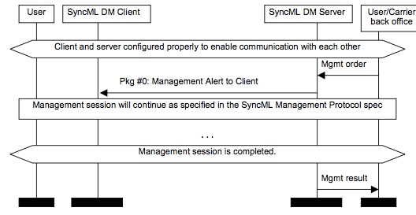

# 6.1 Server Alerted Management Session 服务器提醒的管理会话

This notification message is intended to provide a possibility for the server to alert the client to perform a management session. When the server alerts the client, it can tell for example the protocol version and whether the server proposes the session to be a foreground or background event. It can also tell if the session is happening because server has some management actions to perform or if the user caused the start of the session. The server MUST also send a digest that is included to prevent any Denial of Service (DoS) attacks. 
该通知消息旨在提供服务器提醒客户端执行管理会话的可能性。当服务器提醒客户端时，它可以告诉例如协议版本以及服务器是否建议会话是前台或后台事件。它还可以判断会话是否正在发生，因为服务器有一些管理操作要执行，或者用户是否导致会话启动。服务器还必须发送包含的摘要，以防止任何拒绝服务（DoS）攻击。

Figure describes the MSC how the server alerts management session.
图描述了MSC如何提醒管理会话。

The package flow presented above is one OMA Device Management session. This means that all messages have the same OMA DM Session ID. 
上面给出的包流程是一个OMA设备管理会话。 这意味着所有消息具有相同的OMA DM会话ID。

## 6.2 Nonce Resynchronisation 随机重新同步

After the client has received a notification message and the digest is not correct then the client SHOULD re-verify the digest using the special nonce value, 0x00000000.” Servers can not expect all clients to supports this features and MAY therefore take a different action, such as re-bootstrap the device, for example. 
客户端收到通知消息并且摘要不正确后，客户端应该使用特殊的随机数值0x00000000重新验证摘要。“服务器不能指望所有客户端都支持此功能，因此可能采取不同的操作，例如重新初始化设备。

The flow of this particular scenario is as follows: 
这种特定情况的流程如下：

1. [Pkg #0] Client receives Notification message and fails to authenticate the message using stored server nonce value. 
[Pkg＃0]客户端接收到Notification消息，并且无法使用存储的服务器随机数值来验证消息。

2. Client tries to re-authenticate notification message using a default server nonce value (0x00000000). If this authentication succeeds, then continue to step 3; otherwise notification message is ignored and no session is initiated. 
客户端尝试使用默认服务器随机数值（0x00000000）重新验证通知消息。如果此认证成功，则继续步骤3;否则忽略通知消息，并且不启动会话。

3. [Pkg #1] Client initiates session, with the credentials based on nonce value 0x00000000 in case of application layer security. 
[Pkg＃1]客户端发起会话，在应用层安全的情况下，基于随机数值0x00000000的凭据。

4. [Pkg #2] Server tries to authenticate the message. In case of application layer security then with the default nonce value (0x00000000). If this authentication succeeds, server sends a success Status code with a Chal to update the client nonce on the device used to authenticate messages from the client. 
 [Pkg＃2]服务器尝试验证消息。在应用层安全的情况下，使用默认的随机数值（0x00000000）。如果此身份验证成功，服务器将使用Chal发送成功状态代码，以更新用于验证来自客户端的消息的设备上的客户端随机数。
 
5. [Pkg #3] Client tries to authenticate the message. In case of application layer security then with the default nonce value (0x00000000). If this authentication succeeds, then Client sends success Status code with a Chal to update the server nonce on the server used by the client to authenticate messages from the server (including notification messages). 
 [Pkg＃3]客户端尝试验证消息。在应用层安全的情况下，使用默认的随机数值（0x00000000）。如果此身份验证成功，则客户端通过Chal发送成功状态代码以更新客户端用于验证来自服务器的消息（包括通知消息）。

6. [Pkg #4] Server sends back success Status. If desired, server replaces the server AuthSecret in the DMAcc to further protect against repeated attacks on the nonce re-negotiation protocol. 
[Pkg＃4]服务器发回成功状态。如果需要，服务器替换DMAcc中的服务器AuthSecret以进一步防止对不重新协商协议的重复攻击。