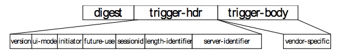

# 6.2 Structure of General Notification Initiated Session Alert 一般通知启动会话提醒的结构

General Package#0 is the default format used for the Notification Initiated Session Trigger Message. This default format can be used if this document does not describe a special format for initialization purposes.<br/>
通用包＃0是用于通知发起的会话触发消息的默认格式。如果本文档没有为初始化目的描述特殊格式，则可以使用此默认格式。

The following figure describes the format of the General Package #0.<br/>
下图描述了通用包＃0的格式。


The MIME type for the General Notification Initiated Session Alert message is application/vnd.syncml.notification and the Content-Type code for that is 0x44. Byte order for General Notification Initiated Session Alert message is Big Endian (Network order).<br/>
通用通知发起的会话警报消息的MIME类型为application/vnd.syncml.notification，而Content-Type代码为0x44。 一般通知发起的警报消息的会话的字节顺序是大端序（网络顺序）。

## 6.2.1 Syntax for the Initiation Notification 启动通知的语法
The following ABNF [RFC2234] defines the syntax for the message. The order and the size of the fields MUST be same as specified in the following syntax of the Trigger Message.<br/>
以下ABNF [RFC2234]定义消息的语法。字段的顺序和大小必须与触发消息的以下语法中指定的相同。
```
<trigger-message> ::= <digest><trigger>
<digest> ::= 128*BIT                               ; ‘MD5 Digest value’
<trigger> ::= <trigger-hdr><trigger-body>
<trigger-hdr> ::= <version><ui-mode><initiator><future-use> 
                  <sessionid><length-identifier><server-identifier>
<version> ::= 10*BIT                               ; ‘Device Management Version’
<ui-mode> ::= <not-specified> / <background> /     ;‘Background/Informative/
               <informative> / <user-interaction>  ; User Interaction session’
<not-specified> ::= “00”                           ; ‘2*bit value “0”’
<background> ::= “01”                              ; ‘2*bit value “1”’
<informative> ::= “10”                             ; ‘2*bit value “2”'
<user-interaction> ::= “11”                        ; ‘2*bit value “3”’
<initiator> ::= <client> / <server>                ; ‘Server/User initiated’
<client> ::= “0”                                   ; ‘1*bit value “0”’ 
<server> ::= “1”                                   ; ‘1*bit value “1”’
<future-use> ::= 27*BIT                            ; ‘Reserved for future DM use’
<sessionid> ::= 16*BIT                             ; ‘Session identifier’
<length-identifier> ::= 8*BIT                      ; ‘Server Identifier length’
<server-identifier> ::= <length-identifier>*CHAR   ; ‘Server Identifier’

<trigger-body> ::= [<vendor-specific>]
<vendor-specific> ::= n*BIT                        ; ‘Optional vendor specific info’
```  

## 6.2.2 Description of the fields 字段说明
### 6.2.2.1 Trigger Message 触发消息

The `<trigger-message>` field specifies the message causing the client to connect to the server.<br/>
<trigger-message>字段指定使客户端连接到服务器的消息。

### 6.2.2.2 Digest 摘要
The `<digest>` field specifies the MD5 Digest authentication. The Digest is computed as Digest = H(B64(H(server- identifier:password)):nonce:B64(H(trigger))). Length of MD5 Digest is 128 bits.<br/>
`<digest>`字段指定MD5摘要认证。Digest计算为Digest = H(B64(H(server- identifier:password)):nonce:B64(H(trigger)))。MD5摘要的长度为128位。

### 6.2.2.3 Trigger 触发
The `<trigger>` field is container for the trigger-hdr and trigger-body fields.<br/>
`<trigger>`字段是trigger-hdr和trigger-body字段的容器。

### 6.2.2.4 Header of the Trigger Message 触发消息的标题
The `<trigger-hdr>` field specifies the header of the Trigger Message.
`<trigger-hdr>`字段指定触发消息的标题。

### 6.2.2.5 Body of the Trigger Message 触发消息的主体
The `<trigger-body>` field specifies the body of the Trigger Message.
`<trigger-body>`字段指定触发消息的主体。

### 6.2.2.6 Version Information 版本信息
The `<version>` field specifies the version of the OMA Device Management Notification message sent by the OMA DM server. This value is specified by using the 10 bits in the Trigger Message. The supported version is counted as `<notification message version> = DEC (version)/10`, i.e. first the bit value is transferred to the numeric and then divided by ten. Therefore the biggest possible version is ‘102.3’ and the version ‘1.0’ is specified as ‘0000001010’.<br/>

`<version>`字段指定由OMA DM服务器发送的OMA设备管理通知消息的版本。 该值通过使用触发消息中的10位来指定。 支持的版本计数为`<notification message version> = DEC（version）/10`，即首先将位值传输到数字，然后除以十。因此，最大可能的版本是“102.3”，版本“1.0”被指定为“0000001010”。

Notification messages conforming to this version of the specification MUST have <version> field 10-bit binary value ‘0000001011’.<br/>
符合此版本规范的通知消息必须具有`<version>`字段10位二进制值“0000001011”。

### 6.2.2.7 User Interaction Mode 用户交互模式
The `<ui-mode>` field specifies the server recommendations whether the server wants the management session to be executed in background or show a notification to the user. A client SHOULD follow this recommendation.<br/>

The values the User Interaction mode can have:<br/>

* Not specified – The `<not-specified>` field in `<user-interaction>` field specifies that the server doesn’t have a recommendation to this element. This value is specified by using the 2 bits and the bit value for not specified action is “00”.<br/>

* Background management action – The `<background>` field specifies that the server recommends the management action SHOULD be done as a background event. This value is specified by using the 2 bits and the bit value for background action is “01”.<br/>

* Informative management action – The `<informative>` field specifies that the server recommends the client to display an informative notification or maybe emitting a beep sound announcing the beginning of the provisioning session to the device user. This value is specified by using the 2 bits and the bit value for informative notification is “10”.<br/>
 
* User Interaction before the management action – The `<user-interaction>` field specifies that the server recommends the client to prompt the device user for acceptance of the offered management session before the management session takes place. This value is specified by using the 2 bits and the bit value for user displayable notification is “11”.<br/>