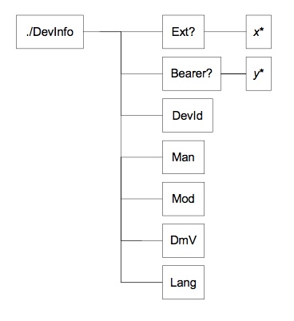
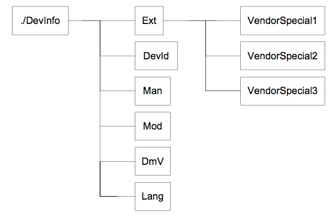
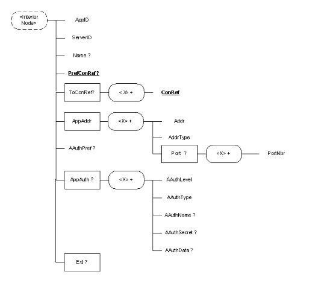

# 7.1 Standardized Objects 标准化对象
## 7.1.1 Management Objects 管理对象
Management objects are logical collections of related nodes that enable the targeting of management operations, using OMA DM protocol commands. Each node in a management object can be as small as an integer or large and complex like a background picture or screen saver. The OMA DM protocol is agnostic about the contents, or values, of the management objects and treats the node values as opaque data. 
管理对象是相关节点的逻辑集合，使用OMA DM协议命令实现管理操作的目标。管理对象中的每个节点可以小到整数或大及复杂到如背景图片或屏幕保护程序。OMA DM协议对管理对象的内容或值是不可知的，并且将节点值视为不透明数据。

### 7.1.1.1 Management Objects 管理对象
OMA DM management objects are defined using the OMA DM Device Description Framework [DMTND], or DDF. The use of this description framework produces detailed information about the device in question. However, due to the high level of detail in these descriptions, they are sometimes hard for humans to digest and it can be a time consuming task to get an overview of a particular objects structure. 
OMA DM管理对象使用OMA DM设备描述框架[DMTND]或DDF来定义。该描述框架的使用产生关于所讨论的设备的详细信息。 然而，由于这些描述中的高水平的细节，它们有时对于人来说是难以消化的，并且获得对特定对象结构的概述可能是耗时的任务。

In order to make it easier to quickly get an overview of how a management object is organized and its intended use, a simplified graphical notation in the shape of a block diagram is used in this document. Even though the notation is graphical, it still uses some printable characters, e.g. to denote the number of occurrences of a node. These are mainly borrowed from the syntax of DTDs for XML. The characters and their meaning are defined in the following table. 
为了使得概述管理对象如何组织及预期其用途更容易快速，在本文档中使用框图形状的简化图形符号。 即使符号是图形的，它仍然使用一些可打印的字符，例如。以表示节点的出现次数。这些主要是从XML的DTD的语法借用。字符及其含义在下表中定义。

| Character 字符 | Meaning 含义 |
| -- | -- |
| + | one or many occurrences 出现一次或多次 |
| * | zero or more occurrences 出现零次或多次 |
| ？ | zero or one occurrences 出现零次或一次 |

If none of these characters is used the default occurrence is exactly once. 
如果没有使用这些字符，默认出现的次数的正好是一次。

There is one more feature of the DDF that needs to have a corresponding graphical notation, the un-named block. These are blocks that act as placeholders in the description and are instantiated with information when the nodes are used at run-time. Un-named blocks in the description are represented by a lower case character in italics, e.g. *x*. 
有一个更多的功能的DDF需要有一个相应的图形符号，即未命名的块。这些是在描述中用作占位符的块，并且在节点运行使用时信息实例化。描述中的未命名块由斜体字的小写字符表示，例如 *x*。

Each block in the graphical notation corresponds to a described node, and the text is the name of the node. If a block contains an *x*, it means that the name is not known in the description and that it will be assigned at run-time. The names of all ancestral nodes are used to construct the URI for each node in the management object. It is not possible to see the actual parameters, or data, stored in the nodes by looking at the graphical notation of a management object. 
图形符号中的每个块对应于一个所描述的节点，并且文本是节点的名称。如果块包含*x*，则意味着名称在描述中未知，并且将在运行时分配。所有祖先节点的名称用于为管理对象中的每个节点构造URI。不可能通过查看管理对象的图形符号来查看存储在节点中的实际参数或数据。

The following is an example of what a management object can look like when it is expressed using the graphical notation. This particular object is the OMA DM Device Information management object. 
以下是使用图形表示法表示管理对象时的示例。这个特定对象是OMA DM设备信息管理对象。

Naturally, this graphical overview does not show all the details of the full description, but it provides a good map of the description so that it is easier to find the individual nodes. Although the figure only provides an elevated view of the description, there are still some things worth noticing. All the blocks with names in place occur exactly once, except Ext and Bearer that are optional and may not be present at all. One of the named nodes, DevInfo, has child nodes; it is an interior node. With the exception of Ext and Bearer, none of the other named nodes can have any children of their own; they are leaf nodes. The un-named leaf nodes are marked with `*`. This means that although the description only contains one node description at this position in the tree, there can be any number of instantiated nodes at run-time, including none. The only limit is that the node names MUST be unique and memory MUST be available to store the nodes. 
自然地，该图形概述不显示完整描述的所有细节，但是它提供了描述的好的图，使得更容易找到各个节点。虽然图中只提供了一个概括的描述，但还有一些值得注意的事情。所有具有名称的块都恰好出现一次，除了Ext和Bearer是可选的，并且可能根本不存在。其中一个命名节点DevInfo具有子节点；它是一个内部节点。除了Ext和Bearer之外，没有其他命名节点可以有自己的任何子节点；它们是叶节点。未命名的叶节点用`*`标记。这意味着虽然描述部分在树中的该位置仅包含一个节点描述，但是在运行时可以有任何数量的实例化节点，数量也可以是没有。唯一的限制是节点名称必须是唯一的，并且存储器必须可用于存储节点。

The next figure shows an example of what the device information management object could look like at run-time. 
下图显示了设备信息管理对象在运行时的外观示例。

The difference between this and the previous figure is that now the un-named blocks have been instantiated. It is also shown that the `*` character means that a node can occur zero or more times. Note that none of the stored data in the leaf nodes is shown in the figure, what are visible are only the node names. 
这和前一个图的区别在于，现在未命名的块已经被实例化。还示出了`*`字符意味着节点可以出现零次或多次。注意，在图中没有示出叶节点中存储的数据，只有节点名称是可见的。

### 7.1.1.2 DDF compliance DDF合规性
The management object descriptions in this document are normative. However, the descriptions also contain are a number of informative aspects that could be included to enhance readability or serve as examples. Other informative aspects are, for instance, the ZeroOrMore and OneOreMore elements, where implementations MAY introduce restrictions. All these exceptions are listed here: 
本文档中的管理对象的描述是规范性的。然而，描述还包括以增强可读性或作为示例的一些方面的信息。其他信息方面例如ZeroOrMore和OneOreMore元素，其中的实现方法可以引入限制机制。所有这些例外情况都列在这里：
* All XML comments, e.g. `<!-- some text -->`, are informative. 
所有XML注释，例如`<！ - some text - >`，是信息性的。
* The descriptions do not contain an RTProperties element, or any of its child elements, but a description of an actual implementation of this object MAY include these. 
描述不包含RTProperties元素或其任何子元素，但对此对象的实际实现的描述可以包括这些元素。
* If a default value for a leaf node is specified in a description, by the DefaultValue element, an implementation MUST supply its own appropriate value for this element. If the DefaultValue element is present in the description of a node, it MUST be present in the implementation, but MAY have a different value. 
如果在描述中由DefaultValue元素指定了叶节点的默认值，则实现必须为此元素提供自己适当的值。如果DefaultValue元素存在于节点的描述中，则它必须存在于实现中，但可能有不同的值。
* The value of all Man, Mod, Description and DFTitle elements are informative and included only as examples. 
所有Man，Mod，Description和DFTitle元素的值都是信息性的，仅作为示例。
* Below the interior nodes Ext and Bearer, an implementation MAY add further nodes at will. 
在内部节点Ext和Bearer下，实现可以随意添加更多节点。
* The contents of the AccessType element MAY be extended by an implementation. 
AccessType元素的内容可以通过实现扩展。
* If the any of the following AccessType values are specified, they MUST NOT be removed in an implementation: Copy, Delete, Exec, Get, and Replace. 
如果指定了以下任何AccessType值，那么在实现中不能移除它们：复制，删除，执行，获取和替换。
* If the AccessType value Add is specified it MAY be removed in an implementation if the implementation only supports a fixed number of child nodes. 
如果指定了AccessType值Add，如果实现只支持固定数量的子节点，则可以在实现中删除它。
* An implementation MAY replace the ZeroOrMore or OneOreMore elements with ZeroOrN or OneOrN respectively. An appropriate value for N MUST also be given with the ...OrN elements. 
实现可以分别用ZeroOrN或OneOrN替换ZeroOrMore或OneOreMore元素。N的适当值也必须与... OrN元素一起给出。

### 7.1.2 Management objects standardized by other organizations 其他组织的标准化管理对象

OMA DM has been designed so that existing management objects can be managed. These existing management objects have typically already been standardized by other standards organizations. 
OMA DM已设计为可以管理现有的管理对象。这些现有的管理对象通常已经被其他标准组织标准化。

### 7.1.3 The OMA DM management objects OMA DM管理对象
Clients implementing OMA DM MUST support the OMA DM Account management object, DevInfo management object and the DevDetail management object. OMA DM servers MUST support all three management objects as well. 
实现OMA DM的客户端必须支持OMA DM帐户管理对象，DevInfo管理对象和DevDetail管理对象。OMA DM服务器也必须支持所有三个管理对象。

| Management Object 管理对象 | Client Support 客户端支持 | Server Support 服务器支持 | Description 描述 |
| -- | -- | -- | -- |
| DMAcc | MUST | MUST | Settings for the DM client in a managed device. 受管设备中的DM客户端的设置。|
| DevInfo | MUST | MUST | Device information for the OMA DM server. Sent from the client to the server.  OMA DM服务器的设备信息。从客户端发送到服务器。|
| DevDetail | MUST | MUST | General device information that benefits from standardization. 从标准化中受益的一般设备信息。 |
| Inbox | MAY | MAY | Reserved URI where the device SHOULD use the management object identifier to identify the absolute URI. 保留的URI，其中推荐设备使用管理对象标识符来标识绝对URI。 |

The difference between DevInfo and DevDetail is that the DevInfo parameters are needed by the management server for problem free operation of the OMA DM protocol. The DevInfo object is sent from client to server in the beginning of every session. 
DevInfo和DevDetail之间的区别在于管理服务器需要DevInfo参数以用于OMA DM协议的无问题操作。 DevInfo对象在每个会话开始时从客户端发送到服务器。

DevDetail contains other device specific parameters that benefits from being standardized and mandatory. The only difference is that these parameters are not sent from client to server automatically. Instead, these parameters are managed by servers as any other parameters and can be manipulated using OMA DM commands. 
DevDetail包含受益于标准化和强制性的其他设备特定参数。唯一的区别是这些参数不是从客户端自动发送到服务器。相反，这些参数由服务器作为任何其他参数来管理，并且可以使用OMA DM命令来操纵。

#### 7.1.3.1 The DM Account management object DM帐户管理对象
The management object is used to manage settings for OMA DM protocol. 
管理对象用于管理OMA DM协议的设置。

Management object identifier: urn:oma:mo:oma-dm-dmacc:1.0 
管理对象标识符：rn:oma:mo:oma-dm-dmacc:1.0

Parameters are also described in Device Management Application Characteristic registration document [w7] which is used as a part of OMA Client Provisioning specifications [ERELDCP]. General mapping rules of OMA Client Provisioning parameters are described in [DMBOOT]. When the DM Account parameters are derived from OMA Client Provisioning w7 document, see more information about parameter mapping in Appendix. 
参数也在设备管理应用特性注册文档[w7]中描述，该文档是OMA客户端配置规范[ERELDCP]的一部分。 OMA客户端提供参数的一般映射规则在[DMBOOT]中描述。 当DM帐户参数是从OMA客户端配置w7文档派生时，请参阅附录中有关参数映射的更多信息。

The complete DDF description of this management object can be found in [DMAccDDF]. 
此管理对象的完整DDF描述可在[DMAccDDF]中找到。

##### 7.1.3.1.1 Node: `<X>`
This interior node acts as a placeholder for one or more accounts or for a fixed node. 
此内部节点充当一个或多个帐户或固定节点的占位符。
* Occurrence: OneOrMore 
出现次数：一次或多次
* Format: Node 
形式：节点
* Access Types: Get 
访问类型：Get
* Values: N/A 
值：无

##### 7.1.3.1.2 Node: `<X>`/AppID
This node specifies the application ID for device management account object. 此节点指定设备管理帐户对象的应用程序ID。
* Occurrence: One 
出现次数：一次
* Format: Chr 
形式：字符
* Access Types: Get 
访问类型：Get
* Values: w7 
值：w7

##### 7.1.3.1.3 Node: `<X>`/ServerID
This node specifies a server identifier for management server used in the management session. 此节点指定管理会话中使用的管理服务器的服务器标识符。
* Occurrence: One 
出现次数：一次
* Format: Chr 
形式：字符
* Access Types: Get 
访问类型：Get
* Values: `<Server identifier>` 
值：`<Server identifier>`

##### 7.1.3.1.4 Node: `<X>`/Name
This node specifies user displayable name for the management server. 
此节点指定管理服务器的用户可显示名称。
* Occurrence: ZeroOrOne 
出现次数：零次或一次
* Format: Chr 
形式：字符
* Access Types: Get 
访问类型：Get
* Values: `<User displayable name>` 
值：`<User displayable name>`

##### 7.1.3.1.5 Node: `<X>`/PrefConRef
This node specifies a reference to preferred connectivity. It is expected that either a proxy or NAP MO is specified, but other, implementation-specific connectoids MAY be referenced. 
此节点指定对首选连接的引用。它期望指定代理或NAP MO，但是可以引用其他方法实现特定的连接。
* Occurrence: ZeroOrOne 
出现次数：零次或一次
* Format: Chr 
形式：字符
* Access Types: Get 
访问类型：Get
* Values:  URI to a management object or implementation specific identifier.
 
值：URI到管理对象或实现特定标识符。

##### 7.1.3.1.6 Node: `<X>`/ToConRef/
The ToConRef interior node is used to allow application to refer to a collection of connectivity definitions. Several connectoids MAY be listed for a given application under this interior node. 
ToConRef内部节点用于允许应用程序引用连接定义的集合。对于这个内部节点下的给定应用，可以列出几个连接体。
* Occurrence: ZeroOrOne 
出现次数：零次或一次
* Format: Chr 
形式：字符
* Access Types: Get 
访问类型：Get
* Values: N/A 
值：无

##### 7.1.3.1.7 Node: `<X>`/ToConRef/`<X>`
This run-time node acts as a placeholder for one or more connectivity parameters. 
此运行时节点充当一个或多个连接参数的占位符。
* Occurrence: OneOrMore 
出现次数：一次或多次
* Format: Node 
形式：节点
* Access Types: Get 
访问类型：Get
* Values: N/A 
值：无

##### 7.1.3.1.8 Node: `<X>`/ToConRef/`<X>`/ConRef
The ConRef leaf indicates the linkage to connectivity parameters. 
ConRef叶表示连接到连接参数。
* Occurrence: One 
出现次数：一次
* Format: Chr 
形式：字符
* Access Types: Get 
访问类型：Get
* Values:  URI to a management object or implementation specific identifier.
 
值：URI到管理对象或实现特定标识符。

##### 7.1.3.1.9 Node: `<X>`/AppAddr
This node is used to specify multiple Management Server addresses. 
此节点用于指定多个管理服务器地址。
* Occurrence: One 
出现次数：一次
* Format: Node 
形式：节点
* Access Types: Get 
访问类型：Get
* Values: N/A 
值：无

##### 7.1.3.1.10 Node: `<X>`/AppAddr/`<X>`
This interior node acts as a placeholder for separating one or more Server Addresses. 
该内部节点充当用于分离一个或多个服务器地址的占位符。
* Occurrence: OneOrMore 
出现次数：一次或多次
* Format: Node 
形式：节点
* Access Types: Get 
访问类型：Get
* Values: N/A 
值：无

##### 7.1.3.1.11 Node: `<X>`/AppAddr/`<X>`/Addr
This node specifies a Management Server address. 
此节点指定管理服务器地址。
* Occurrence: One 
出现次数：一次
* Format: Chr 
形式：字符
* Access Types: Get 
访问类型：Get
* Values: Dependent upon AddrType 
值：取决于AddrType

##### 7.1.3.1.12 Node: `<X>`/AppAddr/`<X>`/AddrType
This node specifies a Management Server address type. 
此节点指定管理服务器地址类型。
* Occurrence: One 
出现次数：一次
* Format: Chr 
形式：字符
* Access Types: Get 
访问类型：Get
* Values:  “URI”, “IPv4” or “IPv6”. If no value exists the default type MUST be “URI”. 
值：“URI”，“IPv4”或“IPv6”。如果没有值，默认类型必须是“URI”。

##### 7.1.3.1.13 Node: `<X>`/AppAddr/`<X>`/Port
This node specifies Port information for Management Server address. 
此节点指定管理服务器地址的端口信息。
* Occurrence: OneOrMore 
出现次数：一次或多次
* Format: Node 
形式：节点
* Access Types: Get 
访问类型：Get
* Values: N/A 
值：无

##### 7.1.3.1.14 Node: `<X>`/AppAddr/`<X>`/Port/`<X>`
This interior node acts as a placeholder for separating one or more Port settings. 
该内部节点充当用于分离一个或多个端口设置的占位符。
* Occurrence: OneOrMore 
出现次数：一次或多次
* Format: Node 
形式：节点
* Access Types: Get 
访问类型：Get
* Values: N/A 
值：无

##### 7.1.3.1.15 Node: `<X>`/AppAddr/`<X>`/Port/`<X>`/PortNbr
This node specifies port number. 此节点指定端口号。
* Occurrence: One 
出现次数：一次
* Format: Chr 
形式：字符
* Access Types: Get 
访问类型：Get
* Values: The port number MUST be a decimal number and must fit within the range of a 16 bit unsigned integer. 
值：端口号必须是十进制数，并且必须符合16位无符号整数的范围。

##### 7.1.3.1.16 Node: `<X>`/AAuthPref
This is a string-valued parameter whose possible values are the names of the various possible authentication types (AAuthType values), e.g. "DIGEST". If this node is present, the client SHOULD use this authentication type when connecting to the server. The use of this node is intended to reduce the number of round trips between client and server that would be caused by authentication challenges. If a client supports this leaf node and the value is empty, the default behaviour is to indicate the authentication mechanism negotiated in the previous session if one exists. 
这是一个字符串值参数，其可能的值是各种可能的认证类型（AAuthType值）的名称，例如 “DIGEST”。 如果此节点存在，推荐客户端在连接到服务器时使用此认证类型。该节点的使用旨在减少由认证质询引起的客户端和服务器之间的往返次数。如果客户端支持此叶节点并且该值为空，则默认行为是指示在上一个会话中协商的认证机制（如果存在）。
* Occurrence: ZeroOrOne 
出现次数：零次或一次
* Format: Chr 
形式：字符
* Access Types: Get 
访问类型：Get
* Values: See AAuthTypes in section 7.1.3.1.20. 
值：请参阅第7.1.3.1.20节中的AAuthTypes。

##### 7.1.3.1.17 Node: `<X>`/AppAuth
This node specifies authentication information. 
此节点指定认证信息。
* Occurrence: OneOrMore 
出现次数：一次或多次
* Format: Node 
形式：节点
* Access Types: Get 
访问类型：Get
* Values: N/A 
值：无

