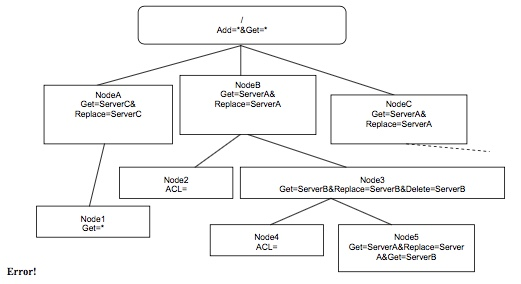

# 8.3 Properties of Nodes 节点属性
## 8.3.1 Definition 定义
Properties of Nodes are used to provide meta information about the Node in question. All properties in this section are run- time properties, e.g. they are available during the lifetime of their associated Node. Section 8.5.4.3 deals with the properties used in the context of device descriptions, which are completely separate from the run-time properties dealt with here.<br/>
节点的属性用于提供关于所讨论的节点的元信息。此部分中的所有属性都是运行时属性，例如，它们在其相关联的节点的生存期期间可用。第8.5.4.3节涉及在设备描述的上下文中使用的属性，它与此处处理的运行时属性完全分离。

| Property 属性 | Explanation 解释 |
| -- | -- |
| ACL |  Access Control List 访问控制列表|
| Format | Specifies how Node values should be interpreted <br/> 指定如何解释节点值 |
| Name | The name of the Node in the tree <br/> 树中的节点的名称 |
| Size | Size of the Node value in bytes<br/> 节点的大小（以字节为单位） |
| Title | Human readable name<br/> 人可读名字 |
| TStamp | Time stamp, date and time of last change<br/>时间戳，上次更改的日期和时间|
| Type | The MIME type of a Leaf Node’s value or a URN representing the Management Object identifier for Interior Nodes which root a Management Object sub-tree<br/> 叶节点的值的MIME类型或表示管理对象子树根的内部节点的管理对象标识符的URN |
| VerNo | Version number, automatically incremented at each modification.<br/> 版本号，每次修改时自动递增 |

It MUST NOT be possible to create new properties in an existing device.<br/>
它必须不在现有设备中创建新的属性。

## 8.3.2 Supported properties 支持的属性
Devices MAY support different sets of properties. Some properties are OPTIONAL for a device to implement, but all are REQUIRED for servers. The following table defines property support for devices.<br/>
设备可以支持不同的属性集。 一些属性对于设备来说是可选的，但对于服务器都是必需的。下表定义了设备的属性支持。

| Property 属性 | Device support 设备支持 |
| -- | -- |
| ACL | MUST 必须 |
| Format | MUST 必须 |
| Name | MUST 必须 |
| Size | MAY for Leaf Nodes <br/> 可以用于叶节点 <br/> MUST NOT for Interior Nodes<br/>必须不用于内部节点 |
| Title | MAY 可以 |
| TStamp | MAY 可以 |
| Type | MUST 必须 |
| VerNo | MAY 可以 |

## 8.3.3 Property addressing 属性寻址
The properties of a Node are addressed by appending `?prop=<property_name>` to the Node’s URI. For instance, to access the ACL of an OMA DM account a DM Server could use one of these URIs;<br/>
通过将`?prop=<property_name>`添加到节点的URI来寻址节点的属性。例如，为了访问OMA DM帐户的ACL，DM服务器可以使用这些URI之一;<br/>
           ./DMAcc/xyzInc?prop=ACL<br/>
           DMAcc/xyzInc?prop=ACL<br/>
If a server addresses an unsupported property in a device, an error is returned in the form of an (406) Optional feature not supported status.<br/>
如果服务器寻址设备中遇到不受支持的属性，则会返回（406）Optional feature not supported status的错误。

## 8.3.4 Property values 属性值
Property values MUST be transported by OMA DM as UTF-8 encoded strings. Numerical property values MUST be converted to numerical strings, expressed in decimal. It is NOT RECOMMENDED to use a `<Meta>` element for property values.<br/>
属性值必须由OMA DM作为UTF-8编码字符串传输。数字属性值必须转换为数字字符串，以十进制表示。 不推荐对属性值使用`<Meta>`元素。

It is unnecessary to use a `<Meta>` element for property values because they are all strings. This means that they would all have the same `<Meta>`, like this:<br/>
对于属性值，不必使用`<Meta>`元素，因为它们都是字符串。这意味着它们都将具有相同的`<Meta>`，如下所示：
```
<Meta>
  <Format xmlns=’syncml:metinf’>chr</Format> 
  <Type xmlns=’syncml:metinf’>text/plain</Type>
</Meta>
```

## 8.3.5 Operations on properties 属性操作
The following table defines the allowed operations for each property. An operation on a property is equivalent to an OMA DM command that is performed by a server on the URI of the property.<br/>
下表定义了每个属性允许的操作。对属性的操作等效于由服务器对属性的URI执行的OMA DM命令。

| Property 属性 | Applicable Commands 适用命令 | Comment 备注 |
| -- | -- | -- |
| ACL | Get, Replace | Get and Replace are the only valid commands for ACL manipulation. Note that Replace always replaces the complete ACL.<br/>Get和Replace是ACL操作的唯一有效命令。请注意，Replace始终会替换完整的ACL。 |
| Format | Get |  Automatically updated by Add and Replace commands on the associated Node.<br/>通过关联节点上的添加和替换命令自动更新。 |
| Name | Get, Replace | A Replace is equivalent to a rename of the Node.<br/>Replace等效于节点的重命名。 |
| Size | Get | Automatically updated by the device.<br/> 由设备自动更新。 |
| Title | Get, Replace | Only updated by server actions or software version changes.<br/> 仅通过服务器操作或软件版本更改进行更新。 |
| TStamp | Get | Automatically updated by the device.<br/>由设备自动更新。 |
| Type | Get | Automatically updated by Add and Replace commands on the associated Leaf Node.<br/>在关联的叶节点上通过Add和Replace命令自动更新。 |
| VerNo | Get | Automatically updated by the device.<br/> 由设备自动更新。 |

Properties do not support the Add command. All mandatory properties, and those optional properties that a device implements, MUST be automatically created when a new Node is created. The values of the newly created Node properties areall empty,e.g.`<Data/>`.However,Node properties that have a default value,or are automatically updated by the device, MUST be assigned appropriate values by the device.<br/>
属性不支持Add命令。所有必需属性和设备实现的那些可选属性必须在创建新节点时自动创建。新创建的N节点属性的值为空，例如`<Data/>`。但是，具有默认值或由设备自动更新的节点属性必须由设备分配适当的值。

Use of an unsupported command on a property will result in an error and the status (405) Command not allowed is returned.<br/>
在属性上使用不支持的命令将导致错误，并返回状态（405）Command not allowed。

Property values MAY also change for reasons other than direct server operations. For instance, some devices MAY allow the user to modify the ACL. If this occurs and the device supports the TStamp or VerNo properties, these MUST be updated.<br/>
属性值也可能因直接服务器操作之外的原因而更改。例如，一些设备可以允许用户修改ACL。如果发生这种情况，并且设备支持TStamp或VerNo属性，则必须更新这些属性。

### 8.3.5.1 Properties of Permanent Nodes 永久节点的属性
The semantics of most properties are independent of the permanent/dynamic status of the Node to which they are associated. The exception is the Name property, which MUST NOT be changed for permanent Nodes. Any attempt to perform such a change SHALL fail.<br/>
大多数属性的语义与它们所关联的节点的永久/动态状态无关。异常是Name属性，必须不更改永久节点。 任何尝试执行这样的更改都将失败。

## 8.3.6 Scope of properties 属性范围

With the exception of the ACL property, all properties are only applicable to the Node with which they are associated. Properties are individual characteristics of each Node. There SHALL be no inheritance of property values, implied or specified, other than for the ACL property.<br/>
除ACL属性外，所有属性仅适用于与其关联的节点。属性是每个节点的个别特性。属性值必须没有隐含或指定的继承，这与ACL属性不同。

## 8.3.7 Detailed description of properties 详细的属性描述

### 8.3.7.1 ACL
The ACL property has some unique characteristics when compared to the other properties.<br/>
与其他属性相比，ACL属性具有一些独特的特性。

The access rights granted by an ACL are granted to Server Identifiers and not to the URI, IP address or certificate of a DM Server. The Server Identifier is an OMA DM specific name for a server. A management session is associated with a DM Server Identifier through OMA DM authentication [DMSEC]. All management commands received in one session are assumed to originate from the same DM Server.<br/>
ACL授予的访问权限授予服务器标识符，而不授予DM服务器的URI，IP地址或证书。服务器标识符是服务器的OMA DM特定名称。管理会话通过OMA DM认证[DMSEC]与DM服务器标识符相关联。在一个会话中接收的所有管理命令被假定为源自同一DM服务器。

#### 8.3.7.1.1 ACL and inheritance ACL和继承
Every Node MUST implement the ACL property, but there can be no guarantee that the ACL of every Node has a value assigned to it. However, the root Node MUST always have an ACL value. If a server performs a management operation on a Node with no value set on the ACL the device MUST look at the ACL of the parent Node for a value. If the parent does not have a value for the ACL, the device MUST look at the ACL of the parent’s parent, and so on until an ACL value is found. This search will always result in a found value since the root Node MUST have an assigned ACL value. This way, Nodes can inherit ACL settings from one of their ancestors.<br/>
每个节点必须实现ACL属性，但不能保证每个节点的ACL都有赋值的值。但是，根节点必须始终具有ACL值。如果服务器在没有在ACL上设置值的节点上执行管理操作，则设备必须查看父节点的ACL的值。如果父节点没有ACL的值，则设备必须查看父节点父节点的ACL，以此类推，直到找到ACL值。此搜索将最终找到值，因为根节点必须具有指派的ACL值。这样，节点可以从其祖先中继承ACL设置。

Inheritance only takes place if there is no value assigned to the complete ACL property, i.e. there are no commands present. As soon as any value for an ACL property is present, this value is the only valid one for the current Node. ACL values MUST NOT be constructed by concatenation of values from the current Node and its ancestors.<br/>
仅在没有为完整ACL属性分配值（即没有命令存在）时才会发生继承。一旦ACL属性的任何值存在，此值是当前节点的唯一有效值。ACL值不能通过连接来自当前节点及其祖先的值来构造。

If an ACL does not contain any Server Identifier for a particular command, then this command MUST NOT be present in the ACL. Inheritance does not take place on a per command basis. Whenever an ACL is changed, by a server or by the client itself, care needs to be taken so that command names without Server Identifiers are not stored in the new ACL, resulting in an improperly formatted ACL.<br/>
如果ACL不包含特定命令的任何服务器标识符，则此命令不得存在于ACL中。继承不会在每个命令的基础上发生。每当ACL由服务器或客户端本身更改时，需要注意，没有服务器标识符的命令名称不应存储在新的ACL中，这将导致格式不正确的ACL。

A Get command on the ACL property of a Node MUST return an empty data value, e.g. `<Data/>`, if the ACL for that Node has no commands present (i.e. if the ACL has no value). In other words, the client SHOULD NOT locate an ancestor with a value for the ACL and provide that value.<br/>
如果该节点的ACL没有命令（即如果ACL没有值），对节点的ACL属性的Get命令必须返回一个空数据值，例如 `<Data/>`。换句话说，客户端不应该找到具有ACL的值的祖先并提供该值。

#### 8.3.7.1.2 The root ACL value 根ACL值
The value of the root is special – it is owned by the device. It is also the only Node that MUST have a value assigned to the ACL. The default value for the root ACL SHOULD be `Add=*&Get=*`.<br/>
根的值是特殊的 - 它由设备拥有。它也是唯一必须为ACL分配值的节点。根ACL的默认值应为`Add = *＆Get = *`。

To ensure that any authenticated server always can extend the Management Tree, the root ACL value for the Add command SHOULD NOT be changed. The ACL value for the Add command in the root ACL SHOULD be “`*`”. Any attempt by a server to modify this ACL value MAY fail with the status code (405) Command not allowed.<br/>
为了确保任何已验证的服务器始终可以扩展管理树，Add命令的根ACL值不应该被更改。根ACL中的Add命令的ACL值应为“`*`”。 服务器尝试修改此ACL值可能会失败，并显示状态代码（405）Command not allowed。

#### 8.3.7.1.3 Changing the ACL 更改ACL
The rules for changing the ACL of a Node are different for Interior Nodes and Leaf Nodes.<br/>
更改节点的ACL的规则对于内部节点和叶节点是不同的。
* Interior Nodes 内部节点<br/>
The ACL is valid for the Node and all properties that the Node may have, i.e. the right to access the ACL is controlled by the ACL itself. If a Server Identifier has Replace access rights according to the Node ACL then this Server Identifier can change the ACL value.<br/>
ACL对节点和节点可能具有的所有属性有效，即访问ACL的权限由ACL本身控制。 如果服务器标识符根据节点ACL具有替换访问权限，则此服务器标识符可以更改ACL值。
* Leaf Nodes 叶节点<br/>
The ACL is valid for the Node value and all properties that the Node may have, except the ACL property itself. If a Server Identifier has Replace access rights according to the Node ACL then this Server Identifier can change the Node value and all property values, but not the ACL value.<br/>
ACL对节点值和节点可能具有的所有属性有效，但ACL属性本身除外。如果服务器标识符根据节点ACL具有替换访问权限，则此服务器标识符可以更改节点值和所有属性值，但不能更改ACL值。

However, for both types of Nodes the right to change the ACL of the Node is also controlled by the ACL of the parent Node. Note that any parent Node is by definition an Interior Node. This makes it possible for a Server Identifier with sufficient access to a parent Node to take control of a child Node. This is a two-step process where the server first changes the ACL of the child Node and then can access the Node value, list of children or other Node properties. Note that even if a server has total access to the parent Node according to the parent’s ACL, this does not imply direct access to the child Node value. To change a child Node value the child ACL value MUST be changed first.<br/>
但是，对于这两种类型的节点，更改节点的ACL的权利也由父节点的ACL控制。注意，任何父节点根据定义是内部节点。这使得具有对父节点的足够访问的服务器标识符能够控制子节点。 这是一个两步过程，其中服务器首先更改子节点的ACL，然后可以访问节点值，子节点列表或其他节点属性。请注意，即使服务器根据父节点的ACL对父节点具有完全访问权限，也不意味着可以直接访问子节点值。要更改子节点值，必须首先更改子ACL值。

The ability for a Server Identifier with access to a parent Node to take control of a child Node implies that any Server Identifier with control of the root Node can take control of the complete Management Tree. Doing so is a laborious process that involves many separate management commands being issued by the server. It also implies that, unless two Server Identifiers agree about passing authority between them, transition of authority cannot take place. This also makes ‘hostile takeovers’ of devices impossible. To provide the end user with the ability to change which Server Identifier that controls the root Node some devices MAY implement a UI for this purpose.<br/>
具有访问父节点以控制子节点的服务器标识符的能力意味着具有根节点的控制的任何服务器标识符可以控制完整的管理树。这样做是一个费力的过程，涉及由服务器发出的许多单独的管理命令。它还意味着，除非两个服务器标识符同意在它们之间传递权限，权限的转换不能发生。这也使得设备的“敌意收购”不可能。为了向最终用户提供改变控制根节点的服务器标识符的能力，一些设备可以为此实现UI。

Servers can explicitly set ACL values by performing a Replace operation on the ACL property of any given Node. A successful completion of such an operation is signaled by an (200) OK status code. If the operation fails due to lack of device memory status code (420) Device full is returned. In addition, if the reason for failure is access violation the status code (425) Permission denied is returned.<br/>
服务器可以通过对任何给定节点的ACL属性执行替换操作来显式设置ACL值。这样的操作的成功完成由（200）OK状态码发出信号。如果操作由于缺少设备内存而失败则返回状态代码（420）Device full。此外，如果失败的原因是访问冲突，则返回状态代码（425）Permission denied。

If a server successfully creates a new Node with the Add command the value of the Node’s ACL property is initially set to no value, e.g. `<Data/>`,. This means that the value is inherited from the parent Node. However, there is one exception to this rule. If a server is adding an Interior Node and does not have Replace access rights on the parent of the new Node then the device MUST automatically set the ACL of the new Node so that the creating server has Add, Delete and Replace rights on the new Node.<br/>
如果服务器使用Add命令成功创建了一个新节点，则节点的ACL属性的值最初被设置为无值，例如。`<Data/>` 。这意味着该值从父节点继承。但是，此规则有一个例外。如果服务器正在添加内部节点并且没有设置新节点的父节点的替换访问权限，则设备必须自动设置新节点的ACL，以便创建服务器在新节点上具有添加，删除和替换权限。

In cases where the above rule does not apply it is RECOMMENDED that the current Server Identifier explicitly set the new Node ACL. This is achieved by using a Replace command on the ACL URI of the new Node. The current server SHOULD set the ACL value so that itself has Delete, Get and Replace access.<br/>
在上述规则不适用的情况下，推荐当前服务器标识符显式地设置新的节点ACL。这通过对新节点的ACL URI使用Replace命令来实现。当前服务器应该设置ACL值，使其自身具有Delete，Get和Replace访问权限。

Note that since the only command available to change an ACL is Replace, all existing Server Identifiers and access rights are overwritten. If a server wishes to keep the existing entries in an ACL it MUST read the ACL, perform the needed changes and then Replace the existing ACL with the new one.<br/>
请注意，由于可用于更改ACL的唯一命令是替换，所有现有的服务器标识符和访问权限都将被覆盖。如果服务器希望保留ACL中的现有条目，它必须读取ACL，执行所需的更改，然后用新的ACL替换现有的ACL。

#### 8.3.7.1.4 Deletion of DM Server Identifier 删除DM服务器标识符
When a DM Server Identifier is to be deleted from the device, the Management Tree MUST be scanned for Nodes with ACL’s held by the soon to be deleted Server Identifier. The reference to this Server Identifier MUST be deleted. In the event that this process removes the only Server Identifier for a particular command on a particular Node, then this command is removed from the ACL for this Node. Note that if all commands are removed from an ACL in this process, resulting in an ACL with no value, the ACL becomes inherited (see Section 8.3.7.1.1).<br/>
当要从设备中删除DM服务器标识符时，管理树必须扫描具有由即将被删除的服务器标识符持有的ACL的节点。必须删除对此服务器标识符的引用。如果此进程删除特定节点上特定命令的唯一服务器标识符，则会从此节点的ACL中删除此命令。注意，如果在此过程中从ACL中删除所有命令，导致ACL没有值，则ACL将被继承（参见第8.3.7.1.1节）。

In the event that this process removes the only Server Identifier for a command in the root ACL, the ACL for that command MUST become `"*"` or a suitable factory default. This is in order to comply with the restriction on the root ACL specified in Section 8.3.7.1.2 in this document.<br/>
如果此进程删除根ACL中命令的唯一服务器标识符，则该命令的ACL必须变为`“*”`或合适的出厂默认值。这是为了遵守本文档中第8.3.7.1.2节中规定的根ACL的限制。

#### 8.3.7.1.5 ACL syntax ACL语法
The ACL structure is a list of Server Identifiers where each identifier is associated with a list of OMA DM command names [DMPRO]. The right to perform a command is granted if an identifier is associated with the name of the command that is to be performed.<br/>
ACL结构是服务器标识符的列表，其中每个标识符与OMA DM命令名称[DMPRO]的列表相关联。如果标识符与要执行的命令的名称相关联，则授予执行命令的权限。

The Server Identifier can also have a wildcard value assigned to it. This means that any Server Identifier used to access the Node and/or its properties is granted access.<br/>
服务器标识符也可以具有分配给它的通配符值。这意味着用于访问节点和/或其属性的任何服务器标识符都被授予访问权限。

ACL are carried over OMA DM as a string. The string MUST be formatted according to the following simple grammar.<br/>
ACL作为字符串在OMA DM上承载。字符串必须根据以下简单语法格式化。
```
            <acl> ::= <acl-value> | ”No value”
           <acl-value> ::= <acl-entry> | <acl-value> & <acl-entry>
           <acl-entry> ::= <command> = <server-identifiers>
           <server-identifiers> ::= <server-identifier> | <server-
           identifier> + <server-identifiers>
           <server-identifier> ::= * | “All printable characters
           except ‘=’, ‘&’, ‘*’, ‘+’ or white-space characters.”
           <command> ::= Add | Delete | Exec | Get | Replace
```
For uniqueness, it is RECOMMENDED that the Server Identifier contain the domain name of the server. For efficiency reasons it is also RECOMMENDED that it is kept as short as possible. The wildcard value for a Server Identifier is character `‘*’`. If a `<server-identifier>` has the value `‘*’`, then there SHOULD NOT be any other `<server- identifier>` values associated with this command in the current ACL. If an ACL entry contains both a wild card, `‘*’`, and a `<server-identifier>`, the access right granted by the `<server-identifier>` is overridden by the wild card.<br/>
为了唯一性，建议服务器标识符包含服务器的域名。出于效率的原因，也建议它保持尽可能短。服务器标识符的通配符值为字符`'*'`。 如果`<server-identifier>`具有值`'*'`，那么在当前ACL中不应该有与此命令相关联的任何其他`<server-identifier>`值。 如果ACL条目包含通配符，`“*”`和`<server-identifier>`，则由`<server-identifier>`授予的访问权限将被通配符覆盖。

Example ACL value: ACL值示例：
```
Add=www.sonera.fi-8765&Delete=www.sonera.fi- 
8765&Replace=www.sonera.fi-8765+321_ibm.com&Get=*
```

There is no ACL representation for the Copy command. Copy exists as a command on its own mainly for efficiency reasons. Any result of a Copy command can always be created by a sequence of other commands. To successfully execute a Copy, a server needs to have the correct access rights for the equivalent Add, Delete, Get, and Replace commands.<br/>
Copy命令没有ACL表示。副本作为命令本身存在主要是出于效率的原因。Copy命令的任何结果都可以通过一系列其他命令创建。要成功执行复制，服务器需要对等效的添加，删除，获取和替换命令具有正确的访问权限。

#### 8.3.7.1.6 ACL Example ACL示例
Consider the following Management Tree:<br/>
考虑以下管理树：

The following statements about this Management Tree are true:<br/>
有关此管理树的以下语句是真实的：
* Any server can Get the value of ./NodeA/Node1, but only ServerC can modify
./NodeA/Node1?prop=ACL in one operation.<br/>
任何服务器可以获取./NodeA/Node1的值，但只有ServerC可以在一次执行中修改./NodeA/Node1?prop=ACL
* No server can directly Delete or Replace the value of ./NodeA/Node1.
没有服务器可以直接删除或替换./NodeA/Node1的值。
* A Get request on ./NodeA/Node1?prop=ACL will return Get=`*`.
/NodeA/Node1?prop=ACL上的Get请求将返回Get = `*`。
* A Get request on ./NodeB/Node3/Node4?prop=ACL will return no value, e.g. `<Data/>`.
./NodeB/Node3/Node4?prop=ACL上的Get请求将不返回任何值，例如 `<Data/>`。
* A Replace request on ./NodeB/Node3/Node5 by ServerA will be successful.<br/>
ServerA对./NodeB/Node3/Node5的替换请求将成功。

#### 8.3.7.1.2 Format
The Format property always maintains information about the data format of the current Node value. Allowed formats are defined in [META].<br/>
Format属性始终维护有关当前Node值的数据格式的信息。允许的格式在[META]中定义。

The entity setting the value MUST supply the format information in the same command that is used to set the value. The format information is carried (in the SyncML message) by the Format tag within the Meta element [META] of the Item that has the data to be set. The property value is represented by a string. See section 8.3.7.7.1 for an example.<br/>
设置值的实体必须在用于设置值的相同命令中提供格式信息。通过具有要设置的数据的项的元元素[META]内的格式标记来携带格式信息（在SyncML消息中）。属性值由字符串表示。例如，见8.3.7.7.1节。

Note that Interior Nodes MUST have node as the Format value.<br/>
注意，内部节点必须有节点作为格式值。

When a Node’s native value is B64-encoded binary, the value b64 is used as the node Format property and a Meta Format [META] value of “b64” MAY be used when sent over DM protocol. When data has a binary form (as indicated by the Mime Type in the Meta Type), and the data is sent over XML, then the Meta Format MUST be b64. The recipient of this data then decodes the data and associates the node Format property bin with the data so that any time a Get command on the Format property of this Node is executed, the response MUST be bin.<br/>
当节点的固有值是B64编码的二进制时，值b64用作节点的格式属性，并且当通过DM协议发送时，可以使用“b64”的元格式[META]值。当数据具有二进制形式（由Meta类型中的Mime类型指示），并且数据通过XML发送时，元格式必须为b64。 然后，此数据的接收者解码数据，并将节点Format属性bin与数据相关联，以便每次执行此节点的Format属性上的Get命令时，响应必须是bin。

In effect, the binary data exists as binary on the server, and is processed as binary on the client. It MAY be only temporarily encoded in Base64 if it needs to be sent over XML.<br/>
实际上，二进制数据作为二进制存在于服务器上，并在客户端上作为二进制处理。如果需要通过XML发送它可能只是临时编码在Base64。

When binary data is sent over WBXML:<br/>
当通过WBXML发送二进制数据时：

the Meta Format MUST be bin, if the Base64 encoding is not used,<br/>
如果不使用Base64编码,元格式必须是bin，

the Meta Format MUST be b64, if the Base64 encoding is used.<br/>
如果使用Base64编码，元格式必须是b64。

In either case, the Base64 encoding is used only during transport. The Management Tree property Format MUST be bin. for this data.<br/>
在任一情况下，Base64编码仅在传输期间使用。此数据管理树属性格式必须是bin。
