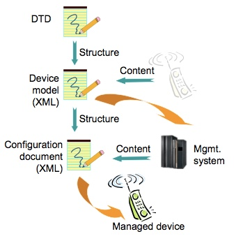

# 8.5 Device Description Framework 设备描述框架
## 8.5.1 Rationale for a Device Description Framework 设备描述框架的原理
In an ideal world all devices would display the same structure and behavior to a management system. But since different vendors are competing with each other on the market for various kinds of devices, it seems very unlikely that this would ever happen. But management systems still need to understand each individual device even though they do appear to have different internal structures and behaviors.<br/>
在理想的世界中，所有设备将向管理系统显示相同的结构和行为。 但是，由于不同的供应商在市场上与各种设备相互竞争，看起来不太可能发生这种情况。 但是管理系统仍然需要理解每个单独的设备，即使它们看起来具有不同的内部结构和行为。

To address this issue the concept of a device description framework is introduced. In short this framework prescribes a way for device vendors to describe their devices so that a management system can understand how to manage the device. The following figure illustrates the principle.<br/>
为了解决这个问题，引入了设备描述框架的概念。简而言之，该框架规定了设备供应商描述他们的设备的方式，使得管理系统可以理解如何管理设备。下图说明了原理。


By using a description framework we also make sure that the total management system based on OMA DM is flexible and easily extendible. And that it can accommodate not only the demands we put on it today but also the ones we might have tomorrow. We also avoid a situation where all future management needs would have to be standardized before they could be used in devices to simplify the use of these devices.<br/>
通过使用描述框架，我们还确保基于OMA DM的总管理系统是灵活的并且易于扩展。它不仅能适应我们今天提出的要求，而且能适应我们明天可能提出的要求。我们还避免了一种情况，即所有未来的管理需求必须标准化，然后才能用于设备，以简化这些设备的使用。

It is important to note that the description framework needs to co-exist with the existing standardized Management Objects, and that the borderline between the standardized Management Objects and Management Objects described by the framework will change over time. This will mainly happen when a standards body decides to create specifications on how their technology should be managed. It is in the interest of the OMA Device Management committee to encourage and support such initiatives from standard bodies active in wireless standardization, so that the set of standardized Management Objects increases.<br/>
重要的是要注意，描述框架需要与现有的标准化管理对象共存，并且框架所描述的标准化管理对象和管理对象之间的边界将随时间而改变。这将主要发生在标准机构决定创建关于如何管理其技术的规范时。符合OMA设备管理委员会的利益的是鼓励和支持活跃于无线标准化的标准机构的这些举措，以便增加标准化管理对象的集合。

## 8.5.2 The OMA DM Device Description Framework OMA DM设备描述框架
Today there exist a number of different description frameworks, but none of these seem to suit the purposes of OMA DM. There are also activities in other standards bodies that aim to develop new frameworks specifically for the wireless industry. With this in mind, OMA DM does currently not specify the use of any particular framework.<br/>
今天，存在许多不同的描述框架，但是这些框架似乎都不符合OMA DM的目的。其他标准机构也还有活动，旨在为无线行业开发新的框架。考虑到这一点，OMA DM目前没有规定使用任何特定的框架。

However, the need for a description framework remains and therefore OMA DM RECOMMEND using the following simple framework as an interim solution. This proposed description framework is defined by an XML DTD. Descriptions of Management Objects, or complete Management Trees, are valid XML documents. Device manufactures using the description framework MUST make the device descriptions available to DM Servers. The mechanism for this is currently not being standardized.<br/>
然而，描述框架是仍然需要的，因此OMA DM推荐使用以下简单框架作为临时解决方案。提出的这个描述框架由XML DTD定义。管理对象或完整管理树的描述是有效的XML文档。使用描述框架的设备制造商必须使设备描述可用于DM服务器。 其机制目前尚未标准化。

The OMA DM Device Description Framework DTD is defined in [DMDDFDTD].<br/>
OMA DM设备描述框架DTD在[DMDDFDTD]中定义。

## 8.5.3 XML usage XML用法
The OMA DM DDF information XML documents are specified using well-formed XML. However, they MAY not be valid XML. That is, they do not need to specify the XML prolog. They only need to specify properly identified name space element types from the OMA DM DDF information DTD. This restriction allows for the OMA DM DDF information to be specified with greater terseness than would be possible if a well-formed, valid XML document was REQUIRED.<br/>
使用格式良好的XML指定OMA DM DDF信息XML文档。但是，它们可能不是有效的XML。也就是说，他们不需要指定XML序言。他们只需要从OMA DM DDF信息DTD中指定正确标识的名称空间元素类型。这种限制允许以比如果需要格式良好的有效XML文档的情况下可能更严格地来指定OMA DM DDF信息。

This DTD makes heavy use of XML name spaces. Name spaces MUST be declared on the first element type that uses an element type from the name space.<br/>
此DTD大量使用XML名称空间。名称空间必须在使用名称空间中的元素类型的第一个元素类型上声明。

Names in XML are case sensitive. The element types in the OMA DM DDF information DTD are defined in [DMDDFDTD] or the URN syncml:dmddf.<br/>
XML中的名称区分大小写。OMA DM DDF信息DTD中的元素类型在[DMDDFDTD]或URN syncml：dmddf中定义。

OMA DM also makes use of XML standard attributes, such as xml:lang. Any XML standard attribute can be used in a XML document conforming to this DTD.<br/>
OMA DM还使用XML标准属性，如xml：lang。任何XML标准属性都可以在符合此DTD的XML文档中使用。

## 8.5.4 Framework Elements 框架元素
This section explains the elements used in the description framework DTD.<br/>
本节介绍在描述框架DTD中使用的元素。

### 8.5.4.1 Structural elements 结构元素
These elements provide various kinds of structural information of the described Management Object.<br/>
这些元素提供所描述的管理对象的各种结构信息。

#### 8.5.4.1.1 MgmtTree
Usage: Container for one or more described Management Objects.<br/>
用法：一个或多个描述的管理对象的容器。

Parent Elements: none<br/>
父元素：无

Restrictions: This MUST be the root element of all descriptions.<br/>
限制：这必须是所有描述的根元素。

Content Model:(VerDTD, Man?, Mod?, Node+)<br/>
内容模型：(VerDTD, Man?, Mod?, Node+)

#### 8.5.4.1.2 VerDTD
Usage: Specifies the major and minor version identifier of the OMA DM Description Framework specification used to represent the OMA DM description.<br/>
用法：指定用于表示OMA DM描述的OMA DM描述框架规范的主要和次要版本标识符。

Parent Elements: MgmtTree<br/>
父元素：MgmtTree

Restrictions: Major revisions of the specification create incompatible changes that will generally require a new parser. Minor revisions involve changes that do not impact basic compatibility of the parser. When the XML document conforms to this revision of the OMA DM Device Description Framework the value MUST be 1.2. The element type MUST be included in the MgmtTree.<br/>
限制：规范的主要修订版创建不兼容的更改，这通常需要一个新的解析器。 次要修订涉及不影响解析器的基本兼容性的更改。当XML文档符合OMA DM设备描述框架的此版本时，值必须为1.2。元素类型必须包含在MgmtTree中。

Content Model: (#PCDATA)<br/>
内容模型：(#PCDATA)

#### 8.5.4.1.3 Man
Usage: Specifies the manufacturer of the device. <br/>
用法：指定设备的制造商

Parent Elements: MgmtTree<br/>
父元素：MgmtTree

Restrictions: This element is OPTIONAL. <br/>
限制：此元素是可选的。

Content Model: (#PCDATA)<br/>
内容模型：(#PCDATA)

#### 8.5.4.1.4 Mod
Usage: Specifies the model number of the device. <br/>
用法：指定设备的型号。

Parent Elements: MgmtTree<br/>
父元素：MgmtTree

Restrictions: This element is OPTIONAL. <br/>
限制：此元素是可选的。

Content Model: (#PCDATA)<br/>
内容模型：(#PCDATA)

#### 8.5.4.1.5 Node
Usage: Specifies a Node.<br/>
用法：指定一个节点。

Parent Elements: MgmtTree <br/>
父元素：MgmtTree

Restrictions: This element is recursive. A Node with a Value element MUST always terminate the recursion. It is possible for a Node to omit both the next recursive Node and a Value, this means that the hierarchy of Nodes continues elsewhere. This can be used to increase readability of very deep trees. In the continuation, the Path element MUST contain a full URI that specifies the insertion point in the tree.<br/>

ContentModel:(NodeName, Path?, RTProperties?, DFProperties?, (Node`*`|Value?))<br/>
内容模型：(NodeName, Path?, RTProperties?, DFProperties?, (Node`*`|Value?))

Example: The following XML is a description of a number of Nodes that form the URI Vendor/ISP/GWInfo/GWName. Note that all the details of DFProperties are deliberately left out.<br/>
```
<MgmtTree>
  <Node>
    <NodeName>Vendor</NodeName>
     <DFProperties>...</DFProperties>
     <Node>
       <NodeName>ISP</NodeName>
       <DFProperties>...</DFProperties>
       <Node>
        <NodeName>GWInfo</NodeName>
        <DFProperties>...</DFProperties>
        <Node>
          <NodeName>GWName</NodeName>
          <DFProperties>...</DFProperties>
          <Value>gw.yyy.se</Value>
        </Node>
      </Node>
     </Node>
  </Node>
</MgmtTree>
```
