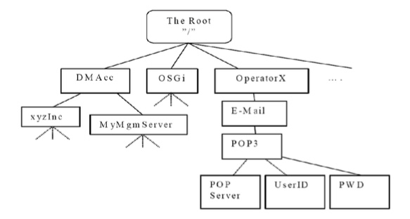

# 9.1 TND Serialization Definition TND序列化定义
## 9.1.1 TNDS XML usage TNDS XML使用
This specification defines how to transform between a management sub-tree and xml structure. The DTD used for this is the same as defined in [DMTND]. A XML document complying with this specification has a similar but different content than the [DMTND] specification. Therefore a document complying with this specification MUST use a specific MIME-type to indicate it. It is also possible to use the WBXML encoding mechanism defined in [DMTND]. The two MIME-types, one for XML and one for WBXML are specified in Appendix.<br/>
这个规范定义了如何在管理子树和xml结构之间转换。用于此的DTD与[DMTND]中定义的相同。符合本规范的XML文档具有与[DMTND]规范类似但不同的内容。因此，符合本规范的文档必须使用特定的MIME类型来表示它。也可以使用[DMTND]中定义的WBXML编码机制。两个MIME类型，一个用于XML，一个用于WBXML，在附录中指定。

## 9.1.2 General 总体
During runtime the client’s management tree will contain interior nodes and leaf nodes. The client may take a snap-shot on the management tree or a subset of the management tree and convert all information of that part of the management tree into either an xml or a wbxml stream. Some fields are optional and some are mandatory to support. The description for all properties is defined in [DMTND]. Properties which are optional in the management tree may not be stored in the file.<br/>
在运行时期间，客户端的管理树将包含内部节点和叶节点。客户端可以在管理树或管理树的子集上进行快照，并将管理树的该部分的所有信息转换为xml或wbxml流。一些字段是可选的，一些是强制支持的。所有属性的描述在[DMTND]中定义。在管理树中可选的属性可能不会存储在于文件中。

The DTD in [DMTND] defines the format of the xml or wbxml file. This specification will not define any transport binding for the xml or wbxml byte stream.<br/>
[DMTND]中的DTD定义了xml或wbxml文件的格式。此规范不会为xml或wbxml字节流定义任何传输绑定。

The following figure shows an example of a management tree. With this specification it is possible for the device to translate the E-Mail Management Object to or from an xml or wbxml file.<br/>
下图显示了管理树的示例。使用此规范，设备可以将电子邮件管理对象转换为xml或wbxml文件或从这些文件中转换。



## 9.1.3 DM Commands with TNDS data DM命令与TNDS数据
The format of the TNDS object as byte stream has it own MIME-type. Therefore if the device and server support this MIME- type it is possible to use DM commands and operate on a complete sub tree in one command. The behavior for these commands are described in [DMREPPRO].<br/>
作为字节流的TNDS对象的格式具有它自己的MIME类型 因此，如果设备和服务器支持这种MIME类型，则可以使用DM命令并且在一个命令中对完整的子树进行操作。这些命令的行为在[DMREPPRO]中描述。

For example the server will be able to create a large complete structure including data with one single Add command. <br/>
例如，服务器将能够使用一个单独的Add命令创建大的包括数据的完整结构。

This is an example for creating a E-Mail object:<br/>
这是创建电子邮件对象的示例：
```
<Add>
  <CmdID>4</CmdID>
  <Item>
    <Target>
       <LocURI>/OperatorX</LocURI>
    </Target>
    <Meta>
      <Format xmlns=’syncml:metinf’>xml</Format> 
      <Type xmlns=’syncml:metinf’>
            application/vnd.syncml.dmtnds+xml
      </Type>
    </Meta>
    <Data>
          <MgmtTree xmlns=’syncml:dmddf1.2’>
            <VerDTD>1.2</VerDTD>
            <Node>
              <NodeName>E-Mail</NodeName>
              <RTProperties >
                <Format>
                  <node/>
                </Format>
                <Type><DDFName>com.operatorX.dm/1.0/EMail</DDFName></Type> 
              </RTProperties>
              <Node>
                <NodeName>POP3</NodeName>
                <Node>
                  <NodeName>POPServer</NodeName>
                  <RTProperties >
                    <Format>
                      <chr/>
                    </Format>
                    <Type ><MIME>text/plain</MIME></Type> 
                  </RTProperties >
                  <Value >mail.Operatorx.com</Value>
                </Node>
                <Node>
                  <NodeName>UserID</NodeName>
                  <RTProperties>
                    <Format>
                      <chr/>
                    </Format>
                    <Type><MIME>text/plain</MIME></Type> 
                  </RTProperties> 
                  <Value>UserName</Value>
                </Node>
                <Node>
                  <NodeName>PWD</NodeName>
                  <RTProperties>
                    <Format>
                      <chr/>
                    </Format>
                    <Type><MIME>text/plain</MIME></Type> 
                  </RTProperties>
                  <Value>4571F7C34A9876B3</Value>
              </Node>
            </Node>
          </Node>
   </MgmtTree>
   </Data>
  </Item>
<Add>

```
