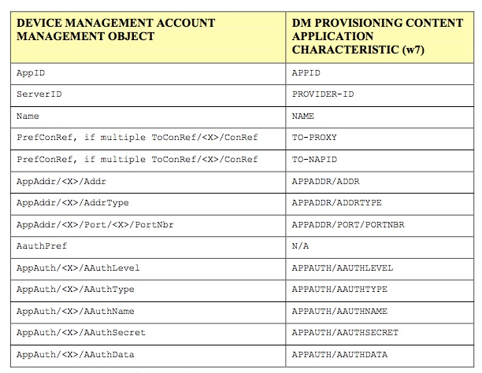
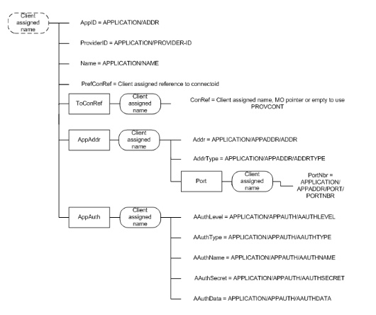

# Appendix 附录

## Mapping of Device Management parameters 设备管理参数映射

In the below table the Device Management Account Management Object and Device Management Provisioning Content Application characteristic (w7) parameter correspondence is shown. 
在下表中，示出了设备管理帐户管理对象和设备管理预配置内容应用特性（w7）参数对应关系。

The following diagram shows how information from the provisioning content and the w7 characteristic are mapped to the management tree. 
下图显示了如何将配置内容和w7特性中的信息映射到管理树。

Requirements for DM client when it converts the w7 APPLICATION characteristic to the management tree: 
DM客户端将w7 APPLICATION特性转换为管理树时的要求：

* DM Client MUST assign a unique name for the `<X>` (DMAcc Interior node) as specified in Section 7.1.3.2 in [DMBOOT]. Management server can modify this node name in some subsequent DM session. 
DM客户端必须为`<X>`（DMAcc内部节点）分配唯一的名称，如第7.1.3.2节[DMBOOT]中所述。管理服务器可以在一些后续DM会话中修改此节点名称。

* The DM Client MUST grant Get, Replace and Delete ACL rights to the specified ServerId for the `<X>` (DMAcc Interior node) as specified in Section 7.1.3.4 in [DMBOOT]. The provisioning server MAY modify this ACL to provide broader or narrower access in a subsequent DM session. 
DM客户端必须授予对`<X>`（DMAcc内部节点）的指定ServerId的Get，Replace和Delete ACL权限，如[DMBOOT]中的第7.1.3.4节中所述。配置服务器可以修改此ACL以在随后的DM会话中提供更宽或更窄的访问。

The values of each leaf in the DMAcc object is derived from a w7 APPLICATION characteristic as follows: 
DMAcc对象中每个叶的值来自w7 APPLICATION特性，如下所示：

* AppID – takes the value of the APPLICATION/APPID = w7. 
AppID - 采用APPLICATION/APPID = w7的值。

* ServerID – takes the value of APPLICATION/PROVIDER-ID. 
ServerID - 取值为APPLICATION/PROVIDER-ID

* Name – takes the value of APPLICATION/NAME 
名称 - 采用APPLICATION/NAME的值

* PrefConRef – client assigned reference to connectoid, e.g. Connectivity MO or connection information maintained outside of the management tree, for example as specified within PXLOGICAL and NAPDEF. 
PrefConRef - 客户端分配给connectoid的引用，例如 在管理树外部维护的连接MO或连接信息，例如在PXLOGICAL和NAPDEF中指定的。

* ToConRef/`<X>`/ConRef -  client assigned name, MO pointer or may be left empty by the DM client to use connection information maintained outside of the management tree, for example as specified within PXLOGICAL and NAPDEF. 
ToConRef/`<X>`/ConRef -  客户端分配的名称，MO指针，或者可以由DM客户端留空以使用在管理树外部维护的连接信息，例如在PXLOGICAL和NAPDEF中指定的。

* AppAddr/`<X>`/Addr  -  takes the value of APPLICATION/APPADDR/ADDR. 
AppAddr/`<X>`/Addr  -  采用APPLICATION / APPADDR / ADDR的值

* AppAddr/`<X>`/AddrType - takes the value of APPLICATION/APPADDR/ADDRTYPE. 
AppAddr /`<X>`/AddrType - 采用APPLICATION / APPADDR / ADDRTYPE的值

* AppAddr/`<X>`/Port/`<X>`/PortNbr  -  takes the value of APPLICATION/APPADDR/PORT/PORTNBR. 
AppAddr/`<X>`/Port/`<X>`/PortNbr - 采用APPLICATION/APPADDR/PORT/PORTNBR的值.

* AppAuth/`<X>`/AAuthLevel  -  correspondence to APPLICATION/APPAUTH/AAUTHLEVEL values is as follows: 
与APPLICATION / APPAUTH / AAUTHLEVEL值的对应关系如下：

| w7 APPLICATION/APPAUTH/AAUTHLEVEL | DMAcc AppAuth/<x>/AAuthLevel |
| -- | -- |
| APPSRV | CLCRED |
| CLIENT | SRVCRED |
| OBEX | OBEX |

* AppAuth/`<X>`/AAuthType – takes the value of APPLICATION/APPAUTH/AAUTHTYPE
AppAuth /`<X>`/ AAuthType - 采用APPLICATION/APPAUTH/AAUTHTYPE的值

* AppAuth/`<X>`/AAuthName – takes the value of APPLICATION/APPAUTH/AAUTHNAME
AppAuth / `<X>` / AAuthName - 采用APPLICATION/APPAUTH/AAUTHNAME的值

* AppAuth/`<X>`/AAuthSecret – takes the value of APPLICATION/APPAUTH/AAUTHSECRET 
AppAuth /`<X>` / AAuthSecret - 采用APPLICATION/APPAUTH/AAUTHSECRET的值

* AppAuth/`<X>`/AAuthData – takes the value of APPLICATION/APPAUTH/AAUTHDATA 
AppAuth /`<X>`/ AAuthData - 采用APPLICATION / APPAUTH / AAUTHDATA的值
