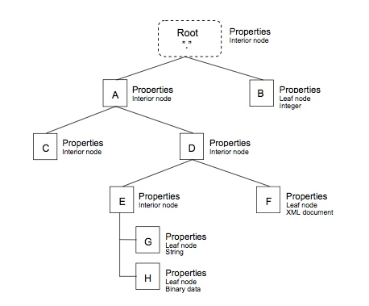

# Appendix 附录

## Tree Exchange Examples 树交换示例
In the examples below the DM client has a following Management Tree.<br/>
在下面的示例中，DM客户端具有以下管理树。

### Example of a Get with Attribute Struct 使用属性获取结构的示例
In the example below DM server requests a Management Tree structure from a client.<br/>
在下面的示例中，DM服务器从客户端请求管理树结构。
```
<Get>
  <CmdID>4</CmdID>
  <Item>
    <Target> 
      <LocURI>./A?list=Struct</LocURI>
    </Target>
  </Item>
</Get>
```
Client response using Result and multiple Item elements.<br/>
客户端响应使用Result和多个Item元素。
```
<Results>
  <CmdRef>4</CmdRef>
  <CmdID>7</CmdID>
  <Item>
    <Meta>
        <Format xmlns="syncml:metinf">node</Format>
    </Meta>
    <Source>
        <LocURI>./A</LocURI>
    </Source>
    </Item>
    <Item>
      <Meta>
        <Format xmlns="syncml:metinf">node</Format>
      </Meta>
    <Source>
      <LocURI>./A/C</LocURI>
    </Source>
    </Item>
    <Item>
      <Meta>
        <Format xmlns="syncml:metinf">node</Format>
      </Meta>
    <Source>
        <LocURI>./A/D</LocURI>
    </Source>
  </Item>
  <Item>
    <Meta>
       <Format xmlns="syncml:metinf">node</Format>
    </Meta>
    <Source>
      <LocURI>./A/D/E</LocURI>
    </Source>
  </Item>
  <Item>
    <Meta>
      <Format xmlns="syncml:metinf">xml</Format>
    </Meta>
    <Source>
      <LocURI>./A/D/F</LocURI>
    </Source>
  </Item>
  <Item>
    <Source>
      <LocURI>./A/D/E/G</LocURI>
    </Source>
  </Item>
  <Item>
    <Meta>
       <Format xmlns="syncml:metinf">b64</Format> </Meta>
    <Source>
      <LocURI>./A/D/E/H</LocURI>
    </Source>
  </Item>
</Results>
```
### Example of a Get with Attribute StructData 获取属性StructData的示例
In the example below DM Server requests a Management Tree structure as well as the data from a client.<br/>
在下面的示例中，DM Server请求管理树结构以及来自客户端的数据。
```
<Get>
  <CmdID>4</CmdID>
  <Item>
    <Target> 
      <LocURI>./A/D?list=StructData</LocURI>
    </Target>
  </Item>
</Get>
```
Client response using Result and multiple Item elements.<br/>
客户端响应使用Result和多个项目元素。
```
<Results>
  <CmdRef>4</CmdRef>
  <CmdID>7</CmdID>
  <Item>
  <Meta>
    <Format xmlns="syncml:metinf">node</Format>
    </Meta>
    <Source>
      <LocURI>./A/D</LocURI>
    </Source>
  </Item>
  <Item>
  <Meta>
    <Format xmlns="syncml:metinf">node</Format>
  </Meta>
    <Source>
      <LocURI>./A/D/E</LocURI>
    </Source>
  </Item>
  <Item>
  <Meta>
      <Format xmlns="syncml:metinf">xml</Format>
  </Meta>
  <Source>
    <LocURI>./A/D/F</LocURI>
  </Source>
    <Data>”XML document”</Data>
  </Item>
  <Item>
  <Source>
      <LocURI>./A/D/E/G</LocURI>
  </Source>
    <Data>leaf node data</Data>
  </Item>
  <Item>
    <Meta>
      <Format xmlns="syncml:metinf">b64</Format>
      <Type xmlns=’syncml:metinf’>image/jpeg</Type> 
    </Meta>
   <Source>
    <LocURI>./A/D/E/H</LocURI>
   </Source>
   <Data>JSCNMDTUVWXYZcuokcdghfidjssatu</Data> 
  </Item>
</Results>
```
## MIME Media Type Definition MIME媒体类型定义
| MIME Type MIME类型 | Description 描述 |
| -- | -- |
| application/vnd.syncml.dmddf+xml | XML encoded DDF document complying to this specification<br/>符合本规范的XML编码DDF文档 |
| application/vnd.syncml.dmddf+wbxml | WBXML encoded DDF document complying to this specification<br/>WBXML编码符合本规范的DDF文档 |
