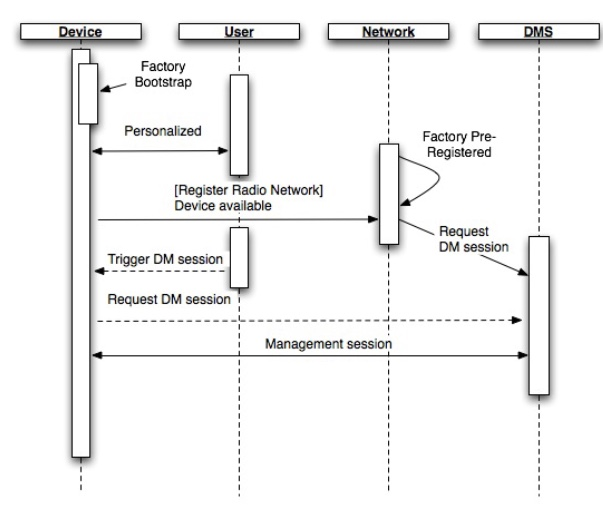
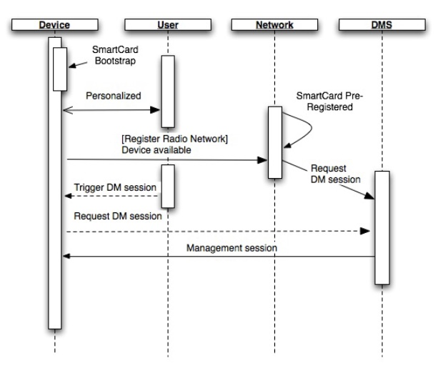
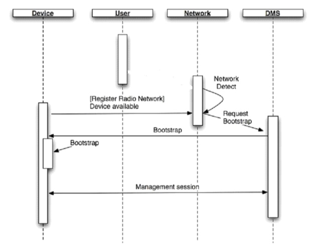
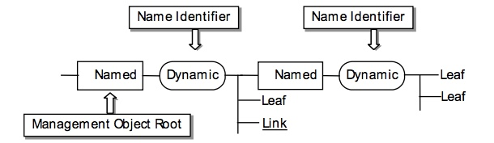

#3.1 Bootstrapping 初始化
##3.1.1 Bootstrap scenarios 初始化场景
OMA DM devices need to be able to function in diverse network environments and using a large set of protocols. This makes it hard to find a ‘one size fits all’ solution to the bootstrap problem. This section starts with the most basic requirements for bootstrap and continues to define three different processes for bootstrap. <br/>
OMA DM设备需要能够在不同的网络环境中工作并使用大量的协议。这使得很难找到一个“一刀切”的解决方案引导问题。本节从初始化的最基本的要求开始，并继续定义三个不同的初始化进程。

##3.1.1.1 Requirements 需求
An OMA DM solution capable of transforming an empty, clean device into a state where it is able to initiate a management session needs to address these requirements.<br/>
能够将空的，干净的设备转换成能够发起管理会话的状态的OMA DM解决方案需要解决这些需求。
* Re-use technology (WAP Push)<br/>
重用技术（WAP Push）
* Tightly standardized and simple Highly interoperable<br/>
严格标准化和简单高度互操作
* Self sufficient and complete<br/>
自给自足，完整
* Secure<br/>
安全
* Data format should be XML based<br/>
数据格式应基于XML
* Content mappable to OMA DM management objects<br/>
可映射到OMA DM管理对象的内容
* Transport encoding should be [WBXML1.1], [WBXML1.2], [WBXML1.3]<br/>
传输编码应为[WBXML1.1]，[WBXML1.2]，[WBXML1.3]

##3.1.1.2 Solutions 解决方案
This document defines three different ways to perform the bootstrap process.<br/>
本文档定义了三种不同的方式来执行初始化过程。

* Customized bootstrap 自定义初始化<br/>
Devices are loaded with OMA DM bootstrap information at manufacture. Also referred to as factory bootstrap.<br/>
设备在制造时加载OMA DM引导信息。也称为工厂初始化。
* Server initiated bootstrap 服务器启动的初始化<br/>
Server sends out bootstrap information via some push mechanism, e.g. WAP Push or OBEX. Server must receive the device address/phone number beforehand.<br/>
服务器经由一些推送机制发送引导信息，例如，WAP推送或OBEX。服务器必须事先接收设备地址/电话号码。
* Bootstrap from smartcard 从智能卡初始化<br/>
The smartcard is inserted in the device and the DM client is bootstrapped from the smartcard.<br/>
将智能卡插入设备中，并且从智能卡初始化DM客户端。

###3.1.1.2.1 Customized bootstrap 自定义初始化

This is a convenient way to bootstrap a device from an end user perspective because the user does not have to do anything. In this scenario, an operator orders the devices pre-configured from a device manufacturer. All the information about the operator’s network and device management infrastructure is already in the devices when they leave the factory. Another advantage of this method is that it is very secure. There is no need to transport sensitive commands and information, e.g. shared secrets, over the air. The method is however not very flexible and not all device manufacturers may provide this service. Not all devices are sourced via the operator. In this scenario, either the DM server or the Client initiates an OMA DM session after user personalizes and bootstraps the Device. If the server initiates management session, the Server is informed about Device address or phone number previously.<br/>
这是从最终用户角度初始化设备的方便方法，因为用户不必做任何事情。在这种情况下，操作员从设备制造商订购预先配置的设备。有关运营商的网络和设备管理基础设施的所有信息在设备出厂时已在设备中。这种方法的另一个优点是它是非常安全的。没有传输敏感的命令和信息，例如，在空下载中传输机密数据。 然而，该方法不是非常灵活，并且并非所有设备制造商都可以提供这种服务。并非所有设备都通过运营商采购。在这种情况下，DM服务器或客户端在用户个性化并初始化设备后启动OMA DM会话。如果由服务器启动管理会话，则设备地址或电话号码需在之前告知服务器。

Figure gives an overview of this scenario.<br/>
图给出了这种情况的概述。


####3.1.1.2.1.1 Bootstrap from smartcard 从智能卡的初始化
This is a convenient way to bootstrap a device from an end user perspective because the user does not have to do anything. In this scenario the DM client is able to obtain the information necessary to bootstrap it from the smartcard. There is no need to transport sensitive bootstrap commands and information, e.g. shared secrets, over the air. The smartcard is secure, ensuring that the bootstrapping commands have been authorized. A device supporting the smartcard can be bootstrapped for DM without necessarily being purchased from the operator. In this scenario, either the DM Server or the Client initiates an OMA DM session after user bootstraps and personalizes the Device. If Server initiates management session, the Server is informed about Device address or phone number previously.<br/>
这是从最终用户角度初始化设备的方便方法，因为用户不必做任何事情。 在这种情况下，DM客户端能够从智能卡获得初始化它所需的信息。不需要传输敏感的初始化命令和信息，例如在空下载中传输机密数据。智能卡是安全的，可以确保引导命令已被授权。支持智能卡的设备可以为DM初始化而不必从运营商处购买。在这种情况下，DM服务器或客户端在用户初始化和个性化设备后启动OMA DM会话。如果服务器启动管理会话，则设备地址或电话号码在之前告知服务器。

Figure gives an overview of this scenario.<br/>
图给出了这种情况的概述。

###3.1.1.2.2 Server initiated bootstrap 服务器启动的引导

In this scenario, the devices leave the assembly line in a clean and empty state. Once a user acquires a device and personalizes it, e.g. by inserting a SIM, the prerequisites for this process are in place. The problem is now to inform the server of the identity, address or phone number of the device and this can be achieved in many ways.<br/>
在这种情况下，设备在干净和空的状态离开装配线。一旦用户获取设备并对其进行个性化，例如，插入SIM，则该过程的先决条件满足。现在的问题是通知服务器设备的身份，地址或电话号码，这可以以许多方式实现。

* It could be done at the point-of-sales where a sales system ties in with the management system and delivers the information.<br/>
可以在销售点，销售系统与管理系统结合提供信息。
* It could be done through a self-service web site where the user enters her own phone number.<br/>
可以通过自助服务网站完成，用户输入自己的电话号码。
* It could be done by the network the first time the device registers to the network. When this happens a trigger could be sent from the core network to the management server with the number used by the device.<br/>
它可以由设备首次注册到网络时完成。当这种情况发生时，触发器可以从核心网络发送到具有设备使用的号码的管理服务器。
* It could be done with a voice prompt system where the user is prompted to key in her phone number using DTMF.<br/>
可以使用语音提示系统完成，即提示用户使用DTMF键入她的电话号码。

Regardless of how the phone number or device address reaches the management server, the server is now in a position where it can send out an OMA DM bootstrap message. This bootstrap message, whose structure and content are defined in this document, contains enough information for the device to be able to initiate a management session with the device management server that sent out the bootstrap message.<br/>
不管电话号码或设备地址如何到达管理服务器，服务器现在处于可以发送OMA DM初始化消息的状态。此初始化消息（其结构和内容在本文档中定义）包含足够的信息，以使设备能够发起与发送初始化消息的设备管理服务器的管理会话。

It is important that DM clients accept bootstrapping commands only from authorized servers [DMSecurity].<br/>
重要的是，DM客户端只接受来自授权服务器[DMSecurity]的引导命令。

Figure gives an overview of this scenario.<br/>
图给出了这种情况的概述。


##3.1.2 Bootstrap profiles 初始化配置文件
OMA DM has been designed to meet the management requirements of many different types of devices. For some of these device types there already exists a bootstrap or provisioning mechanism. In these cases OMA DM leverages the existing mechanisms so that backwards compatibility and simple deployment can be achieved. To define how different kinds of devices can be bootstrapped and to specify how OMA DM leverages existing standards this document introduces the concept of bootstrap profiles. Each profile defines its own security, transport and data format. Support for any particular profile is OPTIONAL.<br/>
OMA DM已经被设计为满足许多不同类型的设备的管理要求。对于这些设备类型中的一些，已经存在初始化或配置机制。 在这些情况下，OMA DM利用现有机制，以便可以实现向后兼容性和简单部署。要定义如何初始化不同类型的设备，并指定OMA DM如何利用现有标准，本文档介绍了初始化配置文件的概念。每个配置文件定义其自身的安全性，传输和数据格式。支持任何特定的配置文件是可选的。

Currently two profiles are planned, but as interest in OMA DM grows and usage of it increases more profiles can be added. The two profiles are:<br/>
目前在计划中的有两个配置文件，但随着对OMA DM的兴趣的增加和使用的增多更多的配置文件可以被添加。这两个配置文件是：

* OMA Client Provisioning OMA客户端配置<br/>
This profile specifies alignment of two existing enablers – OMA Client Provisioning [ERELDCP] and OMA Device Management [ERELDDM]. The profile defines how the information provisioned using OMA Client Provisioning can be transferred to the management tree specified in the OMA Device Management. In this profile at least the mapping of w7 (DM account) information to the management tree needs to be supported, but other provisioning information can also be mapped to the management tree.
此配置文件指定两个现有启用程序（OMA客户端配置[ERELDCP]和OMA设备管理[ERELDDM]）的对齐。配置文件定义如何将配置OMA客户端提供的信息传输到OMA设备管理中指定的管理树。在此配置文件中，至少需要支持w7（DM帐户）信息到管理树的映射，但是其他配置信息也可以映射到管理树。

* OMA Device Management OMA设备管理<br/>
This profile defines how the OMA Device Management [ERELDDM] can be used for bootstrapping.<br/>
此配置文件定义如何使用OMA设备管理[ERELDDM]进行引导。

##3.1.3 OMA Client Provisioning Profile OMA客户端配置文件

OMA Client Provisioning enabler [ERELDCP] is designed to provision the initial configuration information to evices, and can be used with OMA Device Management enabler [ERELDDM] to subsequently add, update, delete and retrieve all kind of data. The chapter specifies the mapping of the Client Provisioning information to the Device Management management tree in a way that later management for the provisioned parameters is possible in case both Client Provisioning and Device Management enablers are supported by the client device.<br/>
OMA客户端配置启用程序[ERELDCP]旨在向设备提供初始配置信息，并可与OMA设备管理启用程序[ERELDDM]一起使用，以便随后添加，更新，删除和检索所有类型的数据。本章以如下方式指定客户端配置信息到设备管理管理树的映射：如果客户端设备支持客户端配置和设备管理使能器，则可以稍后对所配置的参数进行管理。

The content of the Bootstrap message is based on the OMA Provisioning Content Specification [PROVCONT]. In order to enable the usage of the OMA Provisioning Content Specification within the OMA Device Management framework, the DM application registration document w7 [ACw7DM] is released by DM group to provide information how the APPLICATION characteristic in OMA Provisioning content [PROVCONT] is used to provision OMA Device Management enabler [ERELDDM] parameters.<br/>
初始化消息的内容基于OMA初始化内容规范[PROVCONT]。为了能够在OMA设备管理框架内使用OMA配置内容规范，DM组发布DM应用程序注册文档w7 [ACw7DM]，以提供如何使用OMA配置内容[PROVCONT]中的APPLICATION特性配置OMA设备管理启用程序[ERELDDM]参数。

###3.1.3.1 Transports 传输
Bootstrapping using OMA Client Provisioning profile is done as defined in the OMA Provisioning Bootstrap specification [PROVBOOT].<br/>
使用OMA客户端配置文件初始化是按照OMA配置初始化规范[PROVBOOT]中的定义完成的。

###3.1.3.2 Mapping Characteristic Data to the Management Tree 将特征数据映射到管理树
When device receives Client Provisioning document the device creates a management object for that information to the management tree in order to enable the subsequent management. Management object can have two different types of name space identifiers (Property Name described in [DMTND]) - One where the name is already given in the DDF [DMTND] and another where the name is dynamic separating the instances of the child nodes.<br/>
当设备接收到客户端配置文档时，设备为管理树创建该信息的管理对象，以便启用后续管理。管理对象可以有两种不同类型的名称空间标识符（[DMTND]中描述的属性名称）-其中名称已经在DDF [DMTND]中给出，另一个名称是动态分隔子节点的实例。

The name identifiers for named nodes are already given in the management object DDF. Also, the parameter mapping between Client Provisioning parameters and Management Object parameters MAY be specified in the Management Object specification. In addition a general rule that SHOULD be followed to map named information between Client Provisioning APPLICATION characteristic and standardized Application Connectivity Management Object template structure is given in Appendix .<br/>
命名节点的名称标识符已经在管理对象DDF中给出。此外，客户端配置参数和管理对象参数之间的参数映射可以在管理对象规范中指定。此外，在附录中给出了在客户端配置APPLICATION特性和标准化应用连接管理对象模板结构之间推荐遵循的映射命名信息的一般规则。

The device gives the name identifiers for dynamic nodes that are separating the instances of the child nodes. Though the format of name identifiers for these dynamic nodes is implementation specific, a client MAY assign numeric identifiers starting from ‘1’ and increasing by one every time. In this case and when there is priority specified in the Provisioning Content document the rank SHOULD reflect that.<br/>
设备给出了分隔子节点实例的动态节点的名称标识符。尽管这些动态节点的名称标识符的格式是实现特定的，客户端可以分配从“1”开始的数字标识符，并且每次增加一个。 在这种情况下，当在配置内容文档中指定优先级时，推荐排名反映这一点。

###3.1.3.3 Management Object Location in the Management Tree 管理对象在管理树中的位置
Newly created management object location in the management tree is decided by thedevice. However, it MUST be placed following the published DDF of the management tree so that the server is able to know where to find the provisioned information.<br/>

管理树中新创建的管理对象位置由设备决定。但是，它必须放在管理树已发布的DDF之后，以便服务器能够知道在哪里找到已配置的信息。

###3.1.3.4 Management Object Access Rights 管理对象访问权限
All provisioning information mapped from the Provisioning Content [PROVCONT] document to management tree MUST be granted Get, Replace and Delete ACL rights to the ServerID specified in the w7 APPLICATION characteristic provisioned inside Provisioning Content message. The management authority owning the ServerID may modify this ACL in a subsequent DM session.<br/>
从配置内容[PROVCONT]文档映射到管理树的所有配置信息必须被授予对在配置内容消息内配置的w7 APPLICATION特性中指定的ServerID的Get，Replace和Delete ACL权限。 拥有ServerID的管理权限可以在随后的DM会话中修改此ACL。

In case w7 APPLICATION characteristic is not part of the provisioning message client device receiving the message and mapping the information to the DM management tree MUST NOT give the access rights to these parameters to the improper management authority.<br/>
在w7 APPLICATION特征不是配置消息客户端设备的一部分的情况下，接收消息并将该信息映射到DM管理树必须不将这些参数的访问权限给予不适当的管理权限。

###3.1.3.5 Special Behaviors 特殊行为
####3.1.3.5.1 Smart Card Provisioning 智能卡配置
In case Smart Card contains the provisioning information as specified in the [PROVSC] device SHOULD detect the removal and/or change of the Smart Card. When the Smart Card is removed and/or changed, the client device SHOULD remove all the provisioned management object information (originated from the Smartcard) from the management tree.<br/>
如果智能卡包含[PROVSC]设备中指定的配置信息，则推荐检测智能卡的删除和/或更改。 当智能卡被移除和/或更改时，客户端设备应该从管理树中删除所有设置的管理对象信息（源自智能卡）。

###3.1.3.6 Device Management, Access Point and Proxy Information 设备管理，接入点和代理信息
Devices supporting both Client Provisioning and Device Management MUST be able to map w7 (Device Management account) and NAPDEF (if supported) and PROXY (if supported) characteristics information to the management tree. The mapping of the named nodes is specified in [DMSTDOBJ].<br/>
支持客户端配置和设备管理的设备必须能够将w7（设备管理帐户）和NAPDEF（如果支持）和PROXY（如果支持）特性信息映射到管理树。命名节点的映射在[DMSTDOBJ]中指定。

In case device supports the management objects specified in [DMSTDOBJ] a mapping is described in Appendix in [DMSTDOBJ].<br/>
如果设备支持[DMSTDOBJ]中指定的管理对象，则在[DMSTDOBJ]中的附录中描述了映射。

Client device MUST give the names for the dynamic nodes as described in Section 3.1.3.2.<br/>
客户端设备必须给出动态节点的名称，如第3.1.3.2节所述。

###3.1.3.7 Other Client Provisioning information其他客户端配置信息
Devices supporting both Client Provisioning and Device Management MAY decide to map other information provisioned in the Client Provisioning message to the management tree. A general mapping is described in Appendix, but in case a specific mechanism is described in the Management Object document that MUST be followed.<br/>
支持客户端配置和设备管理的设备可以决定将客户端配置消息中配置的其他信息映射到管理树。 一般映射在附录中描述，但是是在管理对象文档中描述的必须遵循的特定机制的情况下。

##3.1.4 OMA Device Management Profile OMA设备管理配置文件
The content of the Bootstrap message is a standard OMA DM message that MUST be encoded into [WBXML1.1], [WBXML1.2], [WBXML1.3]. Clients MUST support embedded WBXML encoded TNDS objects [DMTNDS] and MUST support the inbox. In order to be bootstrapped successfully the DM client requires both DM account information and connectivity information. It is RECOMMENDED to use standardized connectivity MOs to represent the connectivity information.<br/>
初始化消息的内容是必须编码为[WBXML1.1]，[WBXML1.2]，[WBXML1.3]的标准的OMA DM消息。客户端必须支持嵌入的WBXML编码的TNDS对象[DMTNDS]，并且必须支持收件箱。为了成功初始化，DM客户端需要DM帐户信息和连接信息。推荐使用标准化连通性MO来表示连接信息。

###3.1.4.1 Transport 传输
Any transport MAY be used to send the Bootstrap message to the DM client. Security appropriate for bootstrapping a device securely, and appropriate for the transport used MUST be employed. Otherwise, transport neutral security MUST be employed. See the security document for further information [DMSecurity].<br/>
任何传输都可以用于向DM客户端发送初始化消息。它必须使用适合于安全地初始化设备并且适合于所使用的传输的安全性。 否则，必须使用运输中性安全。 更多有关信息，请参阅安全文档[DMSecurity]。

###3.1.4.2 Management tree ACL and bootstrap 管理树ACL和初始化
The policy that the device consults to decide if a bootstrap message will be accepted and what access rights to be granted for the new management authority is outside the scope of this specification. If a bootstrap message is accepted it MUST be processed according to the conditions described in section 3.1.4.5, in order for the bootstrap to be successful.<br/>
设备参考以决定是否接受初始化消息以及为新管理权限授予什么访问权限的策略不在本规范的范围之内。 如果接受初始化消息，它必须根据3.1.4.5节中描述的条件进行处理，以便初始化成功。

###3.1.4.3 Management Object Access Rights 管理对象访问权限
When a DM boostrap message adds new TNDS objects - any ACL values that are to be set for these objects MUST be included in the TNDS data as ACL property data for the applicable nodes.<br/>
当DM初始化消息添加新的TRENDS对象时 - 要为这些对象设置的任何ACL值必须作为适用节点的ACL属性数据包含在TNDS数据中。

###3.1.4.4 Bootstrap Message Content 初始化消息内容
The content of a bootstrap message is an OMA DM message. However, it is a special package in many ways since it is not part of an ongoing OMA DM session but rather a one-time transfer of information. Hence, many of the elements needed to manage the session are superfluous in the context of bootstrapping, but they must still be included so that the message may be processed by the normal OMA DM client.<br/>
引导消息的内容是OMA DM消息。 然而，它在许多方面是一个特殊的包，因为它不是正在进行的OMA DM会话的一部分，而是一次性的信息传递。 因此，在初始化的上下文中管理会话所需的许多元素是多余的，但是它们仍然必须被包括，使得消息可以由正常OMA DM客户端处理。

All OMA DM bootstrap messages MUST be [WBXML1.1], [WBXML1.2], [WBXML1.3] encoded.<br/>
所有OMA DM引导消息必须是[WBXML1.1]，[WBXML1.2]，[WBXML1.3]编码。

OMA DM servers MUST NOT expect any Status for the command in a bootstrap package. An implicit acknowledgement of successful bootstrap can be concluded when the client connects to the server for the first management session.<br/>
OMA DM服务器不能期望引导程序包中的命令有任何状态。当客户端连接到服务器进行第一个管理会话时，成功初始化的隐式确认可以被结束。

A typical bootstrap message will set the values for the DMAcc management object defined in [DMSTDOBJ].<br/>
典型的初始化消息将设置[DMSTDOBJ]中定义的DMAcc管理对象的值。

###3.1.4.5 Processing of the Bootstrap 初始化处理
A Bootstrap message is processed just like a normal DM message, except that a response MUST NOT be sent back.<br/>
初始化消息的处理与正常的DM消息相同，只是必须不发送回应。

The device MAY rename a new MO. In the case of the Connectivity MO the device SHOULD also rename the values of the corresponding connectivity references to the new name for all MO’s encoded within the same TNDS object.<br/>
设备可以重命名新的MO。在连接MO的情况下，推荐设备将对应连接性引用的值重命名为在同一TNDS对象内编码的所有MO的新名称。

When a TNDS object contains a MO where connectivity references are linked to a Connectivity or Proxy MO that also are included in the same TNDS object, then the values of those connectivity references MAY contain a URI that starts with “./Inbox”. In that case the URI MUST have the value of “./Inbox/” plus the URI of that Connectivity MO’s location in the same TNDS object.<br/>
当TNDS对象包含MO，其中连接性引用链接到也包括在同一TNDS对象中的连接或代理MO时，那些连接引用的值可以包含以“./Inbox”开头的URI。 在这种情况下，URI必须具有值“./Inbox/”加上该连接MO在同一TNDS对象中的位置的URI。

This is an example of a TNDS object where only part of the TNDS object is shown:<br/>
这是一个TNDS对象的示例，其中仅显示部分TNDS对象：
```
<MgmtTree>
      <VerDTD>1.2</VerDTD> 
      <Node>
         <NodeName>OperatorX</NodeName> <!--- DM Account MO --->
         <RTProperties>
            <Format> 
                <node/>
            </Format>
            <Type><DDFName>org.openmobilealliance/1.0/w7</DDFName></Type> 
         </RTProperties>
         <Node> 
             <NodeName>PrefConRef</NodeName> 
             <RTProperties>
                <Format> 
                      <chr/>
                </Format>
                <Type><MIME>text/plain</MIME></Type> 
             </RTProperties>
             <Value>./Inbox/Internet</Value> 
         </Node>
          ...
          <NodeName>Internet</NodeName> <!--- Connectivity MO --->
          <RTProperties>
              <Format> 
                  <node/>
              </Format>
              <Type><DDFName>org.openmobilealliance/1.0/ConnMO</DDFName></Type> 
          </RTProperties>          
          ... 
                  </Node>
</MgmtTree>I
```