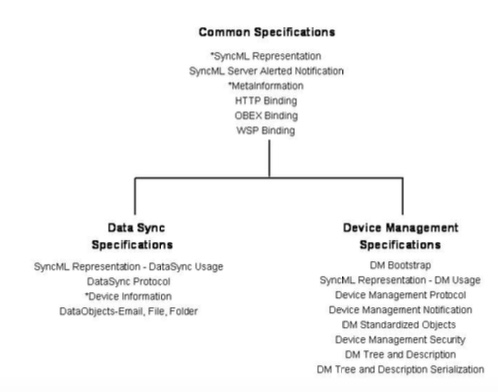

# Enabler Release Definition 启动器发布定义
## Scope 范围
The scope of this document is limited to the Enabler Release Definition of Device Management according to OMA Release process and the Enabler Release specification baseline listed in section Error! Reference source not found.. The OMA DM v1.2 specifications are based on the OMA Device Management (DM) v1.1.2 specifications and make use of the OMA SyncML Common v1.2 specifications as specified in the OMA SyncML Common specifications Enabler Release Definition [ERELDSC]. 
本文档的范围仅限于根据OMA发布过程的设备管理的启动器发布定义中列出的启动器发布规范基准。OMA DM v1.2规范基于OMA设备管理（DM）v1.1.2规范，并且利用OMA SyncML Common v1.2规范，如 OMA SyncML Common specifications Enabler Release Definition [ERELDSC]。

The SyncML Initiative, Ltd. was a not-for-profit corporation formed by a group of companies who co-operated to produce an open specification for data synchronization and device management. Prior to SyncML, data synchronization and device management had been based on a set of different, proprietary protocols, each functioning only with a very limited number of devices, systems and data types. These non-interoperable technologies have complicated the tasks of users, manufacturers, service providers, and developers. Further, a proliferation of different, proprietary data synchronization and device management protocols has placed barriers to the extended use of mobile devices, has restricted data access and delivery and limited the mobility of the users. 
SyncML Initiative有限公司是一家非营利性公司，由一组公司组成，这些公司合作生产用于数据同步和设备管理的开放规范。在SyncML之前，数据同步和设备管理已经基于一组不同的专有协议，每个协议仅仅被非常有限数量的设备，系统和数据类型使用。这些不可互操作的技术使用户，制造商，服务提供商和开发人员的任务复杂化。此外，不同的专有数据同步和设备管理协议的激增对移动设备的扩展使用设置了障碍，限制了数据访问和传递并限制了用户的移动性。

The SyncML Initiative merged with the Open Mobile Alliance in November 2002. The SyncML legacy specifications were converted to the OMA format with the 1.1.2 versions of OMA SyncML Common, OMA Data Synchronization and OMA Device Management in May 2002. The relationship between these documents which had been created during the SyncML Initiative has been preserved and is depicted in Figure. 
SyncML计划于2002年11月与开放移动联盟合并。在2002年5月，SyncML遗留规范被转换为OMA SyncML Common，OMA数据同步和OMA设备管理的1.1.2版本的OMA格式。这些文档之间的关系在SyncML计划期间创建并已经被保留并且在图中描绘。

Although the SyncML Common specification defines transport bindings that specify how to use a particular transport to exchange messages and responses, the SyncML Common representation, synchronization and device management protocols are transport-independent. Each package in these protocols is completely self-contained, and could in principle be carried by any transport. The initial bindings specified are HTTP, WSP and OBEX, but there is no reason why SyncML Common could not be implemented using email or message queues, to list only two alternatives. Because the SyncML Common messages are self-contained, multiple transports may be used without either the server or client devices having to be aware of the network topology. Thus, a short-range OBEX connection could be used for local connectivity, with the messages being passed on via HTTP to an Internet-hosted synchronization server. 
虽然SyncML Common规范定义了指定如何使用特定传输来交换消息和响应的传输绑定，但是SyncML Common表示，同步和设备管理协议是传输独立的。这些协议中的每个包是完全独立的，并且原则上可以由任何传输器承载。所指定的初始绑定是HTTP，WSP和OBEX，但没有理由不能使用电子邮件或消息队列（仅列出两个备选项）实现SyncML Common。 因为SyncML公共消息是自包含的，所以可以使用多个传输，而服务器或客户端设备不必知道网络拓扑。因此，短距离OBEX连接可以用于本地连接，消息通过HTTP传递到因特网托管的同步服务器。

## Definitions 定义
Enabler Release: Collection of specifications that combined together form an enabler for a service area, e.g. a download enabler, a browsing enabler, a messaging enabler, a location enabler, etc. The specifications that are forming an enabler should combined fulfil a number of related market requirements. 
启动器发布：组合在一起的规范的集合形成服务区域的使能器，例如，下载使能器，浏览使能器，消息使能器，位置使能器等。形成使能器的规范应当组合满足多个相关的市场需求。

Device Management: Management of the Device configuration and other managed objects of Devices from the point of view of the various Management Authorities. Device Management includes, but is not restricted to setting initial configuration information in Devices, subsequent updates of persistent information in Devices, retrieval of management information from Devices and processing events and alarms generated by Devices. 
设备管理：从各种管理机构的角度，管理设备配置和设备的其他管理对象。设备管理包括但不限于在设备中设置初始配置信息，随后在设备中更新持久性信息，从设备检索管理信息以及处理由设备生成的事件和警报。

Minimum Functionality Description: Description of the guaranteed features and functionality that will be enabled by implementing the minimum mandatory part of the Enabler Release. 
最低功能描述：通过实施启动器发布的最低强制部分来启用保证的特点和功能的描述。

## Abbreviations 缩写
DM Device Management 设备管理 

DTD Document Type Definition 文档类型定义 

ERDEF Enabler Requirement Definition 启动器需求定义 

ERELD Enabler Release Definition 启动器发布定义 

HTTP Hypertext Transfer Protocol 超文本传输协议 

MIME Multipurpose Internet Mail Extension 多用途互联网邮件扩展 

OBEX Object Exchange protocol 对象交换协议 

OMA Open Mobile Alliance 开放移动联盟 

RD Requirements Document 需求文档 

SCR Static Conformance Requirements 静态一致性要求 

SyncML Synchronization Mark-up Language 同步标记语言 

WAP Wireless Application Protocol 无线应用协议 

WSP Wireless Session Protocol 无线会话协议 

XML Extensible Mark-up Language 可扩展标记语言 

## Release Version Overview 发布版本概述
This section is informative. It describes the functionality that is delivered with the OMA Device Management specifications and their internal mandatory requirements. 
本节内容是信息性的。它描述了随OMA设备管理规范及其内部强制性要求提供的功能。

The OMA DM specifications define the protocols and mechanisms for how configuration parameters can be delivered to an OMA client from a OMA DM server that is part of the overall architecture. The mandatory functionality defines a set of commands used in the DM protocol for various management procedures as well as needed security level for management session. Mandatory management tree is used as server interface to the device, which includes several mandatory management objects that are providing basic device management functionality. 
OMA DM规范定义了如何可以从作为整体架构的一部分的OMA DM服务器将配置参数递送到OMA客户端的协议和机制。强制功能定义在DM协议中用于各种管理过程的一组命令以及管理会话所需的安全级别。强制管理树用作设备的服务器接口，其包括提供基本设备管理功能的若干强制性管理对象。

The optional functionality covers several additional commands in DM protocol. Also, support for notification initiated session and bootstrapping is recommended, but optional functionality. 
可选功能涵盖DM协议中的几个附加命令。此外，建议支持通知启动的会话和引导，但是这是可选功能。

This document outlines the Enabler Release Definition for DM and the respective conformance requirements for client and server implementations claiming compliance to the Open Mobile Alliance DM v1.2 specifications. 
本文档概述了DM的启动器发布定义，以及声明遵守开放移动联盟DM v1.2规范的客户端和服务器实现的相应一致性要求。

It should be understood that the OMA SyncML Common v1.2 specifications must be used in conjunction with the OMA Device Management Enabler Release, version 1.2. Fully conformant DM client and DM server implementations can only be achieved through combining the conformance requirements outlined within this enabler release definition with those outlined within the SyncML Common Specifications [ERELDSC] enabler release definition. 
应当理解，OMA SyncML Common v1.2规范必须与OMA设备管理启动器版本1.2结合使用。完全符合DM客户端和DM服务器实现只能通过将此启用器发布定义中概述的一致性要求与SyncML通用规范[ERELDSC]启用程序发布定义中概述的要求相结合来实现。

Device management is the generic term used for technology that allows third parties to carry out the difficult procedures of configuring mobile devices on behalf of the end user (customer). Third parties would typically be wireless operators, service providers or corporate information management departments. 
设备管理是用于允许第三方执行代表最终用户（客户）配置移动设备的困难过程的技术的通用术语。第三方通常是无线运营商，服务提供商或企业信息管理部门。

Through device management, an external party can remotely set parameters, conduct troubleshooting servicing of terminals, install or upgrade software. In broad terms, device management consists of three parts: 
通过设备管理，外部方可以远程设置参数，对终端进行故障维修，安装或升级软件。从广义上讲，设备管理包括三个部分：

* Protocol and mechanism: The protocol used between a management server and a mobile device 
协议和机制：管理服务器和移动设备之间使用的协议

* Data model: The data made available for remote manipulation, for example browser and mail settings 
数据模型：可用于远程操作的数据，例如浏览器和邮件设置

* Policy: The policy decides who can manipulate a particular parameter, or update a particular object in the device 
策略：策略决定谁可以操纵特定参数，或更新设备中的特定对象

In a wireless environment, the crucial element for device management protocol is the need to efficiently and effectively address the characteristics of mobile devices including low bandwidth and high latency. 
在无线环境中，设备管理协议的关键要素是有效和高效的解决移动设备的特性，包括低带宽和高延迟。

### Version 1.2 Functionality 版本1.2功能
DM 1.0 and 1.1 were completed under the auspices of the SyncML Initiative. DM 1.1.2 was a re-release of the same basic enabler under the OMA auspices. DM 1.1.2 provided basic remote device management capabilities for writing and reading device settings. The enabler strongly depended upon Client Provisioning for initial provisioning for this release. 
DM 1.0和1.1在SyncML Initiative的支持下完成。DM1.1.2是在OMA主持下重新发布的相同的基本启动器。DM 1.1.2提供了用于写入和读取设备设置的基本远程设备管理功能。该启用程序强烈依赖于客户端配置进行此版本的初始配置。

DM 1.2 expanded on DM 1.1 by increasing security requirements, providing bootstrap capabilities that complement Client Provisioning capabilities, Generic Alert, and the ability to provision and read entire management objects. New node formats (such as Date, Time, etc) were added. Security functionality was significantly improved – XML encryption was added, and TLS/SSL was mandated for HTTP. Many minor improvements to the specification were also included. 
DM 1.2通过增加安全要求扩展了DM 1.1，提供了补充客户端配置功能，通用警报以及配置和读取整个管理对象的能力。添加了新节点格式（例如日期，时间等）。安全功能得到显着改进 - 添加了XML加密，并且强制TLS/SSL用于HTTP。还包括对规范的许多小的改进。

DM 1.2.1 is a bug-fix release that removes most of the remaining ambiguities in the specification. No normative changes were made. 
DM 1.2.1是一个bug修复版本，可以消除规范中剩余的大部分的模糊部分。没有做出规范的改变。

### Conformance Requirements Notation Details 一致性要求符号详细信息
The tables in following chapters use the following notation: 
以下章节中的表使用以下符号：

Item:  Entry in this column MUST be a valid ScrItem according to [IOPPROC]. 
项目：该列中的条目必须是根据[IOPPROC]的有效ScrItem。

Feature/Application:Entry in this column SHOULD be a short descriptive label to the Item in question. 
特点/应用：此列中的条目应该是所讨论的项目的简短描述性标签。

Status: Entry in this column MUST accurately reflect the architectural status of the Item in question. 
状态：此列中的条目必须准确反映所讨论的项目的架构状态。
* M means the Item is mandatory for the class 
M表示该类对于类是必需的

* O means the Item is optional for the class 
O表示该项对于类是可选的

* NA means the Item is not applicable for the class 
NA表示该项目不适用于该类

Expression in the column MUST be a valid TerminalExpression according to [IOPPROC] and it MUST accurately reflect the architectural requirement of the Item in question. 
列中的表达式必须是根据[IOPPROC]的有效终端表达式，并且必须准确地反映所讨论的项目的结构要求。

###ERDEF for Device Management - Client Requirements 设备管理的ERDEF - 客户端要求
| Item 项目 | Feature / Application 特征／应用  | Status 状态 | Requirement 需求 |
| -- | -- | -- | -- |
| OMA-ERDEF-DM-C-001 | DM Client | M`*`| [DMPRO] AND [DMREPU] AND [DMSEC] AND [DMTND] AND [DMSTDOBJ] AND [DMDDFDTD]. |
| OMA-ERDEF-DM-C-002 |  DM Client Bootstrap | O | [DMBOOT] |
| OMA-ERDEF-DM-C-003 |  DM Client Notification | O | [DMNOTI] |
| OMA-ERDEF-DM-C-004 |  DM TND Serialization | O | [DMTNDS] |

`*`It should be understood that the OMA SyncML Common v1.2 specifications MUST be used in conjunction with the OMA Device Management Enabler Release, version 1.2. Fully conformant DM client implementations can only be achieved through combining the conformance requirements outlined above with those outlined within the SyncML Common Specifications enabler release definition [ERELDSC]. 
`*`应当理解，OMA SyncML Common v1.2规范必须与OMA设备管理启动器版本1.2结合使用。完全符合DM客户端的实现只能通过将上面概述的一致性要求与SyncML通用规范启用程序发布定义[ERELDSC]中概述的要求相结合来实现。

###ERDEF for Device Management - Client Requirements 设备管理的ERDEF - 服务器要求
| Item 项目 | Feature / Application 特征／应用  | Status 状态 | Requirement 需求 |
| -- | -- | -- | -- |
| OMA-ERDEF-DM-S-001 | DM Server | M`*`| [DMPRO] AND [DMREPU] AND [DMSEC] AND [DMTND] AND [DMSTDOBJ] AND [DMDDFDTD]. |
| OMA-ERDEF-DM-S-002 |  DM Bootstrap Server | O | [DMBOOT] |
| OMA-ERDEF-DM-S-003 |  DM Notification Server | O | [DMBOOT] |
| OMA-ERDEF-DM-S-004 | DM TND Serialization | O | [DMTNDS] |

`*`It should be understood that the OMA SyncML Common v1.2 specifications must be used in conjunction with the OMA Device Management Enabler Release, version 1.2. Fully conformant DM server implementations can only be achieved through combining the conformance requirements outlined above with those outlined within the SyncML Common Specifications enabler release definition [ERELDSC]. 
`*`应当理解，OMA SyncML Common v1.2规范必须与OMA设备管理启动器版本1.2配合使用。完全符合DM服务器的实现只能通过将上面概述的一致性要求与SyncML通用规范使能器释放定义[ERELDSC]中概述的要求相结合来实现。
